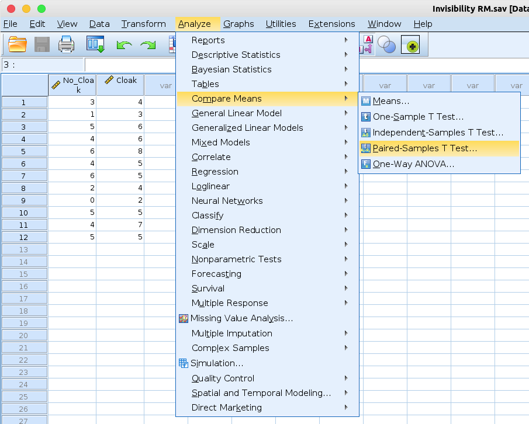
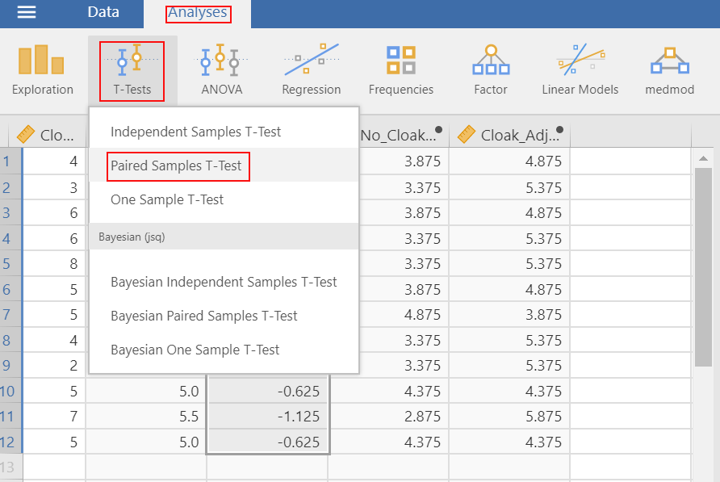
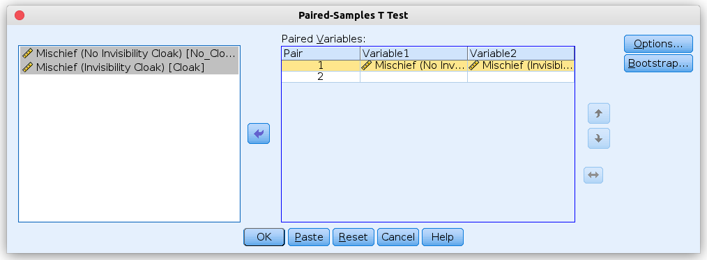
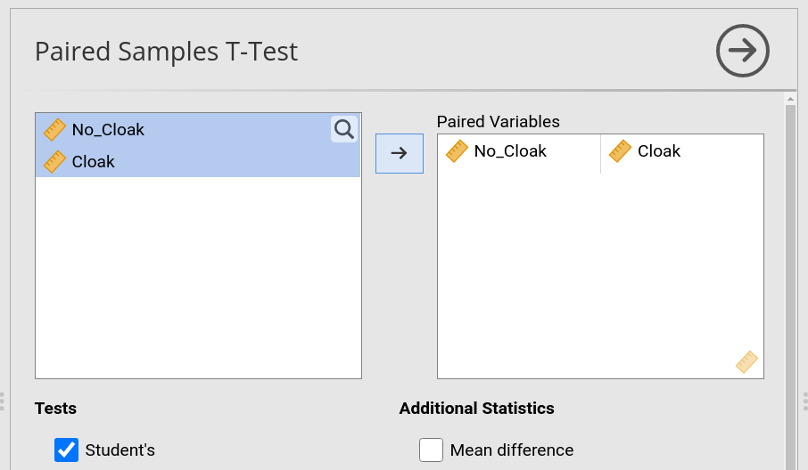
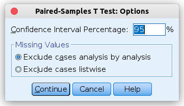
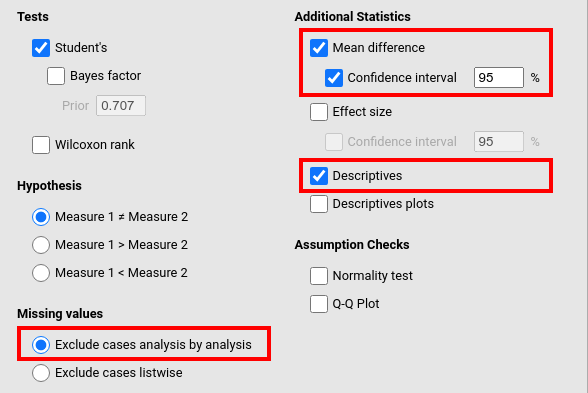
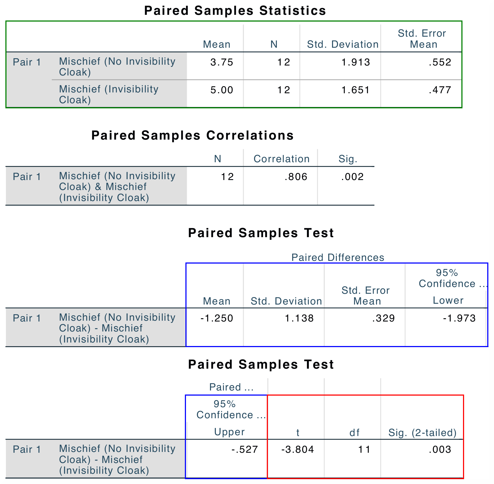
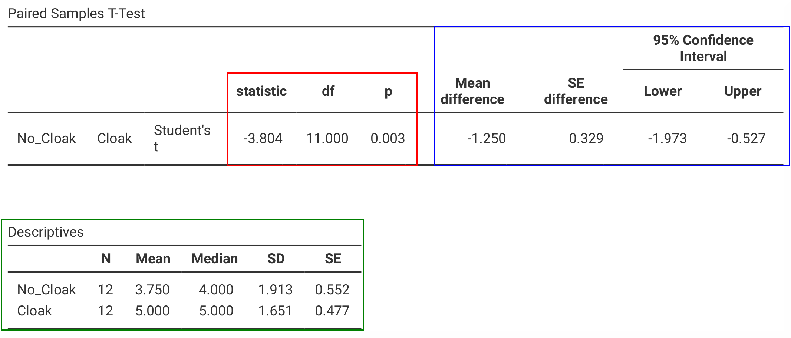

.. sectionauthor:: `Sebastian Jentschke <https://www.uib.no/en/persons/Sebastian.Jentschke>`_

==============================================
From SPSS to jamovi: t-test for paired samples 
==============================================

    After having demonstrated the beneficial effect of repeated-measures-designs on the standard error of mean, we conduct a t-test for paired samples. Using
    this test, we compare whether the number of mischieveous acts has increased after receiving a cloak of invisibility (variable ``Cloak``) in comparison to
    the number of mischieveous acts at baseline (variable ``No_Cloak``). This analysis is described in chapter 10.9.3 of Field (2017), especially Figure 10.12
    and Output 10.8 - 10.9. We use the same data set **Invisibility RM.sav** which can be downloaded from the `web page accompanying Andy Field's book
    <https://edge.sagepub.com/field5e/student-resources/datasets>`__.

+-------------------------------------------------------------------------------+-------------------------------------------------------------------------------+
| **SPSS**                                                                      | **jamovi**                                                                    |
+===============================================================================+===============================================================================+
| In SPSS you can set up a t-test for paired samples using: ``Analyze`` →       | In jamovi you do this using: ``Analyses`` (tab) → ``T-Tests`` → ``Paired      |
| ``Compare means`` → ``Paired Samples T-Test``.                                | Samples T-Test``                                                              |
+-------------------------------------------------------------------------------+-------------------------------------------------------------------------------+
| |SPSS_Menu_ttestPS1|                                                          | |jamovi_Menu_ttestPS1|                                                        |
+-------------------------------------------------------------------------------+-------------------------------------------------------------------------------+
| In the input window that opens, the two variables ``No invisibility cloak``   | In the input panel that opens, the variables ``No_Cloak`` and ``Cloak`` are   |
| and ``Invisibility cloak`` are assigned to the field ``Paired variables``.    | moved to the variable input box ``Paired Variables``.                         |
+-------------------------------------------------------------------------------+-------------------------------------------------------------------------------+
| |SPSS_Input_ttestPS1|                                                         | |jamovi_Input_ttestPS1|                                                       |
+-------------------------------------------------------------------------------+-------------------------------------------------------------------------------+
| Afterwards, we press the ``Options`` button to set the confidence interval    | In jamovi, do we go further down in the input panel and tick ``Mean           |
| to 95%. We, furthermore, select ``Exclude cases analysis by analysis``        | Difference`` and its ``Confidence interval`` underneath. We, furthermore,     |
| (however, the latter setting only matters if we compare two pairs of          | tick ``Descriptives`` to obtain a output that is similar to SPSS. Finally, we |
| variables and if those two pairs differ in for which participant those        | set the radio box to ``Exclude cases analysis by analysis`` (the same comment |
| missing values occur).                                                        | as for SPSS applies; the setting won't matter unless we compare at least two  |
|                                                                               | pairs of variables differing in which participants have missing values).      |
+-------------------------------------------------------------------------------+-------------------------------------------------------------------------------+
| |SPSS_Input_ttestPS2|                                                         | |jamovi_Input_ttestPS2|                                                       |
+-------------------------------------------------------------------------------+-------------------------------------------------------------------------------+
| The results from SPSS and jamovi are identical, but they are arranged slightly differently. SPSS gives the mean difference (blue box) first, before giving    |
| the t-statistics and their respective degrees of freedom and p-value (red box), in jamovi it is the other way round (statistics – red box – first and mean    |
| difference – blue box – afterwards). Another table underneath (green box) gives the descriptive statistics for the two variables that were compared. Except   |
| from that jamovi also reports the Median, and a slightly different way to arrange the columns (SPSS begins with the ``Mean`` and has the ``N`` afterwards,    |
| jamovi vice versa) the two tables are identical.                                                                                                              |
| The numerical values for the statistics are identical: *t* = -3.804, *df* = 11, *p* = 0.003.                                                                  |
+-------------------------------------------------------------------------------+-------------------------------------------------------------------------------+
| |SPSS_Output_ttestPS1|                                                        | |jamovi_Output_ttestPS1|                                                      |
|                                                                               +-------------------------------------------------------------------------------+
|                                                                               | SPSS, in addition, gives the ``Paired Samples Correlation`` (which one        |
|                                                                               | typically would not report). To obtain such table, one would have to use      |
|                                                                               | ``Analyses`` (tab) → ``Regression`` → ``Correlation Matrix`` and assign the   |
|                                                                               | variables ``No_Cloak`` and ``Cloak`` to the variable box.                     |
+-------------------------------------------------------------------------------+-------------------------------------------------------------------------------+
| If you wish to replicate those analyses using syntax, you can use the commands below (in jamovi, just copy to code below to :doc:`Rj <../jamovi2R/j2R_Rj>`).  |
+-------------------------------------------------------------------------------+-------------------------------------------------------------------------------+
| .. code-block:: none                                                          | .. code-block:: none                                                          |
|                                                                               |                                                                               |   
|     T-TEST PAIRS=No_Cloak WITH Cloak (PAIRED)                                 |    jmv::ttestPS(                                                              |
|       /CRITERIA=CI(.95)                                                       |        data = data,                                                           |
|       /MISSING=ANALYSIS.                                                      |        pairs = list(                                                          |
|                                                                               |            list(                                                              |
|                                                                               |                i1="No_Cloak",                                                 |
|                                                                               |                i2="Cloak")),                                                  |
|                                                                               |        meanDiff = TRUE,                                                       |
|                                                                               |        ci = TRUE,                                                             |
|                                                                               |        desc = TRUE)                                                           |
+-------------------------------------------------------------------------------+-------------------------------------------------------------------------------+

| **References**
| Field, A. (2017). *Discovering statistics using IBM SPSS statistics* (5th ed.). SAGE Publications. https://edge.sagepub.com/field5e

.. ---------------------------------------------------------------------

