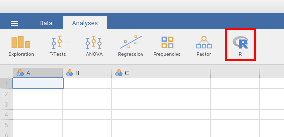
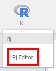
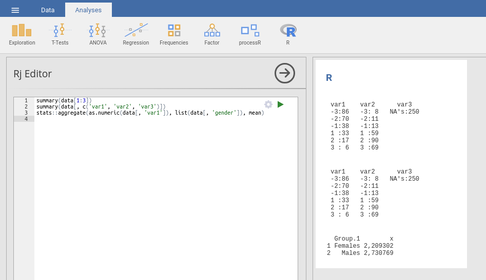
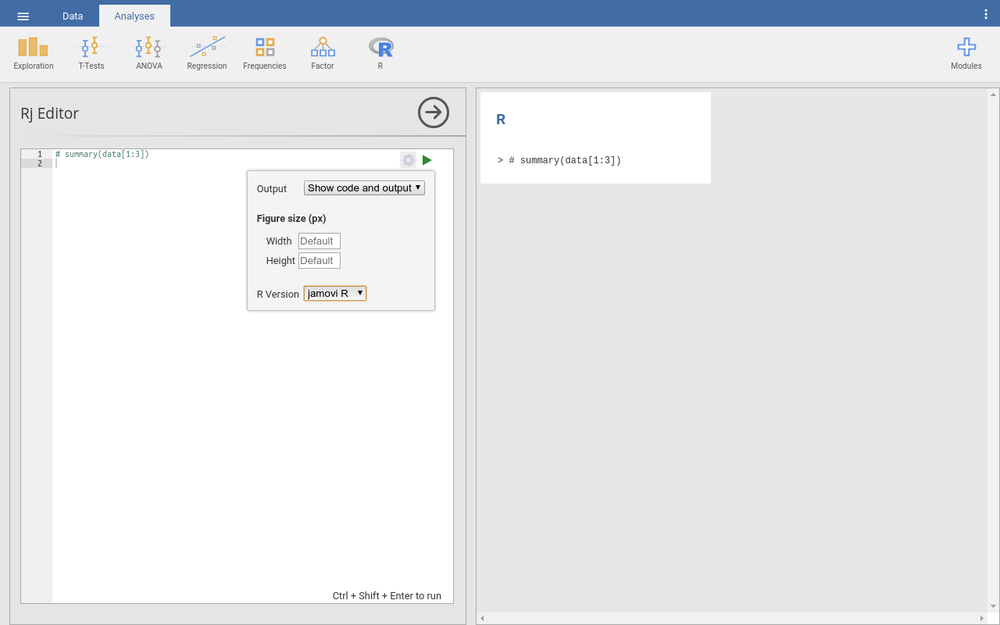

.. sectionauthor:: `Sebastian Jentschke <https://www.uib.no/en/persons/Sebastian.Jentschke>`_

====================
Rj-module for jamovi
====================

Preparation
===========

First you have to `install the module <Install_modules.html>`__ Rj from the
jamovi library. This will create a «R»-icon in the icon bar.

|jamovi_Rj1|

.. toctree::
   :hidden:

   Install_modules

Running R commands
==================

+----------------------------------+---------------------------------------+
| Click on the «R» icon and        | This opens an input field on the left |
| select «Rj Editor».              | side where you can use R commands.    |
|                                  |                                       |
| |jamovi_Rj2|                     | |jamovi_Rj3|                          |
+----------------------------------+---------------------------------------+

You can access your dataset with the variable ``data``. The first line selects
the first three columns of your dataset. Alternatively, you can use variable
names as shown in the second line.
.. code-block: R
summary(data[1:3])
summary(data[, c('var1', 'var2', 'var3')])

But you can also use functions from R libraries:
.. code-block: R
stats::aggregate(as.numeric(data[, 'var1']), list(data[, 'gender']), mean)

It may take a bit of time to figure out how to use these functions, especially
to discover, e.g., which format is required for the data matrices you use as
input to functions (those may need to be converted to numbers with «as.numeric»
or to a list with «list»). But once you managed that, you have unlimited access
to (almost) any kind of statistical analysis you can imagine.

This is not at least because there come already a wealth of R libraries
installed with jamovi and Rj: ``abind``, ``acepack``, ``afex``, ``arm``,
``assertthat``, ``backports``, ``base``, ``base64enc``, ``BayesFactor``,
``BDgraph``, ``BH``, ``bindr``, ``bindrcpp``, ``bitops``, ``boot``, ``ca``,
``car``, ``carData``, ``caTools``, ``cellranger``, ``checkmate``, ``class``,
``cli``, ``clipr``, ``cluster``, ``coda``, ``codetools``, ``colorspace``,
``compiler``, ``contfrac``, ``corpcor``, ``crayon``, ``curl``, ``d3Network``,
``data.table``, ``datasets``, ``deSolve``, ``digest``, ``dplyr``, ``ellipsis``,
``elliptic``, ``emmeans``, ``estimability``, ``evaluate``, ``evaluate``,
``exact2x2``, ``exactci``, ``fansi``, ``fdrtool``, ``forcats``, ``foreign``,
``Formula``, ``gdata``, ``GGally``, ``ggm``, ``ggplot2``, ``ggridges``,
``glasso``, ``glue``, ``gnm``, ``GPArotation``, ``gplots``, ``graphics``,
``grDevices``, ``grid``, ``gridExtra``, ``gtable``, ``gtools``, ``haven``,
``highr``, ``Hmisc``, ``hms``, ``htmlTable``, ``htmltools``, ``htmlwidgets``,
``huge``, ``hypergeo``, ``igraph``, ``jmv``, ``jmvcore``, ``jpeg``,
``jsonlite``, ``KernSmooth``, ``knitr``, ``kutils``, ``labeling``, ``lattice``,
``latticeExtra``, ``lavaan``, ``lazyeval``, ``lisrelToR``, ``lme4``,
``lmerTest``, ``lmtest``, ``magrittr``, ``maptools``, ``markdown``, ``MASS``,
``Matrix``, ``matrixcalc``, ``MatrixModels``, ``methods``, ``mgcv``, ``mi``,
``mime``, ``minqa``, ``mnormt``, ``multcomp``, ``munsell``, ``mvnormtest``,
``mvtnorm``, ``nlme``, ``nloptr``, ``nnet``, ``numDeriv``, ``OpenMx``,
``openxlsx``, ``parallel``, ``pbapply``, ``pbivnorm``, ``pbkrtest``,
``pillar``, ``pkgconfig``, ``pkgconfig``, ``plogr``, ``plyr``, ``PMCMR``,
``png``, ``praise``, ``prettyunits``, ``progress``, ``psych``, ``purrr``,
``qgraph``, ``quantreg``, ``qvcalc``, ``R6``, ``RColorBrewer``, ``Rcpp``,
``RcppArmadillo``, ``RcppEigen``, ``RCurl``, ``readr``, ``readxl``, ``regsem``,
``relimp``, ``rematch``, ``reshape``, ``reshape2``, ``RInside``, ``rio``,
``Rj``, ``rjson``, ``rlang``, ``rockchalk``, ``ROCR``, ``rpart``, ``rpf``,
``RProtoBuf``, ``Rsolnp``, ``rstudioapi``, ``RUnit``, ``sandwich``, ``scales``,
``sem``, ``semPlot``, ``semTools``, ``sp``, ``SparseM``, ``spatial``,
``splines``, ``ssanv``, ``StanHeaders``, ``stats``, ``stats4``, ``stringi``,
``stringr``, ``survival``, ``tcltk``, ``testthat``, ``TH.data``, ``tibble``,
``tidyselect``, ``tools``, ``truncnorm``, ``utf8``, ``utils``, ``vcd``,
``vcdExtra``, ``vctrs``, ``viridis``, ``viridisLite``, ``whisker``, ``withr``,
``xfun``, ``XML``, ``xtable``, ``yaml``, ``zeallot``, ``zip``, ``zoo``.

Some of these libraries are especially interesting:

-  |stats|_ to get access to a wealth of statistical analyses (e.g.,
   ``stats::glm`` for fitting Generalized Linear Models or ``stats:kmeans`` for
   running k-means cluster analyses)
-  |lme4|_ to calculate Linear, Generalized Linear, and Nonlinear mixed modells
-  |MASS|_ implements analyses from Venables og Ripley's famous book «Modern
   Applied Statistics with S» (which includes, e.e., linear discriminant
   analysis ``MASS::lda``)
-  |lavaan|_ to run a wide range of analyses with latent variables (incl.
   confirmatory factor analysis, structural equation modeling and latent growth
   curve models)
-  |BayesFactor|_ to run several types of Bayes-analyses to complement your
   «classical» (frequentist) statistics (e.g. the Bayes-equivalent of the
   t-test; NB: it is of course easier to use the jamovi-module «jsq» for that)
-  |cluster|_ to run several types of cluster analyses
-  |ggplot2|_ to produce (almost) any type of fancy `figures
   <http://www.ggplot2-exts.org/gallery/>`__ you can imagine
-  there are also several of Hadley Wickham's |tidyverse|_ libraries included,
   \e.g., |dplyr|_, |stringr|_ or |tidyselect|_

Switch between R-versions
=========================

+----------------------------+------------------------------------------+
| |jamovi_Rj4|               | Per default, Rj uses the R-installation  |
|                            | that is included with jamovi. For most   |
|                            | circumstances this will be sufficient    |
|                            | (not the least because quite a wealth    |
|                            | of libraries is included; see above).    |
|                            | However, there might be occasions where  |
|                            | you would like to use the R-installation |
|                            | on your computer; typically, if you want |
|                            | to use libraries that are not included   |
|                            | in jamovi's R-version. To do this, click |
|                            | on the cogwheel symbol in the top-right  |
|                            | corner of the Rj-input field. A window   |
|                            | opens where you can set whether you      |
|                            | would like to use jamovi's R version     |
|                            | («jamovi R» in the dropdown box at the   |
|                            | bottom) or your system's R version       |
|                            | («System R»).                            |
|                            | Please note that currently (Nov 2019),   |
|                            | this option is not available for certain |
|                            | system-and-R-version-combinations (e.g., |
|                            | R > 3.4 on Linux).                       |
+----------------------------+------------------------------------------+

.. ----------------------------------------------------------------------------

.. |stats|        replace:: ``stats``
.. _stats:        https://www.rdocumentation.org/packages/stats

.. |lme4|         replace:: ``lme4``
.. _lme4:         https://www.rdocumentation.org/packages/lme4

.. |MASS|         replace:: ``MASS``
.. _MASS:         https://www.rdocumentation.org/packages/MASS

.. |lavaan|       replace:: ``lavaan``
.. _lavaan:       https://www.rdocumentation.org/packages/lavaan

.. |BayesFactor|  replace:: ``BayesFactor``
.. _BayesFactor:  https://www.rdocumentation.org/packages/BayesFactor

.. |cluster|      replace:: ``cluster``
.. _cluster:      https://www.rdocumentation.org/packages/cluster

.. |ggplot2|      replace:: ``ggplot2``
.. _ggplot2:      https://www.rdocumentation.org/packages/ggplot2

.. |tidyverse|    replace:: ``tidyverse``
.. _tidyverse:    https://www.tidyverse.org

.. |dplyr|        replace:: ``dplyr``
.. _dplyr:        https://www.rdocumentation.org/packages/dplyr

.. |stringr|      replace:: ``stringr``
.. _stringr:      https://www.rdocumentation.org/packages/stringr

.. |tidyselect|   replace:: ``tidyselect``
.. _tidyselect:   https://www.rdocumentation.org/packages/tidyselect
