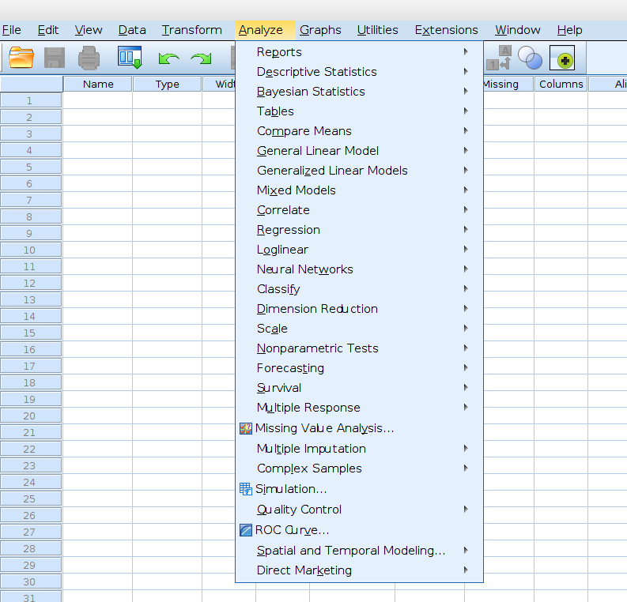
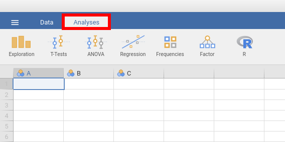

.. .. sectionauthor:: `Sebastian Jentschke <https://www.uib.no/en/persons/Sebastian.Jentschke>`_

===================================================
Comparison of analyses available in SPSS and jamovi
===================================================

+--------------------------------------+--------------------------------------+
| | **SPSS** (version 27)              | **jamovi** (versjon 2.0)             |
| | |spss_prices|                      |                                      |
+--------------------------------------+--------------------------------------+
| |SPSS_Analyze|                       | |jamovi_Analyze|                     |
|                                      |                                      |                     
|                                      | | Already at first glance, it        |
|                                      |   becomes clear that jamovi          |
|                                      |   currently has fewer features than  |
|                                      |   SPSS. But:                         |
|                                      | | (1) There is a (ever increasing)   |
|                                      |   made available via modules (press  |
|                                      |   the "+" sign in the right upper    |
|                                      |   corner of the jamovi window to add |
|                                      |   them) and                          |
|                                      | | (2) The features implemented       |
|                                      |   already cover "standard" needs     |
|                                      |   (90% of the most common analyses   |
|                                      |   used in psychology).               |
|                                      | | Feel free to check out which       |
|                                      |   |modules| are available: There is  |
|                                      |   also quite a wealth of modules     |
|                                      |   covering functions that are not    |
|                                      |   available in SPSS but very useful  |
|                                      |   (e.g., for meta-analyses; MAJOR).  |
|                                      | | If you are willing to use some R   |
|                                      |   code (e.g., in conjunction with    |
|                                      |   the jamovi-module Rj) then you can |
|                                      |   (most presumably) do every         |
|                                      |   analysis you could imagine.        |
|                                      |                                      |
|                                      | |jamovi_Modules|                     |
+--------------------------------------+--------------------------------------+
| **Reports**                                                                 |
+--------------------------------------+--------------------------------------+
| Reports → Codebook                   | N/A                                  |
+--------------------------------------+--------------------------------------+
| Reports → OLAP Cubes                 | N/A                                  |
+--------------------------------------+--------------------------------------+
| Reports → Case summaries             | Exploration → Descriptives *has the  |
|                                      | same functionality*                  |
+--------------------------------------+--------------------------------------+
| Reports → Reports Summaries in       | N/A                                  |
| Rows                                 |                                      |
+--------------------------------------+--------------------------------------+
| Reports → Reports Summaries in       | N/A                                  |
| Columns                              |                                      |
+--------------------------------------+--------------------------------------+
| **Descriptive Statistics**                                                  |
+--------------------------------------+--------------------------------------+
| Descriptive Statistics →             | Exploration → Descriptives           |
| Frequencies                          | combines all three procedures        |
+--------------------------------------+                                      |
| Descriptive Statistics →             | *tick «Frequency tables» to get an   |
| Descriptives                         | output that is similar to that of    |
+--------------------------------------+ «Frequencies» in SPSS*               |
| Descriptive Statistics → Explore     |                                      |
+--------------------------------------+--------------------------------------+
| Descriptive Statistics →             | Frequencies → (Contingency tables)   |
| Crosstabs                            | → Independent samples                |
+--------------------------------------+--------------------------------------+
| Descriptive Statistics → Ratio       | N/A                                  |
+--------------------------------------+--------------------------------------+
| **Bayesian Statistics**                                                     |
+--------------------------------------+--------------------------------------+
|                                      | *requires the jamovi-module «jsq»*   |
+--------------------------------------+--------------------------------------+
| Bayesian Statistics → One Sample     | T-Test → Bayesian One Sample T-Test  |
| Normal                               |                                      |
+--------------------------------------+--------------------------------------+
| Bayesian Statistics → One Sample     | Frequencies → Bayesian Proportion    |
| Binomial                             | Test                                 |
+--------------------------------------+--------------------------------------+
| Bayesian Statistics → One Sample     | Frequencies → Bayesian Contingency   |
| Poisson                              | Tables                               |
+--------------------------------------+--------------------------------------+
| Bayesian Statistics → Related        | T-Test → Bayesian Paired Samples     |
| Sample Normal                        | T-Test                               |
+--------------------------------------+--------------------------------------+
| Bayesian Statistics → Independent    | T-Test → Bayesian Independent        |
| Samples Normal                       | Samples T-Test                       |
+--------------------------------------+--------------------------------------+
| Bayesian Statistics → Pearson        | Regression → Bayesian Correlation    |
| Correlation                          | Matrix / Bayesian Correlation Pairs  |
+--------------------------------------+--------------------------------------+
| Bayesian Statistics → Linear         | Regression → Bayesian Linear         |
| Regression                           | Regression                           |
+--------------------------------------+--------------------------------------+
| Bayesian Statistics → One-way ANOVA  | ANOVA → Bayesian ANOVA (*can handle  |
|                                      | several factors while SPSS is        |
|                                      | limited to one factor*)              |
+--------------------------------------+--------------------------------------+
| Bayesian Statistics → Log-Linear     | Frequencies → Bayesian Log-Linear    |
| Models                               | Regression                           |
+--------------------------------------+--------------------------------------+
| **Compare Means**                                                           |
+--------------------------------------+--------------------------------------+
| Compare Means → Means...             | Exploration → Descriptives *replaces |
|                                      | / integrates that functionality,     |
|                                      | choose the drop-down menu            |
|                                      | «Statistics» and set ticks at        |
|                                      | «Mean», «N» and «Std. deviation»*    |
+--------------------------------------+--------------------------------------+
| Compare Means → Independent-Samples  | T-Test → Independent Samples T-Test  |
| T Test                               |                                      |
+--------------------------------------+--------------------------------------+
| Compare Means → Paired-Samples T     | T-Test → Paired Samples T-Test       |
| Test                                 |                                      |
+--------------------------------------+--------------------------------------+
| Compare Means → One-Sample T Test    | T-Test → One Sample T-Test           |
+--------------------------------------+--------------------------------------+
| Compare Means → One-Way ANOVA        | ANOVA → One-Way ANOVA                |
+--------------------------------------+--------------------------------------+
| **General Linear Model**                                                    |
+--------------------------------------+--------------------------------------+
| General Linear Model → Univariate    | ANOVA → One-Way ANOVA                |
+--------------------------------------+--------------------------------------+
| General Linear Model → Multivariate  | ANOVA → MANCOVA                      |
+--------------------------------------+--------------------------------------+
| General Linear Model → Repeated      | ANOVA → Repeated Measures ANOVA      |
| Measures                             |                                      |
+--------------------------------------+--------------------------------------+
| General Linear Model → Variance      | N/A                                  |
| Components                           |                                      |
+--------------------------------------+--------------------------------------+
| **Generalized Linear Models**                                               |
+--------------------------------------+--------------------------------------+
|                                      | *requires the jamovi-module «GAMLj»  |
|                                      | (General Analyses for the Linear     |
|                                      | Model in jamovi)*                    |
+--------------------------------------+--------------------------------------+
| Generalized Linear Models →          |                                      |
| Generalized Linear Models            |                                      |
+--------------------------------------+--------------------------------------+
| Generalized Linear Models →          |                                      |
| Generalized Estimating Equations     |                                      |
+--------------------------------------+--------------------------------------+
| **Mixed Models**                                                            |
+--------------------------------------+--------------------------------------+
|                                      | *requires the jamovi-module «GAMLj»  |
|                                      | (General Analyses for the Linear     |
|                                      | Model in jamovi)*                    |
+--------------------------------------+--------------------------------------+
| Mixed Models → Linear                |                                      |
+--------------------------------------+--------------------------------------+
| Mixed Models → Generalized Linear    |                                      |
+--------------------------------------+--------------------------------------+
| **Correlate**                                                               |
+--------------------------------------+--------------------------------------+
| Correlate → Bivariate                | Regression → Correlation Matrix      |
+--------------------------------------+--------------------------------------+
| Correlate → Partial                  | Regression → Partial Correlation     |
+--------------------------------------+--------------------------------------+
| Correlate → Distances                | N/A                                  |
+--------------------------------------+--------------------------------------+
| **Regression**                                                              |
+--------------------------------------+--------------------------------------+
| Regression → Automatic Linear Models | N/A                                  |
+--------------------------------------+--------------------------------------+
| Regression → Linear                  | Regression → Linear Regression       |
+--------------------------------------+--------------------------------------+
| Regression → Ordinal                 | Regression → (Logistic Regression) → |
|                                      | Ordinal Outcomes                     |
+--------------------------------------+--------------------------------------+
| Regression → Curve Estimation        |                                      |
+--------------------------------------+--------------------------------------+
| Regression → Partial Least Squares   |                                      |
+--------------------------------------+--------------------------------------+
| **Loglinear**                                                               |
+--------------------------------------+--------------------------------------+
| Loglinear → General                  | Frequencies → Log-Linear Regression  |
+--------------------------------------+--------------------------------------+
| Loglinear → Logit                    |                                      |
+--------------------------------------+--------------------------------------+
| Loglinear → Model Selection          |                                      |
+--------------------------------------+--------------------------------------+
| **Classify**                                                                |
+--------------------------------------+--------------------------------------+
| Classify → Nearest Neighbor          | N/A                                  |
+--------------------------------------+--------------------------------------+
| Classify → Discriminant              | N/A, *can be calculated using*       |
|                                      | |MASS|                               |
+--------------------------------------+--------------------------------------+
| Classify → TwoStep Cluster           | N/A                                  |
+--------------------------------------+--------------------------------------+
| Classify → Hierarchical Cluster      | N/A, *can be calculated using*       |
+--------------------------------------+ |pvclust|                            |
| Classify → K-Means Cluster           |                                      |
+--------------------------------------+--------------------------------------+
| **Dimension Reduction**                                                     |
+--------------------------------------+--------------------------------------+
| Dimension Reduction → Factor         | | Factor → (Data reduction) →        |
|                                      |   Principal Component Analysis       |
|                                      | | Factor → (Data reduction) →        |
|                                      |   Exploratory Factor Analysis [#FA]_ |
+--------------------------------------+--------------------------------------+
| **Scale**                                                                   |
+--------------------------------------+--------------------------------------+
| Scale → Reliability Analysis         | Factor → (Scale analysis) →          |
|                                      | Reliability analysis                 |
+--------------------------------------+--------------------------------------+
| Scale → Multidimensional Scaling     | N/A                                  |
+--------------------------------------+--------------------------------------+
| **Nonparametric Tests**                                                     |
+--------------------------------------+--------------------------------------+
| Nonparametric Tests → One Sample     | N/A, *the tests itself are available |
+--------------------------------------+ (see below), but not a common start  |
| Nonparametric Tests → Independent    | menu that allows a selection based   |
| Samples                              | on your data (e.g., between- or      |
+--------------------------------------+ within-subject)*                     |
| Nonparametric Tests → Related        |                                      |
| Samples                              |                                      |
+--------------------------------------+--------------------------------------+
| Nonparametric Tests → Legacy Dialogs | Frequencies → (One Sample Proportion |
| → Chi-Square                         | Tests) → N Outcomes (x² goodness of  |
|                                      | fit)                                 |
+--------------------------------------+--------------------------------------+
| Nonparametric Tests → Legacy Dialogs | Frequencies → (One Sample Proportion |
| → Binomial                           | Tests) → 2 Outcomes (Binomial test)  |
+--------------------------------------+--------------------------------------+
| Nonparametric Tests → Legacy Dialogs | N/A                                  |
| → Runs                               |                                      |
+--------------------------------------+--------------------------------------+
| Nonparametric Tests → Legacy         | N/A, *Shapiro-Wilks available under  |
| Dialogs → 1-Sample K-S               | Exploration → Descriptives, choose   |
|                                      | drop-down menu «Statistics» and tick |
|                                      | «Shapiro-Wilks»*                     |
+--------------------------------------+--------------------------------------+
| Nonparametric Tests → Legacy         | T-Test → Independent Samples T-Test, |
| Dialogs → 2 Independent Samples      | *set tick-box «Mann-Whitney U»*      |
+--------------------------------------+--------------------------------------+
| Nonparametric Tests → Legacy         | T-Test → Paired Samples T-Test, *set |
| Dialogs → 2 Related Samples          | tick-box «Wilcoxon Rank»*            |
+--------------------------------------+--------------------------------------+
| Nonparametric Tests → Legacy         | ANOVA → (Non-Parametric) → One-Way   |
| Dialogs → K Independent Samples      | ANOVA (Kruskal-Wallis)               |
+--------------------------------------+--------------------------------------+
| Nonparametric Tests → Legacy         | ANOVA → (Non-Parametric) → Repeated  |
| Dialogs → K Related Samples          | Measures ANOVA (Friedman)            |
+--------------------------------------+--------------------------------------+
| **Survival**                                                                |
+--------------------------------------+--------------------------------------+
|                                      | *requires the jamovi-module «Death   |
|                                      | watch»*                              |
+--------------------------------------+--------------------------------------+
| Survival → Life Tables               |                                      |
+--------------------------------------+--------------------------------------+
| Survival → Kaplan-Meier              |                                      |
+--------------------------------------+--------------------------------------+
| Survival → Cox Regression            |                                      |
+--------------------------------------+--------------------------------------+
| Survival → Cox w/ Time-Dep Cov       |                                      |
+--------------------------------------+--------------------------------------+
| **Multiple Response**                                                       |
+--------------------------------------+--------------------------------------+
| Multiple Response → Define Variable  | N/A                                  |
| Sets                                 |                                      |
+--------------------------------------+--------------------------------------+
| Multiple Response → Frequencies      |                                      |
+--------------------------------------+--------------------------------------+
| Multiple Response → Crosstabs        |                                      |
+--------------------------------------+--------------------------------------+
| **ROC Curve**                                                               |
+--------------------------------------+--------------------------------------+
| ROC Curve                            | N/A, *accessible via R packages      |
|                                      | (e.g., ROCR eller pROC)*             |
+--------------------------------------+--------------------------------------+
| **Simulation**                                                              |
+--------------------------------------+--------------------------------------+
| Simulation                           | N/A                                  |
+--------------------------------------+--------------------------------------+
| **Spatial and Temporal Modeling**                                           |
+--------------------------------------+--------------------------------------+
| Spatial and Temporal Modeling →      | N/A                                  |
| Spatial Modeling                     |                                      |
+--------------------------------------+--------------------------------------+

.. ----------------------------------------------------------------------------

.. [#FA] Whereas SPSS puts both methods into one procedure (``FACTOR``) makes
   jamovi a conceptual difference between Principal Component Analysis aiming
   at data reduction (i.e., reducing the number of dimension that are required
   to describe the data) and Exploratory Factor Analysis aiming at extracting
   underlying latent variables.
   
.. |spss_prices|  replace:: The overview covers functions from `SPSS Base (99$) and Advanced (79 US$), i.e. 178 US$ / user and month. <https://www.ibm.com/products/spss-statistics/pricing>`__
.. |MASS|         replace:: `R-code <https://www.statmethods.net/advstats/discriminant.html>`__ *and the R-library «MASS»*
.. |pvclust|      replace:: `R-code <https://www.statmethods.net/advstats/cluster.html>`__ *and the R-library «pvclust»*
.. |modules|      replace:: `modules <https://www.jamovi.org/library.html>`__

.. |jamovi_Modules| image:: ../_images/sj_jamovi_Modules.png
