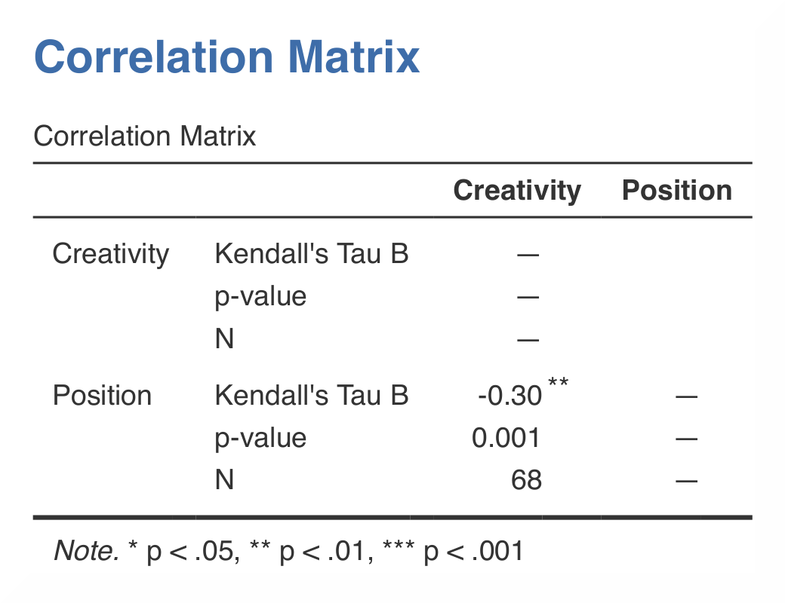

.. sectionauthor:: Rebecca Vederhus, `Sebastian Jentschke <https://www.uib.no/en/persons/Sebastian.Jentschke>`_

================================
From SPSS to jamovi: Correlation
================================

This comparison shows how a Kendall’s tau correlation is conducted in SPSS and jamovi. The SPSS test follows the description in chapter 8.4.4 in `Field (2017)
<https://edge.sagepub.com/field5e>`__, especially output 8.3. It uses the data set **The Biggest Liar.sav** which can be downloaded from the `web page
accompanying the book <https://edge.sagepub.com/field5e/student-resources/datasets>`__.

+-------------------------------------------------------------------------------+-------------------------------------------------------------------------------+
| **SPSS**                                                                      | **jamovi**                                                                    |
+===============================================================================+===============================================================================+
| In SPSS you can run a correlation using: ``Analyze`` → ``Correlate`` →        | In jamovi you do this using: ``Analyses`` → ``Regression`` → ``Correlation    |
| ``Bivariate``.                                                                | Matrix``.                                                                     |
+-------------------------------------------------------------------------------+-------------------------------------------------------------------------------+
| |SPSS_Menu_corr3|                                                             | |jamovi_Menu_corr3|                                                           |
+-------------------------------------------------------------------------------+-------------------------------------------------------------------------------+
| In SPSS, move the variables ``Creativity`` and ``Position`` to the variable   | In jamovi, move the variables ``Creativity`` and ``Position`` into the box on |
| box ``Variables``. Then, tick ``Kendall’s tau-b`` under ``Correlation         | the right. Tick ``Kendall’s tau-b`` under ``Correlation Coefficients`` and    |
| Coefficients``.                                                               | ``Report significance``, ``Flag significant correlations`` and ``N`` under    |
|                                                                               | ``Additional Options``.                                                       |
+-------------------------------------------------------------------------------+-------------------------------------------------------------------------------+
| |SPSS_Input_corr3|                                                            | |jamovi_Input_corr3|                                                          |
+-------------------------------------------------------------------------------+-------------------------------------------------------------------------------+
| The results in SPSS and jamovi are identical.                                                                                                                 |
+-------------------------------------------------------------------------------+-------------------------------------------------------------------------------+
| |SPSS_Output_corr3|                                                           | |jamovi_Output_corr3|                                                         |
+-------------------------------------------------------------------------------+-------------------------------------------------------------------------------+
| In SPSS, you can tell if a correlation is significant by noting the amount of | jamovi, in accordance with APA-style, flags significant correlations using    |
| asterisks after the correlation coefficient. The correlation matrix shows the | one (p < .05), two (p < .01) or three (p < .001) asterisks. In contrast, in   |
| correlation coefficient, the p-value, and the sample size (N).                | SPSS all correlations above p < .01 level are simply marked using two instead |
|                                                                               | of three asterisks.                                                           |
+-------------------------------------------------------------------------------+-------------------------------------------------------------------------------+
| The correlation coefficient is found both underneath and over the diagonal in SPSS, while in jamovi the coefficient is only shown underneath. The numerical   |
| values for the statistics are the same: *r* = -.30, *p* < .01.                                                                                                |
+-------------------------------------------------------------------------------+-------------------------------------------------------------------------------+
| If one wishes to use syntax for running those analyses, this can be done using the following commands (in jamovi with just copying to code below to  `Rj      |
| <Rj_overview.html>`__).                                                                                                                                       |
+-------------------------------------------------------------------------------+-------------------------------------------------------------------------------+
| .. code-block:: none                                                          | .. code-block:: none                                                          |
|                                                                               |                                                                               |   
|    NONPAR CORR                                                                |    jmv::corrMatrix(                                                           |
|      /VARIABLES=Creativity Position                                           |        data = data,                                                           |
|      /PRINT=KENDALL TWOTAIL NOSIG FULL                                        |        vars = vars(Creativity, Position),                                     | 
|      /MISSING=PAIRWISE.                                                       |        pearson = FALSE,                                                       |
|                                                                               |        kendall = TRUE,                                                        |
|                                                                               |        flag = TRUE,                                                           |
|                                                                               |        n = TRUE)                                                              |
+-------------------------------------------------------------------------------+-------------------------------------------------------------------------------+

| **References**
| Field, A. (2017). *Discovering statistics using IBM SPSS statistics* (5th ed.). SAGE Publications. https://edge.sagepub.com/field5e

.. ---------------------------------------------------------------------

