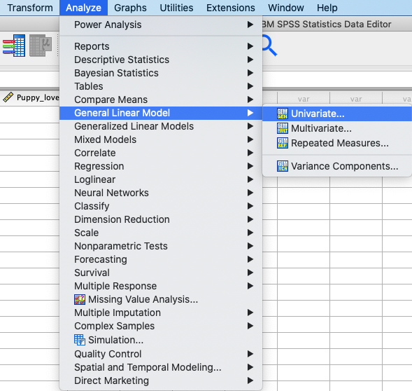
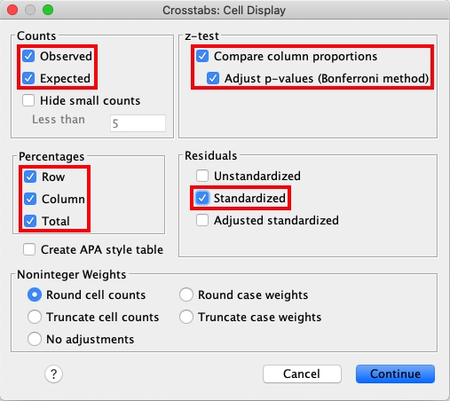

.. sectionauthor:: Rebecca Vederhus, `Sebastian Jentschke <https://www.uib.no/en/persons/Sebastian.Jentschke>`_

============================================
From SPSS to jamovi: Analysis of frequencies
============================================

This comparison shows how a Chi-square test is conducted in SPSS and jamovi. The SPSS test follows the description in chapters 19.7.2-19.7.3 in `Field (2017)
<https://edge.sagepub.com/field5e>`__, especially figures 19.4-19.5 and output 19.2-19.4. It uses the data set **Cats Weight.sav** which can be downloaded from
the `web page accompanying the book <https://edge.sagepub.com/field5e/student-resources/datasets>`__.

+-------------------------------------------------------------------------------+-------------------------------------------------------------------------------+
| **SPSS**                                                                      | **jamovi**                                                                    |
+===============================================================================+===============================================================================+
| In SPSS, you run a chi-square test using : ``Analyze`` → ``Descriptive        | In jamovi, this can be done using: ``Analyses`` → ``Frequencies`` →           |
| Statistics`` → ``Crosstabs``. Before this, you can weight cases by following  | ``Independent Samples – χ² test of association``.                             |
| these steps: ``Data`` → ``Weight Cases``.                                     |                                                                               |
+-------------------------------------------------------------------------------+-------------------------------------------------------------------------------+
| |SPSS_Menu_chi-square_1|                                                      | |jamovi_Menu_chi-square|                                                      |
| |SPSS_Menu_chi-square_2|                                                      |                                                                               |
+-------------------------------------------------------------------------------+-------------------------------------------------------------------------------+
| In the ``Weight Cases`` window, click ``Weight cases by`` and move            | In jamovi, move ``Training`` to ``Rows``, ``Dance`` to ``Columns``, and       |
| ``Frequency`` to the box called ``Frequency Variable``.                       | ``Frequency`` to ``Counts (optional)``.                                       |
+-------------------------------------------------------------------------------+-------------------------------------------------------------------------------+
| |SPSS_Input_chi-square_1|                                                     | |jamovi_Input_chi-square_1|                                                   |
+-------------------------------------------------------------------------------+-------------------------------------------------------------------------------+
| In SPSS, move the ``Training`` variable to the ``Row(s)`` box and the         | Open the ``Statistics`` window and tick the boxes for: ``χ²``, ``continuity   |
| ``Dance`` variable to the variable box ``Column(s)``.                         | correction``, ``Likelihood ratio``, ``Fisher’s exact test``, ``Confidence     |
|                                                                               | intervals``, ``Contingency coefficient`` and ``Phi and Cramer’s V``.          |
+-------------------------------------------------------------------------------+-------------------------------------------------------------------------------+
| |SPSS_Input_chi-square_2|                                                     | |jamovi_Input_chi-square_2|                                                   |
+-------------------------------------------------------------------------------+-------------------------------------------------------------------------------+
| Open the ``Statistics`` window and check the boxes for ``Chi-square``,        | In the window for ``Cells``, tick all the boxes.                              |
| ``Contingency coefficient``, ``Phi and Cramer’s V`` and ``Lambda``.           |                                                                               |
+-------------------------------------------------------------------------------+-------------------------------------------------------------------------------+
| |SPSS_Input_chi-square_3|                                                     | |jamovi_Input_chi-square_3|                                                   |
+-------------------------------------------------------------------------------+-------------------------------------------------------------------------------+
| Access ``Cells`` from the main menu, and tick the boxes as shown in the       |                                                                               |
| picture below.                                                                |                                                                               |
+-------------------------------------------------------------------------------+-------------------------------------------------------------------------------+
| |SPSS_Input_chi-square_4|                                                     |                                                                               |
+-------------------------------------------------------------------------------+-------------------------------------------------------------------------------+
| Lastly, open the window for ``Exact`` and click ``Exact`` and ``Time limit    |                                                                               |
| per test: 5 minutes``.                                                        |                                                                               |
+-------------------------------------------------------------------------------+-------------------------------------------------------------------------------+
| |SPSS_Input_chi-square_5|                                                     |                                                                               |
+-------------------------------------------------------------------------------+-------------------------------------------------------------------------------+
| When comparing the output from SPSS and jamovi, the results are exactly the same, although in jamovi they are much clearer and therefore easier to interpret. |
+-------------------------------------------------------------------------------+-------------------------------------------------------------------------------+
| |SPSS_Output_chi-square_1|                                                    | |jamovi_Output_chi-square|                                                    |
| |SPSS_Output_chi-square_2|                                                    |                                                                               |
| |SPSS_Output_chi-square_3|                                                    |                                                                               |
+-------------------------------------------------------------------------------+-------------------------------------------------------------------------------+
| In SPSS, the ``Crosstabulation`` table shows the amount of cases that can be  | The contingency table in jamovi contains all the same values as in SPSS,      |
| categorized into each combination. We can see the amount of cats that danced, | except for ``Standardized Residual``. In jamovi, the chi-square tests are     |
| and how many of these were rewarded with food or affection. In the            | presented in the table called ``χ² Tests``. In contrast to SPSS, this table   |
| ``Chi-Square Tests`` table, you can find the statistic of the chi-square and  | does not include columns for ``Exact Sig. (2-sided)``, ``Exact Sig.           |
| the significance level of this value. Degrees of freedom are also presented   | (1-sided)`` and ``Point Probability``, or a row for ``Linear-by-Linear        |
| in this table. The measures of association is presented in the ``Symmetric    | Association``. You can find the measures of association in the ``Nominal``    |
| Measures`` table. By looking at these values, you can find an estimate of the | table. Values for ``Approximate Significance`` and ``Exact Significance``     |
| effect size.                                                                  | are not included in jamovi.                                                   |
+-------------------------------------------------------------------------------+-------------------------------------------------------------------------------+
| The only difference between the outputs in SPSS and jamovi is that SPSS produces ``Case Processing Summary`` and ``Directional Measures`` tables.             |
|                                                                                                                                                               |
| The numerical values for the statistics are the same: *χ²* (1, *N* = 200) = 25.36, *p* < .001.                                                                |
+-------------------------------------------------------------------------------+-------------------------------------------------------------------------------+
| If one wishes to use syntax for running those analyses, this can be done using the following commands (in jamovi with just copying to code below to  `Rj      |
| <Rj_overview.html>`__).                                                                                                                                       |
+-------------------------------------------------------------------------------+-------------------------------------------------------------------------------+
| .. code-block:: none                                                          | .. code-block:: none                                                          |
|                                                                               |                                                                               |   
|    WEIGHT BY Frequency.                                                       |    jmv::contTables(                                                           |
|    CROSSTABS                                                                  |        formula = Frequency ~ Training:Dance,                                  |
|      /TABLES=Training BY Dance                                                |        data = data,                                                           |
|      /FORMAT=AVALUE TABLES                                                    |        chiSqCorr = TRUE,                                                      |
|      /STATISTICS=CHISQ CC PHI LAMBDA                                          |        likeRat = TRUE,                                                        |
|      /CELLS=COUNT EXPECTED ROW COLUMN TOTAL SRESID BPROP                      |        fisher = TRUE,                                                         |
|      /COUNT ROUND CELL                                                        |        contCoef = TRUE,                                                       |
|      /METHOD=EXACT TIMER(5).                                                  |        phiCra = TRUE,                                                         |
|                                                                               |        exp = TRUE,                                                            |
|                                                                               |        pcRow = TRUE,                                                          |
|                                                                               |        pcCol = TRUE,                                                          |
|                                                                               |        pcTot = TRUE)                                                          |
+-------------------------------------------------------------------------------+-------------------------------------------------------------------------------+

.. toctree::
   :hidden:

   s2j_frequencies2

| **References**
| Field, A. (2017). *Discovering statistics using IBM SPSS statistics* (5th ed.). SAGE Publications. https://edge.sagepub.com/field5e

.. ---------------------------------------------------------------------

