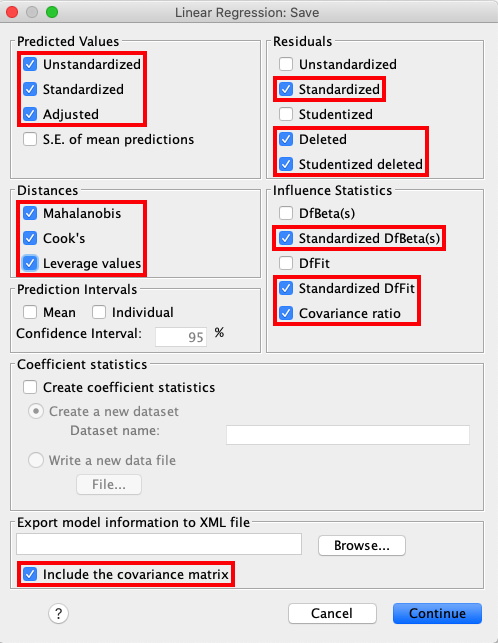
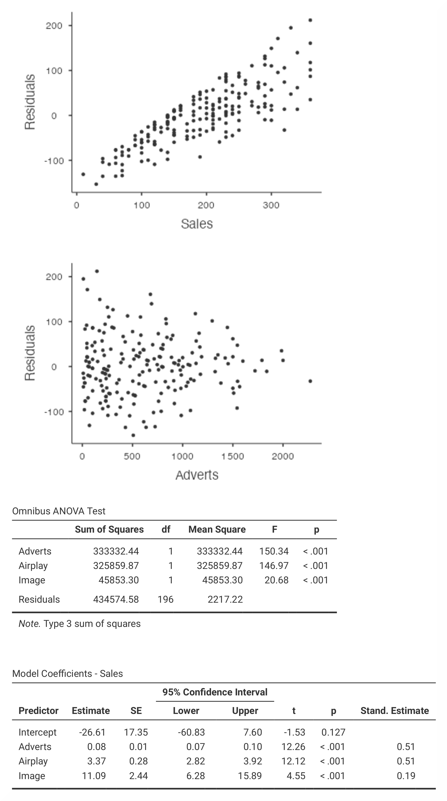

.. sectionauthor:: Rebecca Vederhus, `Sebastian Jentschke <https://www.uib.no/en/persons/Sebastian.Jentschke>`_

======================================
From SPSS to jamovi: Linear regression 
======================================

This comparison shows how a linear model with several predictors is conducted in SPSS and jamovi. The SPSS test follows the description in chapter 9.10-9.11 in
`Field (2017) <https://edge.sagepub.com/field5e>`__, especially figure 9.15-9.19 and 9.22-9.23 as well as output 9.5-9.12. It uses the data set
**Album Sales.sav** which can be downloaded from the `web page accompanying the book <https://edge.sagepub.com/field5e/student-resources/datasets>`__.

+-------------------------------------------------------------------------------+-------------------------------------------------------------------------------+
| **SPSS**                                                                      | **jamovi**                                                                    |
+===============================================================================+===============================================================================+
| In SPSS, the following steps activates a linear regression: ``Analyze`` →     | In jamovi, this can be done using: ``Analyses`` → ``Regression`` → ``Linear   |
| ``Regression`` → ``Linear``.                                                  | Regression``.                                                                 |
+-------------------------------------------------------------------------------+-------------------------------------------------------------------------------+
| |SPSS_Menu_linReg2|                                                           | |jamovi_Menu_linReg2|                                                         |
+-------------------------------------------------------------------------------+-------------------------------------------------------------------------------+
| Move the variable ``Sales`` to the variable box ``Dependent`` and the         | Move ``Sales`` to the ``Dependent Variable`` box, and the variables           |
| variable ``Adverts`` to the variable box ``Independent(s)``.                  | ``Adverts``, ``Airplay`` and ``Image`` to the box called ``Covariates``.      |
+-------------------------------------------------------------------------------+-------------------------------------------------------------------------------+
| |SPSS_Input_linReg2_1|                                                        | |jamovi_Input_linReg2_1|                                                      |
+-------------------------------------------------------------------------------+-------------------------------------------------------------------------------+
| Press ``Next`` to create a new block, and add the variables ``Airplay`` and   | In the ``Model Builder`` window, create a new block by clicking ``+ Add New   |
| ``Image`` to this ``Independent(s)`` box.                                     | Block`` and move the variables ``Airplay`` and ``Image`` to ``Block 2``.      |
+-------------------------------------------------------------------------------+-------------------------------------------------------------------------------+
| |SPSS_Input_linReg2_2|                                                        | |jamovi_Input_linReg2_2|                                                      |
+-------------------------------------------------------------------------------+-------------------------------------------------------------------------------+
| In the ``Statistics`` dialog box, select the options shown in the picture     | Under ``Assumption Checks`` click ``Collinearity statistics``, ``Q-Q plot of  |
| below.                                                                        | residuals``, ``Residuals plots`` and ``Cook’s distance``.                     |
+-------------------------------------------------------------------------------+-------------------------------------------------------------------------------+
| |SPSS_Input_linReg2_3|                                                        | |jamovi_Input_linReg2_3|                                                      |
+-------------------------------------------------------------------------------+-------------------------------------------------------------------------------+
| From the main menu, open the ``Plots`` window and assign ``\*ZRESID`` to the  | Open the ``Model Fit`` window and choose ``R``, ``R²`` and ``Adjusted R²``.   |
| to the box labelled ``Y`` and ``\*ZPRED`` to the box labelled ``X``. In       |                                                                               |
| addition, select the options ``Histogram``, ``Normal probability plot`` and   |                                                                               |
| ``Produce all partial plots``.                                                |                                                                               |
+-------------------------------------------------------------------------------+-------------------------------------------------------------------------------+
| |SPSS_Input_linReg2_4|                                                        | |jamovi_Input_linReg2_4|                                                      |
+-------------------------------------------------------------------------------+-------------------------------------------------------------------------------+
| Open the `Save`` window from the main menu and select the same options as     | In the ``Model Coefficients`` window, click ``ANOVA test``, ``Confidence      |
| seen in the picture below.                                                    | interval`` and ``Standardized estimate``.                                     |
+-------------------------------------------------------------------------------+-------------------------------------------------------------------------------+
| |SPSS_Input_linReg2_5|                                                        | |jamovi_Input_linReg2_5|                                                      |
+-------------------------------------------------------------------------------+-------------------------------------------------------------------------------+
| Lastly, activate the dialog box for ``Options`` and select ``Use probability  |                                                                               |
| for F``, ``Include constant in equation`` and ``Exclude cases listwise``.     |                                                                               |
+-------------------------------------------------------------------------------+-------------------------------------------------------------------------------+
| |SPSS_Input_linReg2_6|                                                        |                                                                               |
+-------------------------------------------------------------------------------+-------------------------------------------------------------------------------+
| The results are essentially the same in SPSS and in jamovi, although they are found in slightly different places. Also, jamovi does not provide all of the    |
| information that can be found in the SPSS output.                                                                                                             |
+-------------------------------------------------------------------------------+-------------------------------------------------------------------------------+
| |SPSS_Output_linReg2_1| |SPSS_Output_linReg2_2|                               | |jamovi_Output_linReg2_1| |jamovi_Output_linReg2_2|                           |
|                                                                               |                                                                               |
| |SPSS_Output_linReg2_3|                                                       | |jamovi_Output_linReg2_3|                                                     |
|                                                                               |                                                                               |
| |SPSS_Output_linReg2_4|                                                       | |jamovi_Output_linReg2_4|                                                     |
|                                                                               |                                                                               |
| |SPSS_Output_linReg2_5|                                                       | |jamovi_Output_linReg2_5|                                                     |
|                                                                               |                                                                               |
| |SPSS_Output_linReg2_6|                                                       | |jamovi_Output_linReg2_6|                                                     |
|                                                                               |                                                                               |
| |SPSS_Output_linReg2_7|                                                       |                                                                               |
|                                                                               |                                                                               |
| |SPSS_Output_linReg2_8|                                                       |                                                                               |
|                                                                               |                                                                               |
| |SPSS_Output_linReg2_9|                                                       |                                                                               |
|                                                                               |                                                                               |
+-------------------------------------------------------------------------------+-------------------------------------------------------------------------------+
| In the Model Summary, you can see the summary statistics for model 1, where   | In jamovi, the *R*²-value is found in the Model Fit Measures table and the    |
| the only predictor is advertising budget, as well as for model 2, in which    | beta values are found in the Model Coefficients – Sales table. The ANOVA and  |
| all three predictors are used. The *R*²-value of 0.66 in model 2 tells us     | Coefficients tables for model 1 and 2 are found in separate tables, whereas   |
| that advertising budgets, image and airplay together accounts for 66.5% of    | in SPSS both models are presented in the same tables. Also, the Model Summary |
| the variance in album sales. The standardised beta values (*β*) indicate what | is divided into two different tables in jamovi – Model Fit Measures and Model |
| happens to the outcome if one predictor changes by one standard deviation.    | Comparisons.                                                                  |
| The beta values for all the variables are easily comparable (*β* = 0.51, *β*  |                                                                               |
| = 0.51 and *β* = 0.19) because they are almost the same. According to the     |                                                                               |
| results, the overall sales will increase by 0.512 standard deviations if the  |                                                                               |
| number of radio plays the week before the release date increase by 1 standard |                                                                               |
| deviation (12.27). Significance levels for all beta values are also important |                                                                               |
| to note.                                                                      |                                                                               |
+-------------------------------------------------------------------------------+-------------------------------------------------------------------------------+
| When doing a linear regression analysis, SPSS produces several output tables that are not produced in jamovi. For instance, jamovi does not provide tables    |
| for Descriptive Statistics, Correlations, Casewise Diagnostics and Residuals Statistics. However, jamovi does provide tables for Model Summary, ANOVA and     |
| Coefficients, which show the most important findings from the regression. Furthermore, jamovi does not produce an *F*-statistic for model 2 or a Std. Error   |
| of the Estimate.                                                                                                                                              |
| Similar to the analysis on the previous page, the numerical outputs for the current analysis are identical: *R* = 0.82, *R*²* = 0.66; *β* = 0.51, *p* < .001; |
| *β* = 0.51, *p* < .001; *β* = 0.19, *p* < .001.                                                                                                               |
+---------------------------------------------------------------------------------------------------------------------------------------------------------------+
| If one wishes to use syntax for running those analyses, this can be done using the following commands (in jamovi with just copying to code below to  `Rj      |
| <Rj_overview.html>`__).                                                                                                                                       |
+-------------------------------------------------------------------------------+-------------------------------------------------------------------------------+
| .. code-block:: none                                                          | .. code-block:: none                                                          |
|                                                                               |                                                                               |   
|    REGRESSION                                                                 |    jmv::linReg(                                                               |
|      /DESCRIPTIVES MEAN STDDEV CORR SIG N                                     |        data = data,                                                           |
|      /MISSING LISTWISE                                                        |        dep = Sales,                                                           |
|      /STATISTICS COEFF OUTS CI(95) R ANOVA COLLIN TOL CHANGE ZPP              |        covs = vars(Adverts, Airplay, Image),                                  |
|      /CRITERIA=PIN(.05) POUT(.10)                                             |        blocks = list(                                                         |
|      /NOORIGIN                                                                |            list("Adverts"),                                                   |
|      /DEPENDENT Sales                                                         |            list("Airplay", "Image")),                                         |
|      /METHOD=ENTER Adverts                                                    |        refLevels = list(),                                                    |
|      /METHOD=ENTER Airplay Image                                              |        r2Adj = TRUE,                                                          |
|      /PARTIALPLOT ALL                                                         |        anova = TRUE,                                                          |
|      /SCATTERPLOT=(\*ZRESID ,\*ZPRED)                                         |        ci = TRUE,                                                             |
|      /RESIDUALS HISTOGRAM(ZRESID) NORMPROB(ZRESID)                            |        stdEst = TRUE,                                                         |
|      /CASEWISE PLOT(ZRESID) OUTLIERS(2)                                       |        qqPlot = TRUE,                                                         |
|      /SAVE PRED ZPRED ADJPRED MAHAL COOK LEVER ZRESID DRESID SDRESID SDBETA   |        resPlots = TRUE,                                                       |
|         SD FIT COVRATIO.                                                      |        collin = TRUE,                                                         |
|                                                                               |        cooks = TRUE)                                                          |
|                                                                               |                                                                               |   
+-------------------------------------------------------------------------------+-------------------------------------------------------------------------------+

| **References**
| Field, A. (2017). *Discovering statistics using IBM SPSS statistics* (5th ed.). SAGE Publications. https://edge.sagepub.com/field5e

.. ---------------------------------------------------------------------

