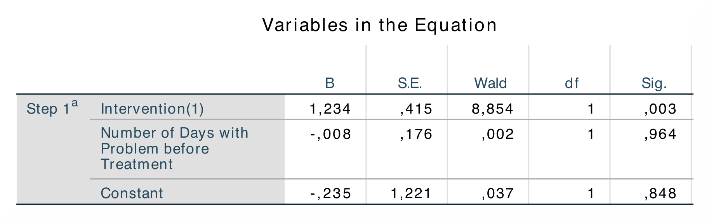
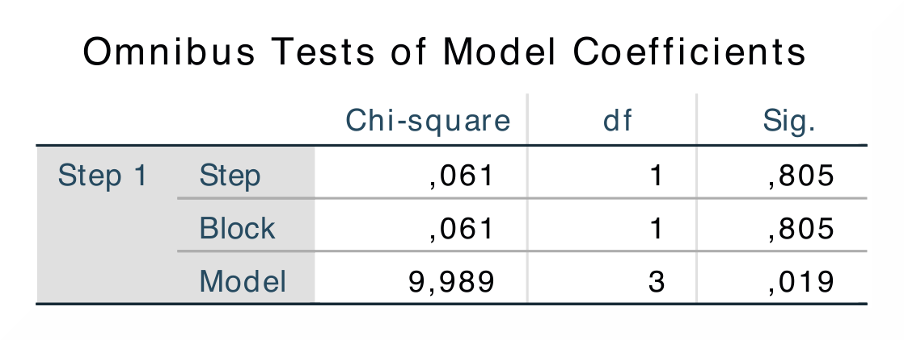
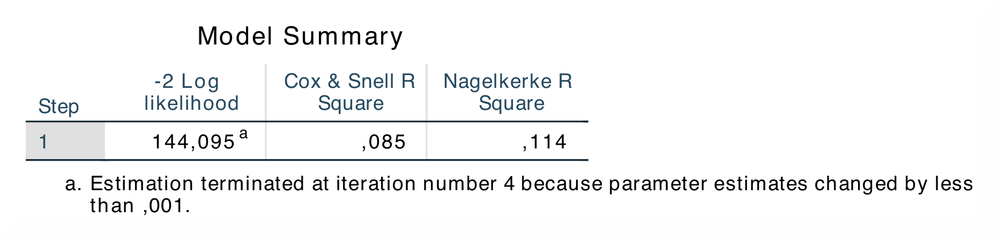
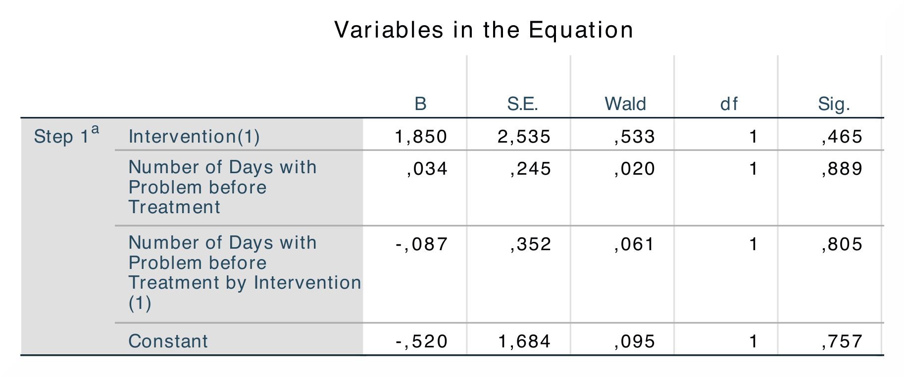

.. sectionauthor:: Rebecca Vederhus, `Sebastian Jentschke <https://www.uib.no/en/persons/Sebastian.Jentschke>`_

========================================
From SPSS to jamovi: Logistic Regression 
========================================

This comparison shows how a binary logistic regression is conducted in SPSS and jamovi. The SPSS test follows the description in chapter 20.5 - 20.6 in `Field
(2017) <https://edge.sagepub.com/field5e>`__, especially figure 20.7 - 20.10 and output 20.1 - 20.5 (bootstrap excluded). It uses the data file **Eel.sav**
which can be downloaded from the `web page accompanying the book <https://edge.sagepub.com/field5e/student-resources/datasets>`__.

+-------------------------------------------------------------------------------+-------------------------------------------------------------------------------+
| **SPSS**                                                                      | **jamovi**                                                                    |
+===============================================================================+===============================================================================+
| In SPSS you can run a binary logistic regression using: ``Analyze`` →         | In jamovi you do this using: ``Analyses`` → ``Regression`` → ``2 Outcomes     |
| ``Regression`` → ``Binary Logistic``.                                         | Binominal``.                                                                  |
+-------------------------------------------------------------------------------+-------------------------------------------------------------------------------+
| |SPSS_Menu_logReg1|                                                           | |jamovi_Menu_logReg1|                                                         |
+-------------------------------------------------------------------------------+-------------------------------------------------------------------------------+
| In SPSS, move ``Cured`` to the ``Dependent`` variable box and                 | In jamovi, move the variable ``Cured`` to ``Dependent Variable`` and the      |
| ``Intervention`` to the ``Covariates`` variable box.                          | variables ``Duration`` and ``Intervention`` to ``Covariates``.                |
+-------------------------------------------------------------------------------+-------------------------------------------------------------------------------+
| |SPSS_Input_logReg1_1|                                                        | |jamovi_Input_logReg1_1|                                                      |
+-------------------------------------------------------------------------------+-------------------------------------------------------------------------------+
| Click ``Next`` and add ``Duration`` to this new block.                        | Create two new blocks by clicking ``+ Add New Block`` in the ``Model          |
|                                                                               | Builder`` drop-down menu. Add the ``Duration`` variable to ``Block 2``, and   |
|                                                                               | add ``Duration`` and ``Intervention`` to ``Block 3`` by marking them both and |
|                                                                               | clicking ``Interaction`` in the drop-down menu.                               |
+-------------------------------------------------------------------------------+-------------------------------------------------------------------------------+
| |SPSS_Input_logReg1_2|                                                        | |jamovi_Input_logReg1_2|                                                      |
+-------------------------------------------------------------------------------+-------------------------------------------------------------------------------+
| Create a third block by clicking ``Next`` one more time, and create an        |                                                                               |
| interaction by marking both ``Intervention`` and ``Duration`` and moving      |                                                                               |
| them to the block by pressing the arrow.                                      |                                                                               |
+-------------------------------------------------------------------------------+-------------------------------------------------------------------------------+
| |SPSS_Input_logReg1_3|                                                        | |jamovi_Input_logReg1_3|                                                      |
+-------------------------------------------------------------------------------+-------------------------------------------------------------------------------+
| Access the ``Categorical`` window and open the drop-down menu for             |                                                                               |
| ``Contrast``. Here, choose ``Indicator`` and then check ``First`` as the      |                                                                               |
| ``Reference Category``. Click ``Change``.                                     |                                                                               |
+-------------------------------------------------------------------------------+-------------------------------------------------------------------------------+
| |SPSS_Input_logReg1_4|                                                        |                                                                               |
+-------------------------------------------------------------------------------+-------------------------------------------------------------------------------+
| Open the ``Save`` window and check the boxes as shown in the picture below    | In the ``Model Fit`` window, check the boxes for ``Deviance``, ``AIC``,       |
|                                                                               | ``McFadden's R²``, ``Cox & Snell's R²`` and ``Nagelkerke's R²``.              | 
+-------------------------------------------------------------------------------+-------------------------------------------------------------------------------+
| |SPSS_Input_logReg1_5|                                                        |                                                                               |
+-------------------------------------------------------------------------------+-------------------------------------------------------------------------------+
| Lastly, check the following boxes in the ``Options`` window:                  |                                                                               |
+-------------------------------------------------------------------------------+-------------------------------------------------------------------------------+
| |SPSS_Input_logReg1_6|                                                        |                                                                               |
+-------------------------------------------------------------------------------+-------------------------------------------------------------------------------+
| If you compare the output from SPSS and jamovi, the results are essentially the same. However, the results from jamovi are presented on one page, while the   |
| SPSS results are much more extensive (likely to the more comprehensive choice of options, according to Field, 2017).                                          |
+-------------------------------------------------------------------------------+-------------------------------------------------------------------------------+
| |SPSS_Output_logReg1_1| |SPSS_Output_logReg1_2|                               | |jamovi_Output_logReg1|                                                       |
+-------------------------------------------------------------------------------+                                                                               |
| |SPSS_Output_logReg1_3|                                                       |                                                                               |
+-------------------------------------------------------------------------------+                                                                               |
| |SPSS_Output_logReg1_4|                                                       |                                                                               |
+-------------------------------------------------------------------------------+                                                                               |
| |SPSS_Output_logReg1_5|                                                       |                                                                               |
+-------------------------------------------------------------------------------+                                                                               |
| |SPSS_Output_logReg1_6|                                                       |                                                                               |
+-------------------------------------------------------------------------------+                                                                               |
| |SPSS_Output_logReg1_7|                                                       |                                                                               |
+-------------------------------------------------------------------------------+-------------------------------------------------------------------------------+
| In the output from SPSS you can find tables for ``Model Summary``,            | In jamovi, -2LL values, Cox & Snell R² and Nagelkerke R² values for all the   |
| ``Variables in the Equation`` and ``Omnibus Tests of Model Coefficients`` for | predictors are found in the table called ``Model Fit Measures``. χ²-values,   |
| each of the predictors in the model. The ``Model Summary`` tables shows the   | degrees of freedom and significance levels are found in the ``Model           |
| -2LL value for the model, as well as Cox & Snell R² and Nagelkerke R². In the | Comparisons`` table. In addition, *b*-values, *SE*-values, and significance   |
| ``Omnibus Tests of Model Coefficients`` tables, χ²-values, degrees of freedom | levels are shown in three separate tables (one for each model in the          |
| and significance values are found. Lastly, you can find *b*-values,           | analysis).                                                                    |
| *SE*-values, degrees of freedom and significance values in the ``Variables in |                                                                               |
| the Equation`` table. This table also shows the odds ratio.                   |                                                                               |
+-------------------------------------------------------------------------------+-------------------------------------------------------------------------------+
| | SPSS produces a lot more output tables than jamovi, but this is likely due to Field (2017) asking for more options than those available in jamovi.          |
| | The numerical values for the statistic are the same: χ² = 0.002, *p* = 0.964; χ² = 0.061, *p* = 0.805.                                                      |
+-------------------------------------------------------------------------------+-------------------------------------------------------------------------------+
| If you want to use syntax for running these analyses, this can be done using the following commands (in jamovi, copy the code to `Rj <Rj_overview.html>`__).  |
+-------------------------------------------------------------------------------+-------------------------------------------------------------------------------+
| .. code-block:: none                                                          | .. code-block:: none                                                          |
|                                                                               |                                                                               |   
|    LOGISTIC REGRESSION VARIABLES Cured                                        |    jmv::logRegBin(                                                            |
|       /METHOD=ENTER Intervention                                              |        data = data,                                                           |
|       /METHOD=ENTER Duration                                                  |        dep = Cured,                                                           |
|       /METHOD=ENTER Duration * Intervention                                   |        covs = vars(Duration, Intervention),                                   |
|       /CONTRAST (Intervention)=Indicator(1)                                   |        blocks = list(list("Intervention"),                                    |
|       /SAVE=PRED PGROUP COOK LEVER DFBETA ZRESID                              |                      list("Duration"),                                        |
|       /CLASSPLOT                                                              |                      list(c("Duration", "Intervention"))),                    |
|       /CASEWISE OUTLIER(2)                                                    |        refLevels = list(list(var="Cured", ref="Not Cured")),                  |
|       /PRINT=GOODFIT ITER(1) CI(95)                                           |        pseudoR2 = c("r2mf", "r2cs", "r2n"))                                   |
|       /CRITERIA=PIN(0.05) POUT(0.10) ITERATE(20) CUT(0.5).                    |                                                                               |
+-------------------------------------------------------------------------------+-------------------------------------------------------------------------------+

| **References**
| Field, A. (2017). *Discovering statistics using IBM SPSS statistics* (5th ed.). SAGE Publications. https://edge.sagepub.com/field5e

.. ---------------------------------------------------------------------

.. |SPSS_Menu_logReg1|                 image:: ../_images/s2j_SPSS_Menu_logReg1.png
.. |jamovi_Menu_logReg1|               image:: ../_images/s2j_jamovi_Menu_logReg1.png
.. |SPSS_Input_logReg1_1|              image:: ../_images/s2j_SPSS_Input_logReg1_1.png
.. |SPSS_Input_logReg1_2|              image:: ../_images/s2j_SPSS_Input_logReg1_2.png
.. |SPSS_Input_logReg1_3|              image:: ../_images/s2j_SPSS_Input_logReg1_3.png
.. |SPSS_Input_logReg1_4|              image:: ../_images/s2j_SPSS_Input_logReg1_4.png
.. |SPSS_Input_logReg1_5|              image:: ../_images/s2j_SPSS_Input_logReg1_5.png
.. |SPSS_Input_logReg1_6|              image:: ../_images/s2j_SPSS_Input_logReg1_6.png
.. |jamovi_Input_logReg1_1|            image:: ../_images/s2j_jamovi_Input_logReg1_1.png
.. |jamovi_Input_logReg1_2|            image:: ../_images/s2j_jamovi_Input_logReg1_2.png
.. |jamovi_Input_logReg1_3|            image:: ../_images/s2j_jamovi_Input_logReg1_3.png
.. |SPSS_Output_logReg1_1|             image:: ../_images/s2j_SPSS_Output_logReg1_1.png
.. |SPSS_Output_logReg1_2|             image:: ../_images/s2j_SPSS_Output_logReg1_2.png
.. |SPSS_Output_logReg1_3|             image:: ../_images/s2j_SPSS_Output_logReg1_3.png

.. |jamovi_Output_logReg1|             image:: ../_images/s2j_jamovi_Output_logReg1.png
