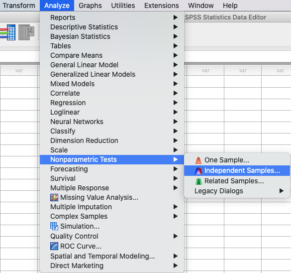

.. sectionauthor:: Rebecca Vederhus, `Sebastian Jentschke <https://www.uib.no/en/persons/Sebastian.Jentschke>`_

============================================
From SPSS to jamovi: Non-parametric analyses
============================================

This comparison shows how a Kruskal-Wallis test is conducted in SPSS and jamovi. The SPSS test follows the description in chapter 7.6.4 in `Field (2017)
<https://edge.sagepub.com/field5e>`__, especially figure 7.13 and output 7.5 - 7.6. It uses the data set **Soya.sav** which can be downloaded from the `web
page accompanying the book <https://edge.sagepub.com/field5e/student-resources/datasets>`__.

+-------------------------------------------------------------------------------+-------------------------------------------------------------------------------+
| **SPSS**                                                                      | **jamovi**                                                                    |
+===============================================================================+===============================================================================+
| In SPSS, a Kruskal-Wallis test can be run using: ``Analyze`` →                | In jamovi this is done using the following steps: ``Analyses`` → ``ANOVA`` →  |
| ``Nonparametric Tests `` → ``Independent Samples``.                           | ``One-Way ANOVA Kruskal-Wallis``.                                             |
+-------------------------------------------------------------------------------+-------------------------------------------------------------------------------+
| |SPSS_Menu_nonParametric3|                                                    | |jamovi_Menu_nonParametric3|                                                  |
+-------------------------------------------------------------------------------+-------------------------------------------------------------------------------+
| In SPSS, choose ``Fields`` from the menu. Then, click ``Use custom field      | In jamovi, move ``Sperm`` to the ``Dependent Variables`` box and ``Soya`` to  |
| assignments`` and move the ``Sperm`` variable to ``Test Fields``, and the     | the ``Grouping Variable`` box. Then, tick the box for ``DSCF pairwise         |
| variable ``Soya`` to ``Groups``.                                              | comparisons``.                                                                |
+-------------------------------------------------------------------------------+-------------------------------------------------------------------------------+
| |SPSS_Input_nonParametric3_1|                                                 | |jamovi_Input_nonParametric3|                                                 |
+-------------------------------------------------------------------------------+-------------------------------------------------------------------------------+
| Open the ``Settings`` window, and click ``Customize tests``. Tick the box for |                                                                               |
| ``Kruskal-Wallis 1-way ANOVA (k samples)``, and use the drop-down menu next   |                                                                               |
| to ``Multiple comparisons`` to select ``All pairwise``.                       |                                                                               |
+-------------------------------------------------------------------------------+-------------------------------------------------------------------------------+
| |SPSS_Input_nonParametric3_2|                                                 |                                                                               |
+-------------------------------------------------------------------------------+-------------------------------------------------------------------------------+
| When comparing the outputs, the results in SPSS and jamovi are slightly different. In addition, the results from jamovi appear much clearer.                  |
+-------------------------------------------------------------------------------+-------------------------------------------------------------------------------+
| |SPSS_Output_nonParametric3_1|                                                | |jamovi_Output_nonParametric3|                                                |
|                                                                               |                                                                               |
| |SPSS_Output_nonParametric3_2|                                                |                                                                               |
|                                                                               |                                                                               |
| |SPSS_Output_nonParametric3_3|                                                |                                                                               |
+-------------------------------------------------------------------------------+-------------------------------------------------------------------------------+
| In SPSS, you have to double-click the summary table to get all of the         | The output in jamovi contains two tables - ``Kruskal-Wallis`` and ``Pairwise  |
| results. The significance value of the test is found both in the summary      | comparisons – Sperm``. The ``Kruskal-Wallis`` table includes all the same     |
| table and in the ``Independent Samples Test View``. You can also find the     | values that are included in the equivalent table in SPSS, except for the      |
| Kruskal-Wallis statistic and the degrees of freedom here.                     | sample number. The pairwise comparison looks quite different than the one in  |
|                                                                               | SPSS, and only includes a *W*-value and a *p*-value.                          |
+-------------------------------------------------------------------------------+-------------------------------------------------------------------------------+
| The ``Pairwise comparisons`` tables differ in SPSS and jamovi, but this is likely due to jamovi using a different method to calculate these values than SPSS. |
| In addition, the results from the Kruskal-Wallis test are presented horizontally in jamovi and vertically in SPSS.                                            |
|                                                                                                                                                               |
| The numerical values from the Kruskal-Wallis test are the same in SPSS and jamovi: *H* = 8.66, *df* = 3, *p* = .034.                                          |
+-------------------------------------------------------------------------------+-------------------------------------------------------------------------------+
| If one wishes to use syntax for running those analyses, this can be done using the following commands (in jamovi with just copying to code below to  `Rj      |
| <Rj_overview.html>`__).                                                                                                                                       |
+-------------------------------------------------------------------------------+-------------------------------------------------------------------------------+
| .. code-block:: none                                                          | .. code-block:: none                                                          |
|                                                                               |                                                                               |   
|    NPTESTS                                                                    |    jmv::anovaNP(                                                              |
|      /INDEPENDENT TEST (Sperm) GROUP (Soya) KRUSKAL\_WALLIS(COMPARE=PAIRWISE) |        formula = Sperm ~ Soya,                                                |
|      /MISSING SCOPE=ANALYSIS USERMISSING=EXCLUDE                              |        data = data,                                                           |
|      /CRITERIA ALPHA=0.05 CILEVEL=95.                                         |        es = TRUE,                                                             |
|                                                                               |        pairs = TRUE)                                                          |
+-------------------------------------------------------------------------------+-------------------------------------------------------------------------------+

| **References**
| Field, A. (2017). *Discovering statistics using IBM SPSS statistics* (5th ed.). SAGE Publications. https://edge.sagepub.com/field5e

.. ---------------------------------------------------------------------

.. |jamovi_Menu_nonParametric3|        image:: ../_images/s2j_jamovi_Menu_ nonParametric3.png
.. |SPSS_Input_nonParametric3_1|       image:: ../_images/s2j_SPSS_Input_ nonParametric3_1.png
.. |SPSS_Input_nonParametric3_2|       image:: ../_images/s2j_SPSS_Input_ nonParametric3_2.png
.. |jamovi_Input_nonParametric3|       image:: ../_images/s2j_jamovi_Input_ nonParametric3.png
.. |SPSS_Output_nonParametric3_1|      image:: ../_images/s2j_SPSS_Output_ nonParametric3_1.png
.. |SPSS_Output_nonParametric3_2|      image:: ../_images/s2j_SPSS_Output_ nonParametric3_2.png
.. |SPSS_Output_nonParametric3_3|      image:: ../_images/s2j_SPSS_Output_ nonParametric3_3.png
.. |jamovi_Output_nonParametric3|      image:: ../_images/s2j_jamovi_Output_ nonParametric3.png
