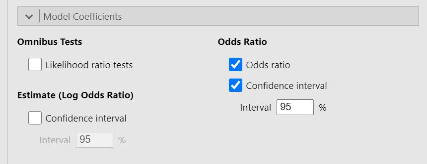

.. sectionauthor:: `Jonas Rafi <https://www.su.se/english/profiles/jora9288-1.283149>`__

===================
Logistic Regression
===================

| How to perform a logistic regression in jamovi:

#. | You need one |nominal| |ordinal| categorical dependent variable (nominal or ordinal), and at least one continuous explanatory variable.
     
   | A correct setup should look similar to this:
   
   |data_format_regression_logistic|
   
   | 

#. | Logistic regression can be found by selecting ``Analyses`` → ``Regression``. If the outcome variable is nominal (as in the above image), select
     ``2 Outcomes`` if it has 2 steps / different values, or ``N outcomes`` if it has *more* than 2 steps. If the outcome variable is ordinal (e.g., low,
     medium, high), select ``Ordinal Outcomes``.

   |select_regression_logistic|

   | 

#. | Drag and drop your dependent variable to ``Dependent Variable`` and your predictor to ``Covariates``.

   |add_var_regression_logistic|

   | 

#. | Scroll down to the ``Model Coefficients`` drop-down-menu and check the options ``Odds ratio`` and ``Confidence interval``.

   |options_regression_logistic|

#. | The result is shown in the right panel:

   |output_regression_logistic|

   |

.. admonition:: Further help from the community resources
   
   | A little more comprehensive introduction into this statistical method is provided by this two videos, explaining logistic regression with `two levels
     <https://www.youtube.com/embed/s7GL0z-3ymA?list=PLkk92zzyru5OAtc_ItUubaSSq6S_TGfRn>`__ (to predict, e.g., gender or clinical vs. control group) and with
     `more than two levels <https://www.youtube.com/embed/nuyEUEBf-GQ?list=PLkk92zzyru5OAtc_ItUubaSSq6S_TGfRn>`__ (to predict, e.g., food preferences: fast
     food, healthy food, high protein food, vegan food, etc.).
     
|

.. ---------------------------------------------------------------------

.. |nominal|                           image:: ../_images/variable-nominal.*
   :width: 16px
.. |ordinal|                           image:: ../_images/variable-ordinal.*
   :width: 16px
.. |continuous|                        image:: ../_images/variable-continuous.*
   :width: 16px
.. |data_format_regression_logistic|   image:: ../_images/jg_data_format_regression_logistic.jpg
   :width: 25%
.. |select_regression_logistic|        image:: ../_images/jg_select_regression_logistic.jpg
   :width: 40% 
.. |add_var_regression_logistic|       image:: ../_images/jg_add_var_regression_logistic.jpg
   :width: 70%

.. |output_regression_logistic|        image:: ../_images/jg_output_regression_logistic.jpg
   :width: 50%
