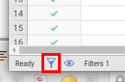
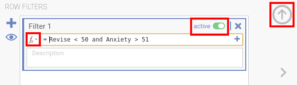
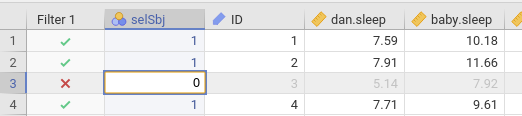
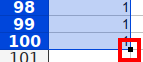
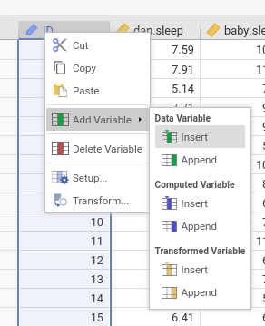

.. sectionauthor:: `Sebastian Jentschke <https://www.uib.no/en/persons/Sebastian.Jentschke>`_

===========================================================
How do I create a filter variable and use it for selection?
===========================================================

|Outliers_Filter_Shortcut|

-  | open the “Data” tab and select “Filter” (either by using the symbol in the
     icon bar or the one in the bottom-left corner of the jamovi window)
   | in order to access functions, press the “fx” icon in the filter settings
   | there also is a switch where you can activate or deactivate the filter
     (see the comment in red below)
   | you close the filter settings by pressing the arrow in the top-right
     corner

-  | there are three large approaches, to exclude outliers:
     (1) based upon z-scores (the absolute value should be larger 3.3; this
         equals to a probability of 0.1% = 1 / 1000)
     (2) based upon the IQR (like in a box plot)
     (3) based on the Mahalanobis distance (multivariate)

   | for (1), there exists a function in jamovi (see next bullet point), for (2)
     and (3) you have to use R-code (decribed two bullet point below); for (2)
     you could also do it visually (three bullet points below)

-  | you can either use an function-based selection (e.g., based on z-scores)
     .. code-block:: text
     MAXABSZ([VARIABLE1], [VARIABLE2], …)

   |Outliers_Filter_Settings|

-  | you can manually create a select variable and use that (see below)
     .. code-block:: text
     selSbj == 1
   
-  | you can now use with R-scripts to find outliers based upon the 
     `interquartile range <Syntax_Outliers_IQR_R.txt>`__ (doing the same with
     code that you visually do with box plots) and multivariate outliers based
     upon the `Mahalanobis distance <Syntax_Outliers_Mahalanobis_R.txt>`__
   
   | the output from those scripts tells you which lines you should de-select
   | you use the scripts within the `Rj editor <jamovi-module_Rj>`__, just
     copy-and-paste them and run them by hitting the "Play"-button (the
     little green triangle)
   | ..role:: red
     PLEASE NOTE: If you already filtered cases, the lines with filtered cases
     are not included and the line numbers when using the R-scripts get wrong.
     Open the filter settings by either double-clicking on the header line of
     the filter variable or use the symbol in the bottom-left corner of the
     jamovi window (only to see if you selected the tab “Data”) and deactivate
     the filter.
     
-  | the filter conditions can be combined using boolean ``and`` / ``or``
     .. code-block:: text
     MAXABSZ([VARIABLE1], [VARIABLE2], …) < 3.3 and selSbj == 1

-  | you can also de-select cases by setting limits to the values of variables
     (after visually checking the box-plots under “Descriptives”):
     .. code-block:: text
     Revise < 50 and Anxiety > 51

==============================================================================
How do I manually create a variable that I can use for selecting / deselecting
==============================================================================
======
cases?
======

|Outliers_AddVar_selSbj|

-  | open the “Data” tab so that you see your data spreadsheet

-  | go to the first column (if there are filter variables, to the first 
     column after those)

-  | right-click on the header line in that column, choose "Add variable"
     in the menu that opens, and then Data Variable → "Insert"

-  | briefly check how many participants are contained in your file by
     going to the last line of your data set, remember this line number

   |Outliers_ExcelMagic|

-  | now, we have to to a little bit of magic in Excel, LibreOffice Calc or
     `Google Sheets <https://docs.google.com/spreadsheets>`__: open one of
     these programs, write "1" in the first and the second line of an empty
     spreadsheet, mark these two lines and then use the little black marker
     bottom right to drag the ones until you reached the number of participants
     in your data set within jamovi

-  | copy the column with the "1" you just created to jamovi and paste it
     into the variable you just created

-  | open the filter settings (either by using the symbol in the icon bar or
     the one in the bottom-left corner of the jamovi window) and either change
     an existing filter with adding:
     .. code-block::
     and [VARIABLE NAME] == 1
     
   | or create a new filter with just writing:
     .. code-block::
     [VARIABLE NAME] == 1
     
   | obviously you have to adjust ``[VARIABLE NAME]`` to the name of your
     selected variable

   |Outliers_SelectUnselect|

-  | now you can de-select case by changing them "1" to "0" (and also
     select them again by changing "0" into "1")
   
.. ----------------------------------------------------------------------------

