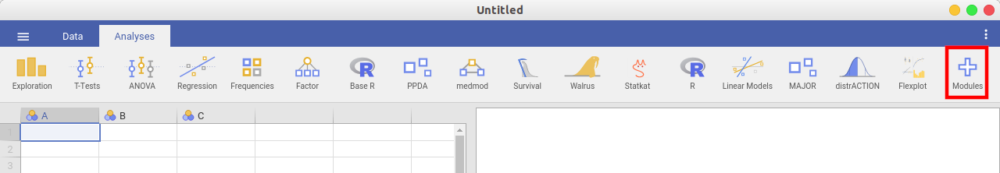
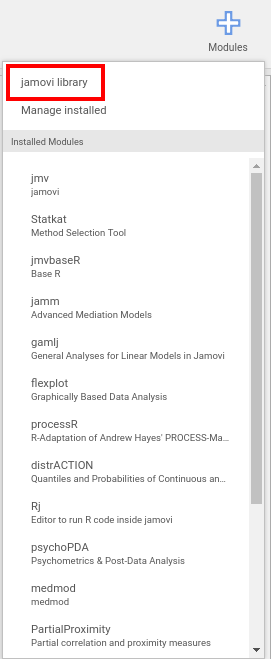
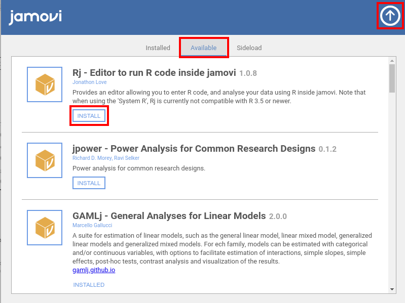

.. sectionauthor:: `Sebastian Jentschke <https://www.uib.no/en/persons/Sebastian.Jentschke>`_

=========================
Install modules in jamovi
=========================

| Click on the «+»-icon in the top-right corner to install modules from
  the jamovi library.
| |jamovi_Modules1|

| Choose the jamovi library from the menu that opens. 
| |jamovi_Modules2|

| In the window that opens now, first click on «Available» (top-middle). Then
  go through the list with modules and click «INSTALL» at any module that you
  would like to use. Finally, close this window by clicking on the arrow
  pointing up (top-right corner).
| |jamovi_Modules3|

.. ----------------------------------------------------------------------------

