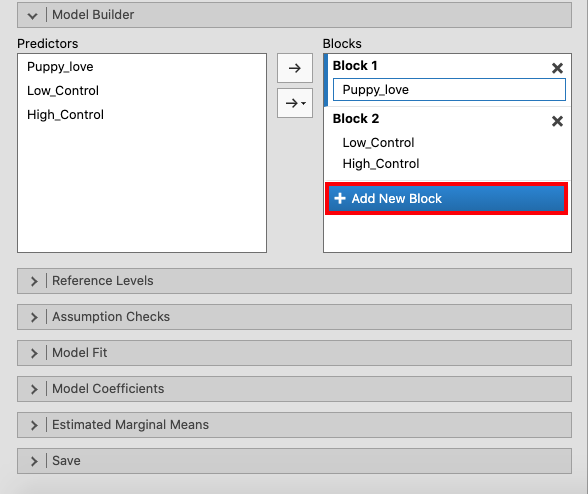
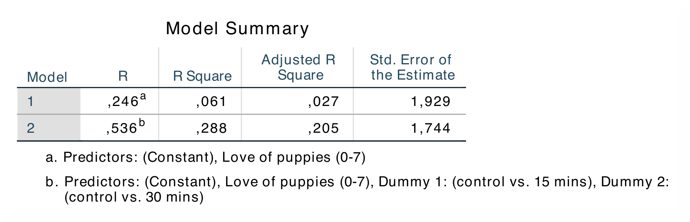

.. sectionauthor:: Rebecca Vederhus, `Sebastian Jentschke <https://www.uib.no/en/persons/Sebastian.Jentschke>`_

====================================================
From SPSS to jamovi: Analysis of Covariance (ANCOVA) 
====================================================

    This comparison shows how a regression with one predictor and two dummy variables is performed in SPSS and jamovi. The SPSS test follows the description in
    chapter 13.3 of `Field (2017) <https://edge.sagepub.com/field5e>`__, especially Output 13.1 - 13.2. It uses the data set **Puppy Love Dummy.sav** which can
    be downloaded from the `web page accompanying the book <https://edge.sagepub.com/field5e/student-resources/datasets>`__.

+-------------------------------------------------------------------------------+-------------------------------------------------------------------------------+
| **SPSS**                                                                      | **jamovi**                                                                    |
+===============================================================================+===============================================================================+
| In SPSS you can run a regression using: ``Analyze`` → ``Regression`` →        | In jamovi you do this using: ``Analyses`` → ``Regression`` → ``Linear         |
| → ``Linear``.                                                                 | Regression``.                                                                 |
+-------------------------------------------------------------------------------+-------------------------------------------------------------------------------+
| |SPSS_Menu_ANCOVA1|                                                           | |jamovi_Menu_ANCOVA1|                                                         |
+-------------------------------------------------------------------------------+-------------------------------------------------------------------------------+
| In SPSS, move ``Happiness`` to the variable box ``Independent`` and           | In jamovi, move ``Happiness`` to the variable box ``Dependent Variable``,     |
| ``Puppy_love`` to the variable box ``Independent(s)``.                        | ``Puppy_love`` to the variable box ``Covariates``, and ``Low_Control`` and    |
|                                                                               | ``High_Control`` to the ``Factors`` box.                                      |
+-------------------------------------------------------------------------------+-------------------------------------------------------------------------------+
| |SPSS_Input_ANCOVA1_1|                                                        | |jamovi_Input_ANCOVA1_1|                                                      |
+-------------------------------------------------------------------------------+-------------------------------------------------------------------------------+
| Press the ``Next`` button to create a new block of ``Independent(s)``, and    | Create a new block of independent variables using ``Model Builder``. Press    |
| move the variables ``Low_Control`` and ``High_Control`` into this box.        | ``+ Add New Block`` and move ``Low_Control`` and ``High_Control`` into        |
|                                                                               | ``Block 2``.                                                                  |
+-------------------------------------------------------------------------------+-------------------------------------------------------------------------------+
| |SPSS_Input_ANCOVA1_2|                                                        | |jamovi_Input_ANCOVA1_2|                                                      |
+-------------------------------------------------------------------------------+-------------------------------------------------------------------------------+
|                                                                               | Open the ``Model Coefficients`` window and tick the box for ``Standardized    |
|                                                                               | estimate``.                                                                   |
+-------------------------------------------------------------------------------+-------------------------------------------------------------------------------+
|                                                                               | |jamovi_Input_ANCOVA1_3|                                                      |
+-------------------------------------------------------------------------------+-------------------------------------------------------------------------------+
| If you compare the SPSS and jamovi outputs, the results are the same. However, the output from jamovi is much clearer as it only includes the most important  |
| information. The results are found in slightly different places in SPSS and in jamovi.                                                                        |
+-------------------------------------------------------------------------------+-------------------------------------------------------------------------------+
| |SPSS_Output_ANCOVA1_1|                                                       | |jamovi_Output_ANCOVA1_1|                                                     |
|                                                                               |                                                                               |
| |SPSS_Output_ANCOVA1_2|                                                       | |jamovi_Output_ANCOVA1_2|                                                     |
+-------------------------------------------------------------------------------+-------------------------------------------------------------------------------+
| In SPSS, the output table ``Model Summary`` starts with *R* and *R²*. The     | In jamovi, the *R *and *R²*-values are found in the output table ``Model Fit  |
| *R²*-value for model 1 shows the goodness of fit when only the covariate is   | Measures``. The Sum of Squares and *F*-values are found in the ``Omnibus      |
| included in the analysis, and the value for model 2 shows the results when    | ANOVA Test`` table, which in jamovi is separated into a table for model 1 and |
| the dummy variables and the covariate are included. The ``ANOVA`` table       | a table for model 2. Nonetheless, the numbers appear in the same place in the |
| presents the sum of squares for the regression, which tells us how many units | tables. The ``Coefficients`` table is also divided into two tables - one for  |
| of variance the model accounts for. The most interesting table is the         | each model – in jamovi. Here the *b*-values are found under Estimate and the  |
| ``Coefficients`` table, where you can find the differences  in *b-*values and | the *β*-values under Stand. Estimate.                                         |
| *β*-values for the two models, as well as their significance values.          |                                                                               |
+-------------------------------------------------------------------------------+-------------------------------------------------------------------------------+
| The *R *and *R²*-values are found in the first and second column in the first output table in both SPSS and jamovi. In contrast to SPSS, jamovi splits the    |
| ``ANOVA`` and ``Coefficients`` for model 1 and model 2. Despite this, almost all the values are found in the same columns, except for the *β*-values, which   |
| are located before the *t*- and *p*-values in SPSS and after the *t*- and *p*-values in jamovi.                                                               |
|                                                                                                                                                               |
| The numerical values for the model 2 statistics are identical: *R* = 0.54, *R²* = 0.29; *b* = 0.42, *p* < .05; *β* = 0.39, *p* < .05.                         |
+-------------------------------------------------------------------------------+-------------------------------------------------------------------------------+
| If you wish to replicate those analyses using syntax, you can use the commands below (in jamovi, just copy to code below to :doc:`Rj <../jamovi2r/j2R_Rj>`).  |
<<<<<<< HEAD
| Alternatively, you can download the SPSS output files and the jamovi files with the analyses from below the syntax.                                           |
=======
>>>>>>> master
+-------------------------------------------------------------------------------+-------------------------------------------------------------------------------+
| .. code-block:: none                                                          | .. code-block:: none                                                          |
|                                                                               |                                                                               |   
|    REGRESSION                                                                 |    jmv::linReg(                                                               |
|      /MISSING LISTWISE                                                        |        data = data,                                                           |
|      /STATISTICS COEFF OUTS R ANOVA                                           |        dep = Happiness,                                                       |
|      /CRITERIA=PIN(.05) POUT(.10)                                             |        covs = Puppy_love,                                                     |
|      /NOORIGIN                                                                |        factors = vars(Low_Control, High_Control),                             |
|      /DEPENDENT Happiness                                                     |        blocks = list(                                                         |
|      /METHOD=ENTER Puppy_love                                                 |            list("Puppy_love"),                                                |
|      /METHOD=ENTER Low_Control High_Control.                                  |            list("Low_Control", "High_Control")),                              |
|                                                                               |        refLevels = list(                                                      |
|                                                                               |            list(var="Low_Control", ref="0"),                                  |
|                                                                               |             list(var="High_Control", ref="0")),                               |
|                                                                               |        anova = TRUE)                                                          |
+-------------------------------------------------------------------------------+-------------------------------------------------------------------------------+
<<<<<<< HEAD
| `SPSS output file containing the analyses`_                                   | `jamovi file containing the analyses`_                                        | 
+-------------------------------------------------------------------------------+-------------------------------------------------------------------------------+
=======
>>>>>>> master

.. toctree::
   :hidden:

   s2j_ANCOVA2
   s2j_ANCOVA3
   s2j_ANCOVA4
   s2j_ANCOVA5

| **References**
| Field, A. (2017). *Discovering statistics using IBM SPSS statistics* (5th ed.). SAGE Publications. https://edge.sagepub.com/field5e

.. ---------------------------------------------------------------------

.. |SPSS_Input_ANCOVA1_1|              image:: ../_images/s2j_SPSS_Input_ANCOVA1_1.png

.. |jamovi_Input_ANCOVA1_1|            image:: ../_images/s2j_jamovi_Input_ANCOVA1_1.png

.. |jamovi_Output_ANCOVA1_2|           image:: ../_images/s2j_jamovi_Output_ANCOVA1_2.png
<<<<<<< HEAD

.. _SPSS output file containing the analyses:  ../_static/output/s2j_Output_SPSS_ANCOVA1.spv
.. _jamovi file containing the analyses:       ../_static/output/s2j_Output_jamovi_ANCOVA1.omv
=======
>>>>>>> master
