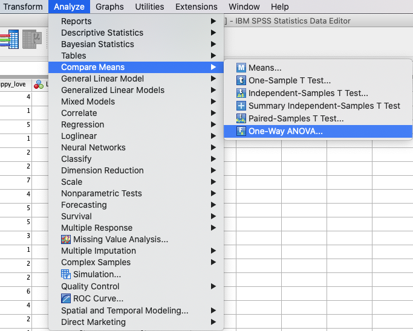
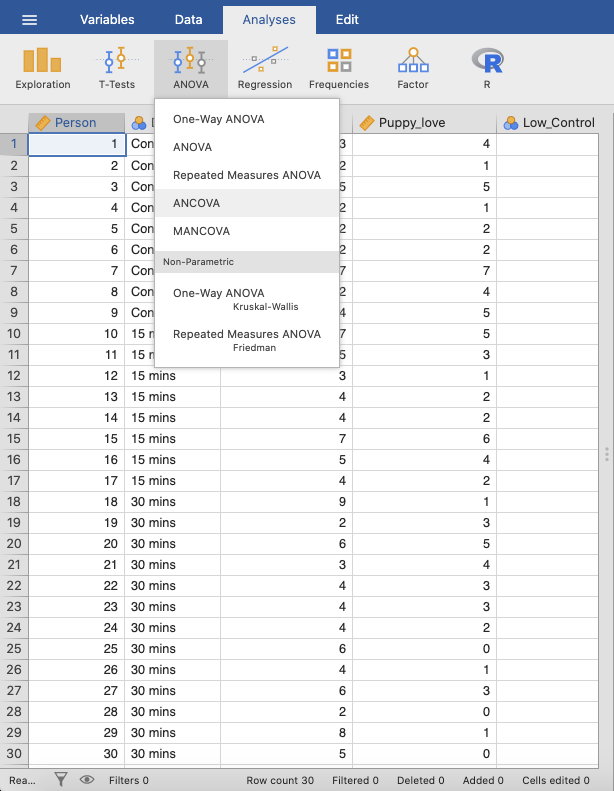
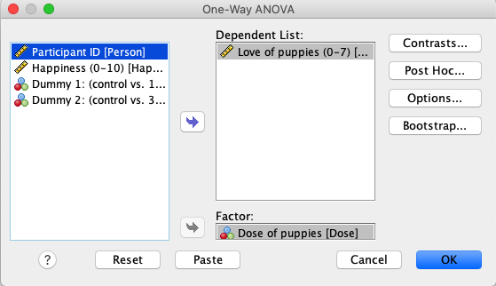
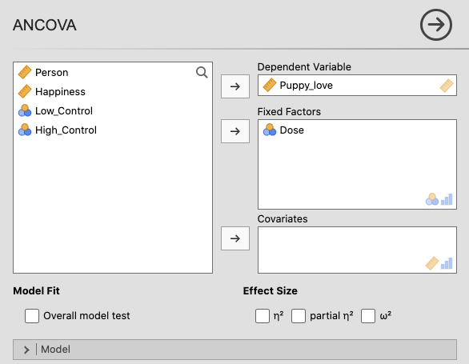
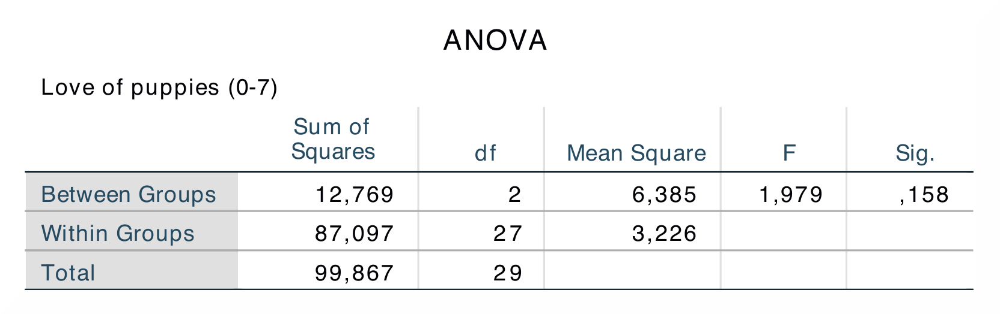
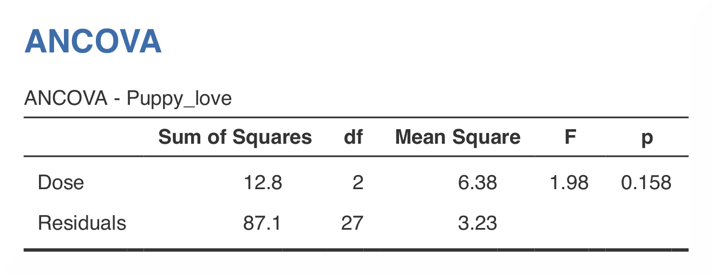

.. sectionauthor:: Rebecca Vederhus, `Sebastian Jentschke <https://www.uib.no/en/persons/Sebastian.Jentschke>`_

====================================================
From SPSS to jamovi: Analysis of Covariance (ANCOVA) 
====================================================

    This comparison shows how to test if the covariate is independent of the independent variable, as described in chapter 13.5.3 of `Field (2017)
    <https://edge.sagepub.com/field5e>`__, especially output 13.3. It uses the data set **Puppy Love Dummy.sav** which can be downloaded from the `web page
    accompanying the book <https://edge.sagepub.com/field5e/student-resources/datasets>`__.

+-------------------------------------------------------------------------------+-------------------------------------------------------------------------------+
| **SPSS**                                                                      | **jamovi**                                                                    |
+===============================================================================+===============================================================================+
| In SPSS you can run this test using `` ``Analyze`` → ``Compare Means`` →      | In jamovi you do this using: ``Analyses`` → ``ANOVA`` → ``ANCOVA``.           |
| ``One Way ANOVA``.                                                            |                                                                               |
+-------------------------------------------------------------------------------+-------------------------------------------------------------------------------+
| |SPSS_Menu_ANCOVA2|                                                           | |jamovi_Menu_ANCOVA2|                                                         |
+-------------------------------------------------------------------------------+-------------------------------------------------------------------------------+
| In SPSS, move ``Puppy_love`` to the variable box ``Dependent List`` and       | In jamovi, move ``Puppy_love`` to the variable box ``Dependent Variable`` and |
| ``Dose`` to the variable box ``Factor``.                                      | ``Dose`` to the variable box ``Fixed Factors``.                               |
+-------------------------------------------------------------------------------+-------------------------------------------------------------------------------+
| |SPSS_Input_ANCOVA2|                                                          | |jamovi_Input_ANCOVA2|                                                        |
+-------------------------------------------------------------------------------+-------------------------------------------------------------------------------+
| When comparing the outputs in SPSS and jamovi, the results are exactly the same. The only difference is that jamovi does not provide a row with the total sum |
| of squares and degrees of freedom.                                                                                                                            |
+-------------------------------------------------------------------------------+-------------------------------------------------------------------------------+
| |SPSS_Output_ANCOVA2|                                                         | |jamovi_Output_ANCOVA2|                                                       |
+-------------------------------------------------------------------------------+-------------------------------------------------------------------------------+
| In the ``ANCOVA`` table, you can find the degrees of freedom between groups   | In jamovi, these values are found in the equivalent table (``ANCOVA –         |
| and within groups, as well as the *F*-value and its significance level. The   | Puppy_love``).                                                                |
| results from this analysis indicate that for all three puppy therapy groups,  |                                                                               |
| the love for puppies were about the same.                                     |                                                                               |
+-------------------------------------------------------------------------------+-------------------------------------------------------------------------------+
| In both SPSS and in jamovi, the degrees of freedom can be found in the second, the *F*-value in the fourth, and the *p*-value in the fifth column.            |
|                                                                                                                                                               |
| The numerical values are the same in both SPSS and jamovi: *F*(2, 27) = 1.98, *p* = 0.16.                                                                     |
+-------------------------------------------------------------------------------+-------------------------------------------------------------------------------+
| If you wish to replicate those analyses using syntax, you can use the commands below (in jamovi, just copy to code below to :doc:`Rj <../jamovi2r/j2R_Rj>`).  |
| Alternatively, you can download the SPSS output files and the jamovi files with the analyses from below the syntax.                                           |
+-------------------------------------------------------------------------------+-------------------------------------------------------------------------------+
| .. code-block:: none                                                          | .. code-block:: none                                                          |
|                                                                               |                                                                               |   
|    ONEWAY Puppy_love BY Dose                                                  |    jmv::ancova(                                                               |
|      /MISSING ANALYSIS.                                                       |        formula = Puppy_love ~ Dose,                                           |
|                                                                               |        data = data)                                                           |
+-------------------------------------------------------------------------------+-------------------------------------------------------------------------------+
| `SPSS output file containing the analyses`_                                   | `jamovi file containing the analyses`_                                        | 
+-------------------------------------------------------------------------------+-------------------------------------------------------------------------------+

| **References**
| Field, A. (2017). *Discovering statistics using IBM SPSS statistics* (5th ed.). SAGE Publications. https://edge.sagepub.com/field5e

.. ---------------------------------------------------------------------

.. _SPSS output file containing the analyses:  ../_static/output/s2j_Output_SPSS_ANCOVA2.spv
.. _jamovi file containing the analyses:       ../_static/output/s2j_Output_jamovi_ANCOVA2.omv
