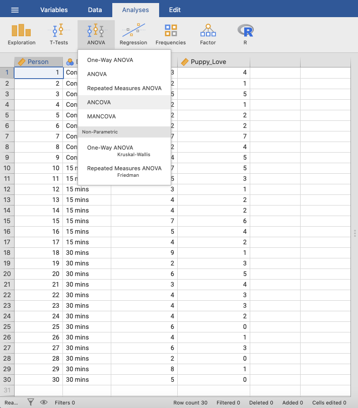

.. sectionauthor:: Rebecca Vederhus, `Sebastian Jentschke <https://www.uib.no/en/persons/Sebastian.Jentschke>`_

====================================================
From SPSS to jamovi: Analysis of Covariance (ANCOVA) 
====================================================

    This comparison shows how to conduct an analysis of covariance in SPSS and jamovi. The SPSS test follows the description in chapter 13.5.4 - 13.5.6 in
    `Field (2017) <https://edge.sagepub.com/field5e>`__, especially figure 13.5 - 13.7 (excluding ``Options``) and outputs 13.6 - 13.11 (excluding
    ``Bootstrap``, as this is not [yet] an option in jamovi). It uses the data set **Puppy Love.sav** which can be downloaded from the `web page accompanying
    the book <https://edge.sagepub.com/field5e/student-resources/datasets>`__.

+-------------------------------------------------------------------------------+-------------------------------------------------------------------------------+
| **SPSS**                                                                      | **jamovi**                                                                    |
+===============================================================================+===============================================================================+
| In SPSS, you can run this test using: ``Analyze`` → ``General Linear Model``  | In jamovi you do this using: ``Analyses`` → ``ANOVA`` → ``ANCOVA``.           |
| → ``Univariate``.                                                             |                                                                               |
+-------------------------------------------------------------------------------+-------------------------------------------------------------------------------+
| |SPSS_Menu_ANCOVA3|                                                           | |jamovi_Menu_ANCOVA3|                                                         |
+-------------------------------------------------------------------------------+-------------------------------------------------------------------------------+
| In SPSS, move ``Happiness`` to the ``Dependent Variable`` box, ``Dose`` to    | In jamovi, move ``Happiness`` to the ``Dependent Variable`` box, ``Dose`` to  |
| the ``Fixed Factor(s)`` box, and ``Puppy_love`` into ``Covariate(s)``.        | the ``Fixed Factors`` box and ``Puppy_love`` into ``Covariates``.             |
+-------------------------------------------------------------------------------+-------------------------------------------------------------------------------+
| |SPSS_Input_ANCOVA3_1|                                                        | |jamovi_Input_ANCOVA3_1|                                                      |
+-------------------------------------------------------------------------------+-------------------------------------------------------------------------------+
| Then, open the dialog box called ``Contrasts``, and click the drop-down menu  | Open the ``Contrasts`` window, and select ``simple`` from the drop-down menu. |
| to select ``Simple``. Change the ``Reference Category`` to ``First``, and     |                                                                               |
| press ``Change``.                                                             |                                                                               |
+-------------------------------------------------------------------------------+-------------------------------------------------------------------------------+
| |SPSS_Input_ANCOVA3_2|                                                        | |jamovi_Input_ANCOVA3_2|                                                      |
+-------------------------------------------------------------------------------+-------------------------------------------------------------------------------+
| Select ``EM Means`` from the sidebar. Move ``Dose`` to the box called         | Then, move ``Dose`` to ``Term 1`` in the ``Estimated Marginal Means`` window. |
| ``Display Means for:``, press ``Compare main effects`` and select ``Sidak``   | Tick the box for ``Marginal means tables`` as shown in the picture below.     |
| in the drop-down list.                                                        |                                                                               |
+-------------------------------------------------------------------------------+-------------------------------------------------------------------------------+
| |SPSS_Input_ANCOVA3_3|                                                        | |jamovi_Input_ANCOVA3_3|                                                      |
+-------------------------------------------------------------------------------+-------------------------------------------------------------------------------+
| When comparing the output from SPSS and jamovi, the results are the same. However, SPSS provides a lot more, rather unnecessary output than jamovi. These     |
| outputs are not included here.                                                                                                                                |
+-------------------------------------------------------------------------------+-------------------------------------------------------------------------------+
| |SPSS_Output_ANCOVA3_1|                                                       | |jamovi_Output_ANCOVA3|                                                       |
|                                                                               |                                                                               |
| |SPSS_Output_ANCOVA3_2|                                                       |                                                                               |
|                                                                               |                                                                               |
| |SPSS_Output_ANCOVA3_3|                                                       |                                                                               |
+-------------------------------------------------------------------------------+-------------------------------------------------------------------------------+
| In SPSS, you can find the adjusted values of the group means in the           | In jamovi, the adjusted values can be found in the table called ``Estimated   |
| ``Estimates`` table. By looking at the ``Mean`` you can find out if there     | Marginal Means – Dose``. This table looks exactly the same as the equivalent  |
| are any changes in happiness levels if there is an increase in puppy          | table in SPSS. Sum of squares are found in the ``ANCOVA – Happiness`` table.  |
| exposure. The ``Tests of Between-Subjects Effects`` table shows the sum of    | These tables differ slightly in SPSS and in jamovi, as jamovi only gives      |
| squares for the ``Dose`` variable, and this tells us how many units of        | results for ``Dose`` and ``Residuals``. The contrast analysis in jamovi also  |
| variance this factor account for. In the ``Contrast Results (K Matrix)``      | does not provide all of the values that the SPSS analysis does. However, the  |
| table, level 2 (15 mins) is compared with level 1 (control) and then level 3  | most important information is included.                                       |
| (30 mins) is compared with level 1 (control). Here, the group differences are |                                                                               |
| indicated by standard error, a difference value and a *p*-value.              |                                                                               |
+-------------------------------------------------------------------------------+-------------------------------------------------------------------------------+
| jamovi does not include the values for the ``Corrected Model``, ``Intercept``, ``Total`` and ``Corrected Total`` in its analysis of covariance. Apart from    |
| this, the ANCOVA table follows the same structure as in SPSS. The tables for ``Estimated Marginal Means`` are also identical in SPSS and jamovi. The results  |
| from the contrast analysis in jamovi appears much clearer than the one in SPSS. Here the results are presented horizontally, while the results in SPSS are    |
| presented vertically. In contrast to SPSS, jamovi only includes the following values: ``Estimate``, ``SE`, ``t`` and ``p``.                                   |
|                                                                                                                                                               |
| The numerical values for these analyses are the same: *SS*Dose = 25.19, *p* < .05; *SS*Puppy_love = 15.08, *p* < .05;                   | 
| *M*Control = 2.93, *M*15mins = 4.71, *M*30mins = 5.15; contrast 1, *p* = 0.045; contrast 2, *p* = 0.010.                     |
+-------------------------------------------------------------------------------+-------------------------------------------------------------------------------+
| If you wish to replicate those analyses using syntax, you can use the commands below (in jamovi, just copy to code below to :doc:`Rj <../jamovi2r/j2R_Rj>`).  |
<<<<<<< HEAD
| Alternatively, you can download the SPSS output files and the jamovi files with the analyses from below the syntax.                                           |
=======
>>>>>>> master
+-------------------------------------------------------------------------------+-------------------------------------------------------------------------------+
| .. code-block:: none                                                          | .. code-block:: none                                                          |
|                                                                               |                                                                               |   
|    UNIANOVA Happiness BY Dose WITH Puppy_love                                 |    jmv::ancova(                                                               |
|      /CONTRAST(Dose)=Simple(1)                                                |        formula = Happiness ~ Dose + Puppy_Love,                               |
|      /METHOD=SSTYPE(3)                                                        |        data = data,                                                           |
|      /INTERCEPT=INCLUDE                                                       |        contrasts = list(list(var = "Dose", type = "simple")),                 |
|      /EMMEANS=TABLES(Dose) WITH(Puppy_love=MEAN) COMPARE ADJ(SIDAK)           |        emMeans = ~ Dose,                                                      |
|      /CRITERIA=ALPHA(0.05)                                                    |        emmPlots = FALSE,                                                      |
|      /DESIGN=Puppy_love Dose.                                                 |        emmPlotError = "none",                                                 |
|                                                                               |        emmTables = TRUE)                                                      |
+-------------------------------------------------------------------------------+-------------------------------------------------------------------------------+
<<<<<<< HEAD
| `SPSS output file containing the analyses`_                                   | `jamovi file containing the analyses`_                                        | 
+-------------------------------------------------------------------------------+-------------------------------------------------------------------------------+
=======
>>>>>>> master

| **References**
| Field, A. (2017). *Discovering statistics using IBM SPSS statistics* (5th ed.). SAGE Publications. https://edge.sagepub.com/field5e

.. ---------------------------------------------------------------------

.. |SPSS_Menu_ANCOVA3|                 image:: ../_images/s2j_SPSS_Menu_ANCOVA3.png

.. |SPSS_Output_ANCOVA3_3|             image:: ../_images/s2j_SPSS_Output_ANCOVA3_3.png

<<<<<<< HEAD

.. _SPSS output file containing the analyses:  ../_static/output/s2j_Output_SPSS_ANCOVA3.spv
.. _jamovi file containing the analyses:       ../_static/output/s2j_Output_jamovi_ANCOVA3.omv
=======
>>>>>>> master
