.. sectionauthor:: Rebecca Vederhus, `Sebastian Jentschke <https://www.uib.no/en/persons/Sebastian.Jentschke>`_

====================================================
From SPSS to jamovi: Analysis of Covariance (ANCOVA) 
====================================================

    This comparison shows how an analysis of covariance which excludes the covariate is conducted in SPSS and jamovi. The SPSS test follows the description in
    chapter 13.6.1 - 13.6.4 in `Field (2017) <https://edge.sagepub.com/field5e>`__, especially figure 13.5 - 13.7 (excluding the covariate in figure 13.5 and
    ``Options`` in figure 13.7) and output 13.5. It uses the data set **Puppy Love.sav** which can be downloaded from the `web page accompanying the book
    <https://edge.sagepub.com/field5e/student-resources/datasets>`__.

+-------------------------------------------------------------------------------+-------------------------------------------------------------------------------+
| **SPSS**                                                                      | **jamovi**                                                                    |
+===============================================================================+===============================================================================+
| In SPSS, you can run this test using: ``Analyze`` → ``General Linear Model``  | In jamovi, you can create an analysis of covariance using: ``Analyses`` →     |
| → ``Univariate``.                                                             | ``ANOVA`` → ``ANCOVA``.                                                       |
+-------------------------------------------------------------------------------+-------------------------------------------------------------------------------+
| |SPSS_Menu_ANCOVA4|                                                           | |jamovi_Menu_ANCOVA4|                                                         |
+-------------------------------------------------------------------------------+-------------------------------------------------------------------------------+
| In SPSS, move ``Happiness`` to the ``Dependent Variable`` box and ``Dose``    | In jamovi, move ``Happiness`` to ``Dependent Variable`` and ``Dose`` to       |
| to the ``Fixed Factor(s)`` box.                                               | ``Fixed Factors``.                                                            |
+-------------------------------------------------------------------------------+-------------------------------------------------------------------------------+
| |SPSS_Input_ANCOVA4_1|                                                        | |jamovi_Input_ANCOVA4_1|                                                      |
+-------------------------------------------------------------------------------+-------------------------------------------------------------------------------+
| Open the dialog box called ``Contrasts``, and click the drop-down menu to     | Open the ``Contrasts`` window, and select ``simple`` from the drop-down menu. |
| select ``Simple``. Change the ``Reference Category`` to ``First``, and press  |                                                                               |
| press ``Change``.                                                             |                                                                               |
+-------------------------------------------------------------------------------+-------------------------------------------------------------------------------+
| |SPSS_Input_ANCOVA4_2|                                                        | |jamovi_Input_ANCOVA4_2|                                                      |
+-------------------------------------------------------------------------------+-------------------------------------------------------------------------------+
| Select ``EM Means`` from the sidebar. Move ``Dose`` to the box called         | In the ``Estimated Marginal Means`` window, move ``Dose`` to ``Term 1``. Tick |
| ``Display Means for:``, press ``Compare main effects`` and select ``Sidak``   | Tick the box for ``Marginal means tables`` as shown in the picture below.     |
| in the drop-down list.                                                        |                                                                               |
+-------------------------------------------------------------------------------+-------------------------------------------------------------------------------+
| |SPSS_Input_ANCOVA4_3|                                                        | |jamovi_Input_ANCOVA4_3|                                                      |
+-------------------------------------------------------------------------------+-------------------------------------------------------------------------------+
| The results are essentially the same in SPSS and jamovi, except that SPSS provides more output tables than jamovi.                                            |
+-------------------------------------------------------------------------------+-------------------------------------------------------------------------------+
| |SPSS_Output_ANCOVA4_1|                                                       | |jamovi_Output_ANCOVA4|                                                       |
|                                                                               |                                                                               |
| |SPSS_Output_ANCOVA4_2|                                                       |                                                                               |
|                                                                               |                                                                               |
| |SPSS_Output_ANCOVA4_3|                                                       |                                                                               |
+-------------------------------------------------------------------------------+-------------------------------------------------------------------------------+
| In SPSS, you can find the adjusted values of the group means in the           | In jamovi, the adjusted values can be found in the table called ``Estimated   |
| ``Estimates`` table. By looking at the ``Mean`` you can find out if there are | Marginal Means – Dose``. This table looks exactly the same as the equivalent  |
| any changes in happiness levels if there is an increase in puppy exposure.    | table in SPSS. Sum of squares are found in the ``ANCOVA – Happiness`` table.  |
| The ``Tests of Between-Subjects Effects`` table shows the sum of squares for  | These tables differ slightly in SPSS and in jamovi, as jamovi only gives      |
| the dose of puppies, and this tells us how many units of variance this factor | results for ``Dose``, ``Puppy_love`` and ``Residuals``. The contrast analysis |
| accounts for. In the ``Contrast Results (K Matrix)`` table, level 2 (15 mins) | in jamovi also does not provide all of the values that the SPSS analysis      |
| is compared with level 1 (control) and then level 3 (30 mins) is compared     | does. However, all important information (that you typically would report)    |
| with level 1 (control). Here, the group differences are indicated by standard | is included.                                                                  |
| error, a difference value and a *p*-value.                                    |                                                                               |
+-------------------------------------------------------------------------------+-------------------------------------------------------------------------------+
| jamovi does not include the values for the ``Corrected Model``, ``Intercept``, ``Total`` and ``Corrected Total`` in its analysis of covariance. Apart from    |
| this, the ANCOVA table follows the same structure as in SPSS. The tables for ``Estimated Marginal Means`` are also identical in SPSS and jamovi. The results  |
| from the contrast analysis in jamovi appears much clearer than the one in SPSS. Here, the results are presented horizontally, while the results in SPSS are   |
| presented vertically. In contrast to SPSS, jamovi only includes the following values: ``Estimate``, ``SE`, ``*t*`` and ``*p*``.                               |
|                                                                                                                                                               |
| The numerical values for these analyses are the same: *SS*Dose = 16.84; *M*Control = 3.22, *M*15mins = 4.87,                 |
| *M*30mins = 4.85; contrast 1, *p* = 0.080; contrast 2, *p* = 0.055.                                                                                |
+-------------------------------------------------------------------------------+-------------------------------------------------------------------------------+
| If you wish to replicate those analyses using syntax, you can use the commands below (in jamovi, just copy to code below to :doc:`Rj <../jamovi2r/j2R_Rj>`).  |
| Alternatively, you can download the SPSS output files and the jamovi files with the analyses from below the syntax.                                           |
+-------------------------------------------------------------------------------+-------------------------------------------------------------------------------+
| .. code-block:: none                                                          | .. code-block:: none                                                          |
|                                                                               |                                                                               |   
|    UNIANOVA Happiness BY Dose                                                 |    jmv::ancova(                                                               |
|      /CONTRAST(Dose)=Simple(1)                                                |        formula = Happiness ~ Dose,                                            |
|      /METHOD=SSTYPE(3)                                                        |        data = data,                                                           |
|      /INTERCEPT=INCLUDE                                                       |        contrasts = list(list(var = "Dose", type = "simple")),                 |
|      /EMMEANS=TABLES(Dose) COMPARE ADJ(SIDAK)                                 |        emMeans = ~ Dose,                                                      |
|      /CRITERIA=ALPHA(0.05)                                                    |        emmPlots = FALSE,                                                      |
|      /DESIGN=Dose.                                                            |        emmPlotError = "none",                                                 |
|                                                                               |        emmTables = TRUE)                                                      |
+-------------------------------------------------------------------------------+-------------------------------------------------------------------------------+
| `SPSS output file containing the analyses                                     | `jamovi file containing the analyses                                          |
| <../_static/output/s2j_Output_SPSS_ANCOVA4.spv>`_                             | <../_static/output/s2j_Output_jamovi_ANCOVA4.omv>`_                           |
+-------------------------------------------------------------------------------+-------------------------------------------------------------------------------+

| **References**
| Field, A. (2017). *Discovering statistics using IBM SPSS statistics* (5th ed.). SAGE Publications. https://edge.sagepub.com/field5e

.. ---------------------------------------------------------------------

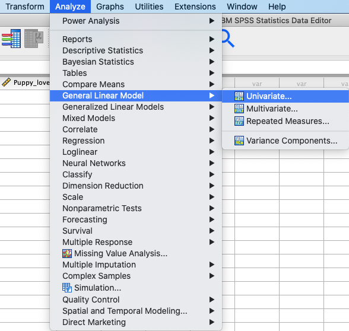
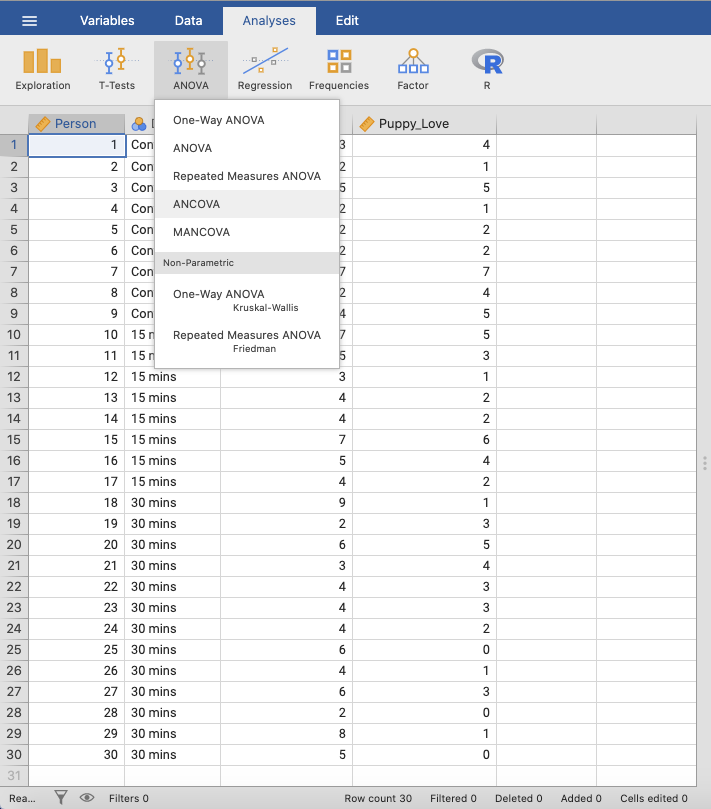
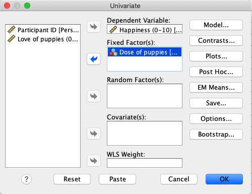
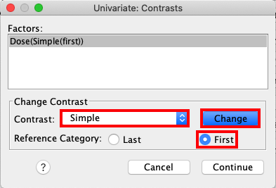
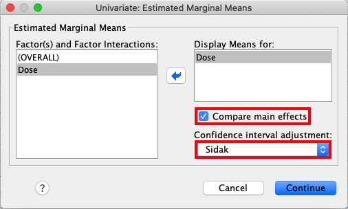
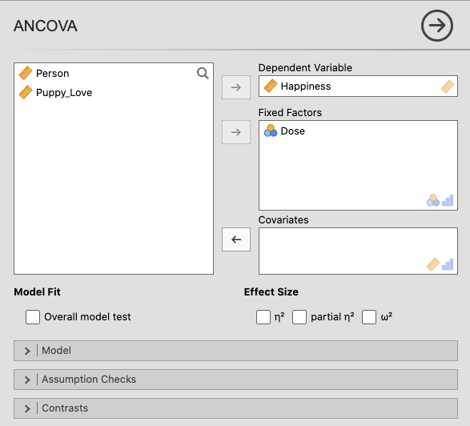
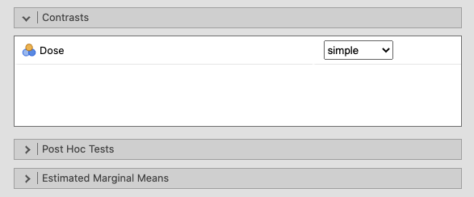
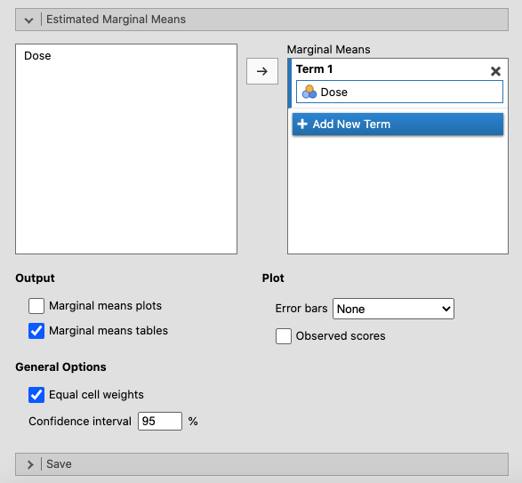
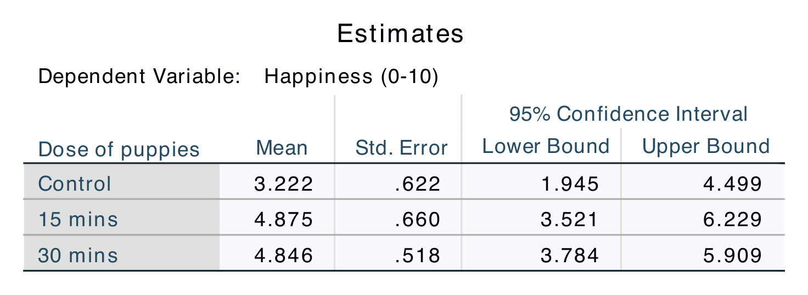
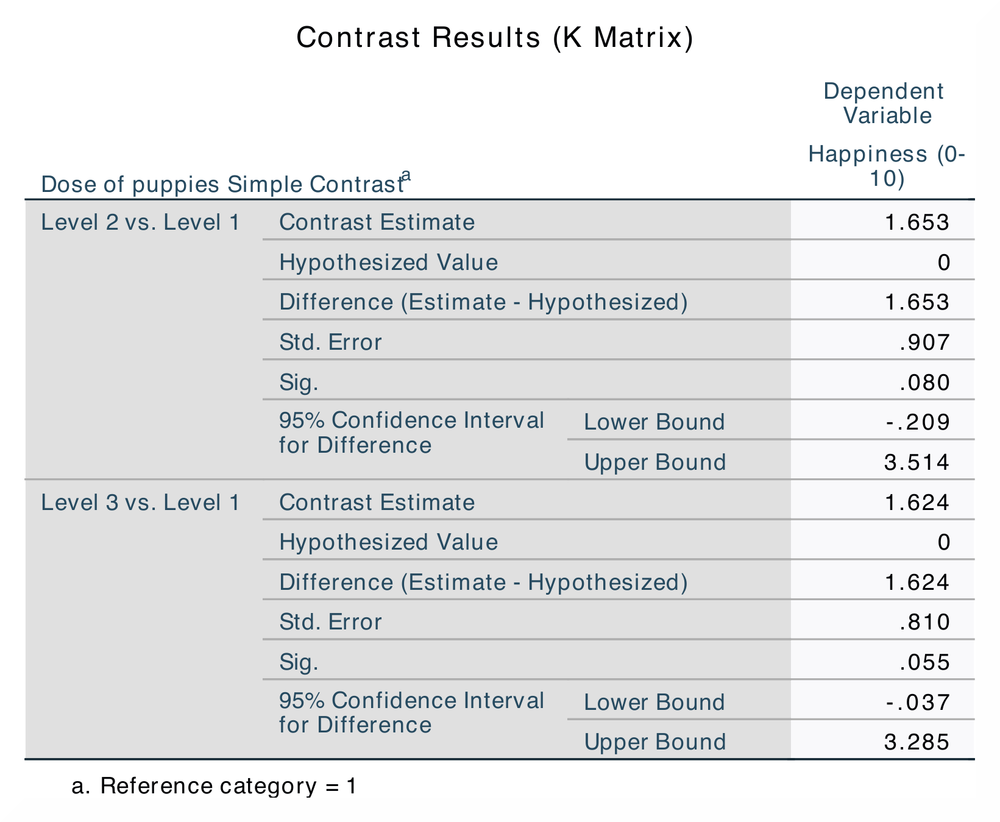
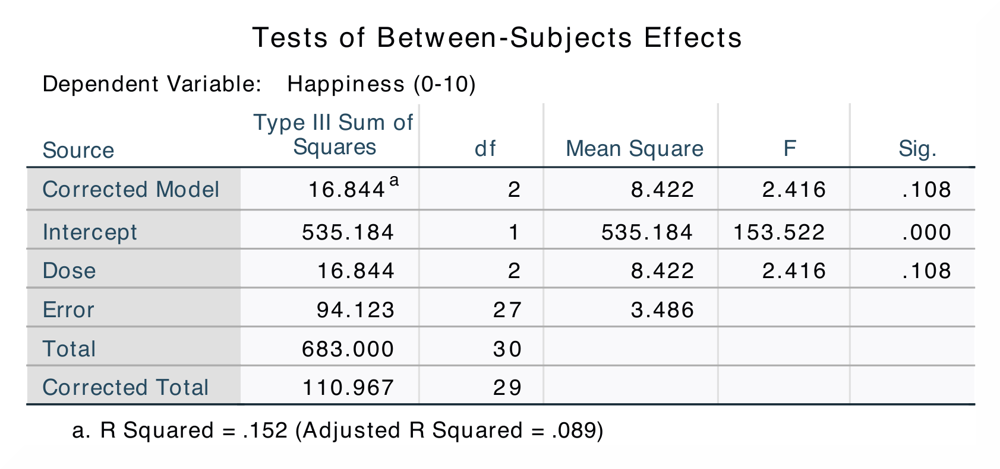
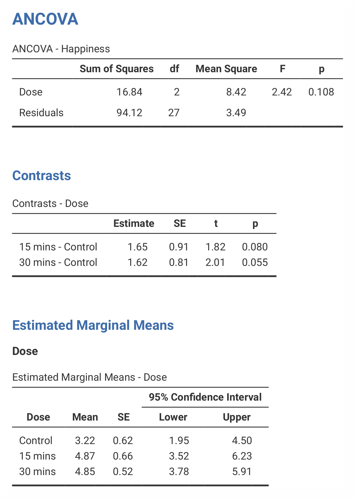
