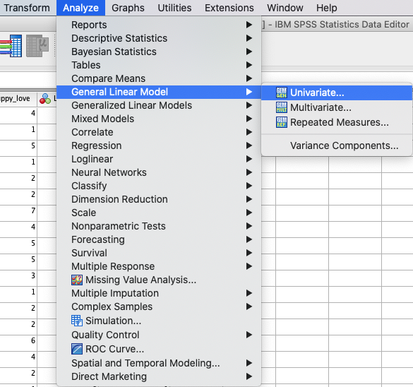
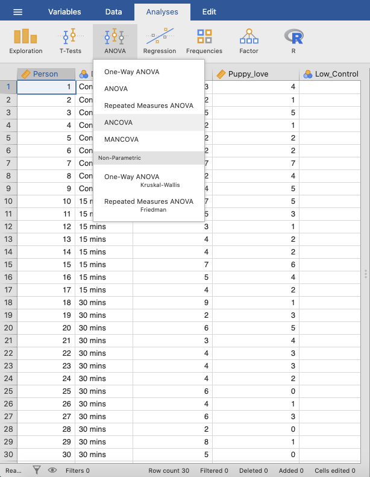
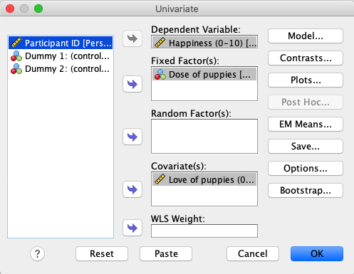
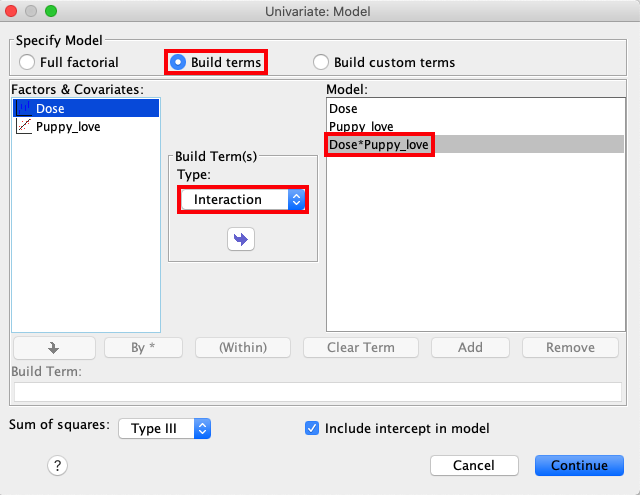
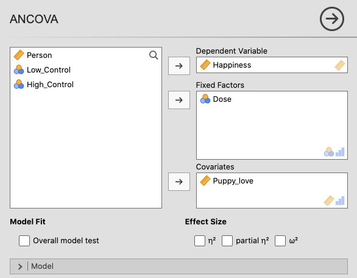
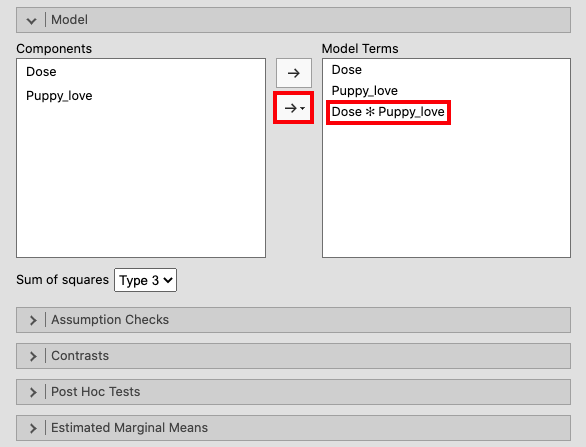
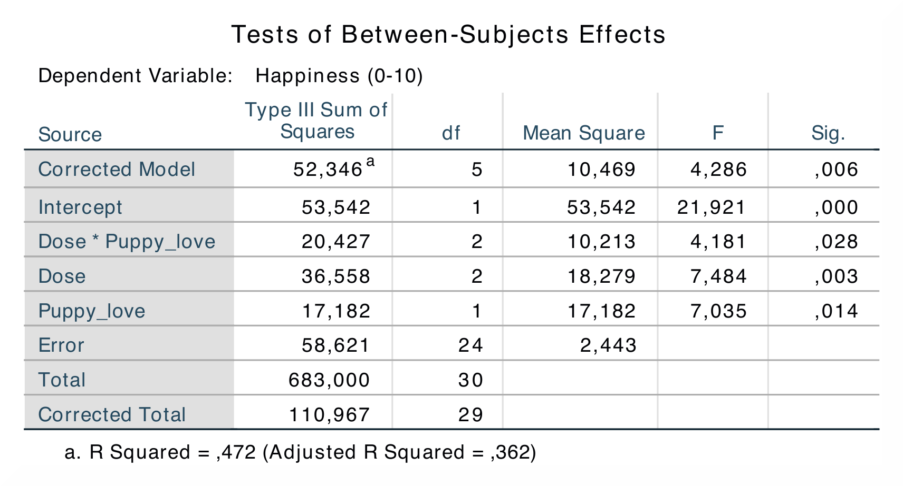
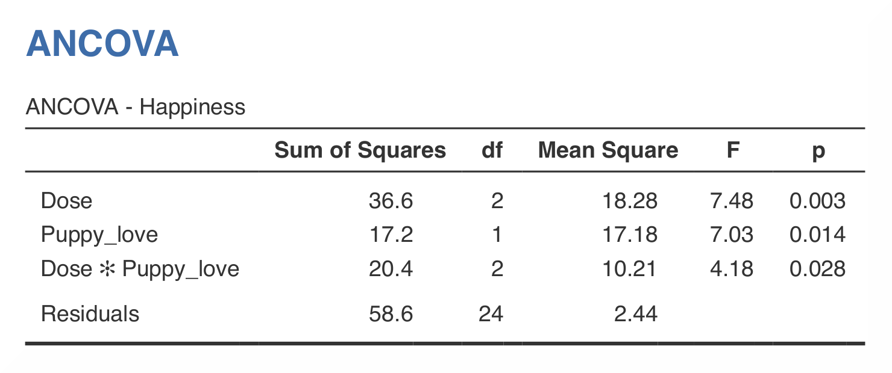

.. sectionauthor:: Rebecca Vederhus, `Sebastian Jentschke <https://www.uib.no/en/persons/Sebastian.Jentschke>`_

====================================================
From SPSS to jamovi: Analysis of Covariance (ANCOVA) 
====================================================

    This comparison shows how to test the assumption of homogeneity of regression slopes in SPSS and jamovi. The SPSS test follows the description in chapter
    \13.7 in `Field (2017) <https://edge.sagepub.com/field5e>`__, especially figure 13.9 and output 13.12. It uses the data set **Puppy Love Dummy.sav** which
    can be downloaded from the `web page accompanying the book <https://edge.sagepub.com/field5e/student-resources/datasets>`__.

+-------------------------------------------------------------------------------+-------------------------------------------------------------------------------+
| **SPSS**                                                                      | **jamovi**                                                                    |
+===============================================================================+===============================================================================+
| In SPSS, you can run this test using: ``Analyze`` → ``General Linear Model``  | In jamovi you do this using: ``Analyses`` → ``ANOVA`` → ``ANCOVA``.           |
| → ``Univariate``.                                                             |                                                                               |
+-------------------------------------------------------------------------------+-------------------------------------------------------------------------------+
| |SPSS_Menu_ANCOVA5|                                                           | |jamovi_Menu_ANCOVA5|                                                         |
+-------------------------------------------------------------------------------+-------------------------------------------------------------------------------+
| In SPSS, move ``Happiness`` to the ``Dependent Variable`` box, ``Dose`` to    | In jamovi, move the ``Happiness`` variable to ``Dependent Variable``, the     |
| the ``Fixed Factor(s)`` box, and ``Puppy_love`` to the ``Covariate(s)`` box.  | ``Dose`` variable to ``Fixed Factors``, and the ``Puppy_love`` variable to    |
|                                                                               | ``Covariates``.                                                               |
+-------------------------------------------------------------------------------+-------------------------------------------------------------------------------+
| |SPSS_Input_ANCOVA5_1|                                                        | |jamovi_Input_ANCOVA5_1|                                                      |
+-------------------------------------------------------------------------------+-------------------------------------------------------------------------------+
| Access the ``Model`` window, and click ``Build terms``. Then, mark the        | Next, open the ``Model`` window. Mark both ``Dose`` and ``Puppy_love``, then  |
| variables ``Dose`` and ``Puppy_love``, open the drop-down menu and choose     | click the arrow with the drop-down menu and click ``Interaction``.            |
| ``Interaction``.                                                              |                                                                               |
+-------------------------------------------------------------------------------+-------------------------------------------------------------------------------+
| |SPSS_Input_ANCOVA5_2|                                                        | |jamovi_Input_ANCOVA5_2|                                                      |
+-------------------------------------------------------------------------------+-------------------------------------------------------------------------------+
| Comparisons between the output in SPSS and jamovi shows that the results are the same.                                                                        |
+-------------------------------------------------------------------------------+-------------------------------------------------------------------------------+
| |SPSS_Output_ANCOVA5|                                                         | |jamovi_Output_ANCOVA5|                                                       |
+-------------------------------------------------------------------------------+-------------------------------------------------------------------------------+
| In SPSS, the ``Tests of Between-Subjects Effects`` table shows the sum of     | In jamovi, these results are found in a similar ``ANCOVA`` table, which also  |
| squares for the variables, as well as the interaction term (Dose \*           | includes sum of squares, degrees of freedom, mean square, *F*-values and      |
| Puppy_love). The tables also includes degrees of freedom, mean square,        | significance values. These values are located in the same order as in the     |
| *F*-values and significance values.                                           | SPSS table.                                                                   |
+-------------------------------------------------------------------------------+-------------------------------------------------------------------------------+
| The main difference between the results in SPSS and jamovi is that SPSS provides values for the following: ``Corrected Model``, ``Intercept``, ``Total`` and  |
| ``Corrected Total``. SPSS also gives *R²* and adjusted *R²* values for the corrected model.                                                                   |
|                                                                                                                                                               |
| If one compares the numerical values, they are the same: *SS*Dose = 36.6, *p* < .01; *SS*Puppy_love = 17.2, *p* < .05;                  |
| *SS*Dose \* Puppy_love = 20.4, *p* < .05.                                                                                                          |
+-------------------------------------------------------------------------------+-------------------------------------------------------------------------------+
| If you wish to replicate those analyses using syntax, you can use the commands below (in jamovi, just copy to code below to :doc:`Rj <../jamovi2r/j2R_Rj>`).  |
+-------------------------------------------------------------------------------+-------------------------------------------------------------------------------+
| .. code-block:: none                                                          | .. code-block:: none                                                          |
|                                                                               |                                                                               |   
|    UNIANOVA Happiness BY Dose WITH Puppy_love                                 |    jmv::ancova(                                                               |
|      /METHOD=SSTYPE(3)                                                        |        formula = Happiness ~ Dose + Puppy_love + Dose:Puppy_love,             |
|      /INTERCEPT=INCLUDE                                                       |        data = data)                                                           |
|      /CRITERIA=ALPHA(0.05)                                                    |                                                                               |
|      /DESIGN=Dose\*Puppy_love Dose Puppy_love.                                |                                                                               |
+-------------------------------------------------------------------------------+-------------------------------------------------------------------------------+

| **References**
| Field, A. (2017). *Discovering statistics using IBM SPSS statistics* (5th ed.). SAGE Publications. https://edge.sagepub.com/field5e

.. ---------------------------------------------------------------------

