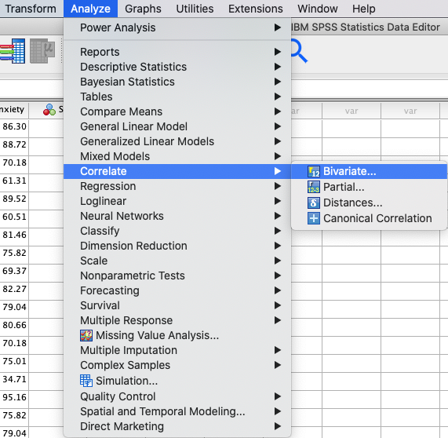
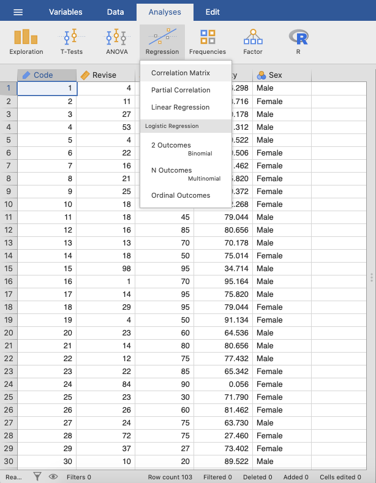
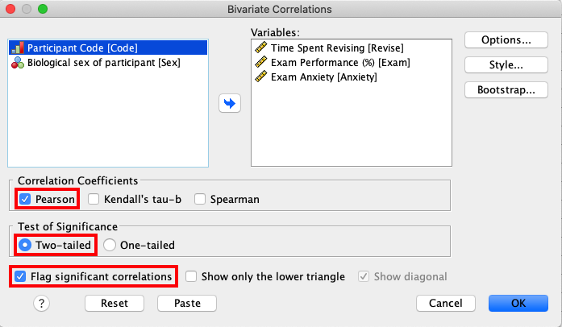
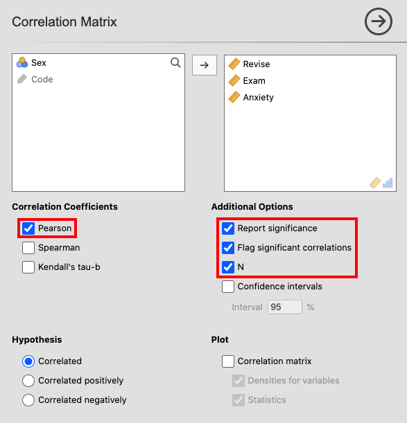
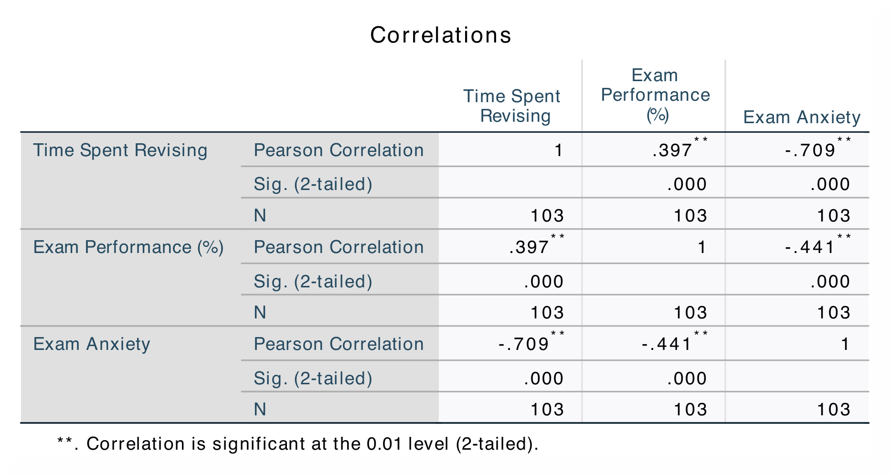
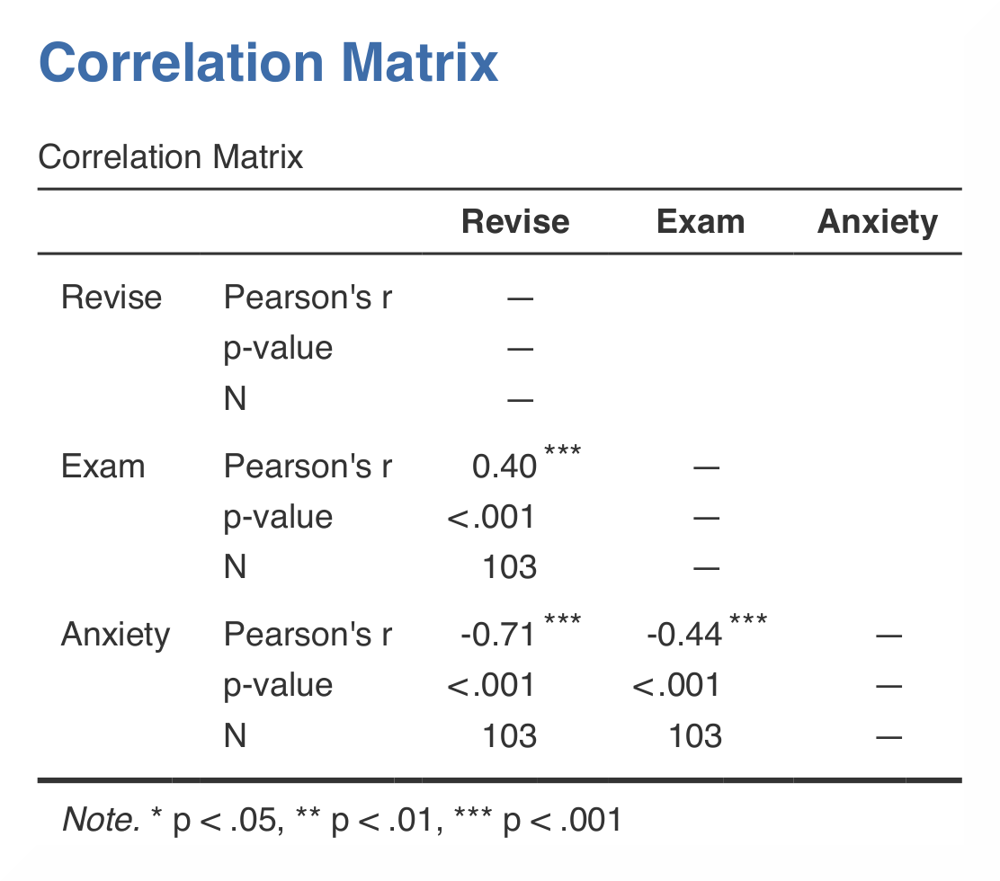

.. sectionauthor:: Rebecca Vederhus, `Sebastian Jentschke <https://www.uib.no/en/persons/Sebastian.Jentschke>`_

================================
From SPSS to jamovi: Correlation
================================

    This comparison shows how a Pearson’s correlation is conducted in SPSS and jamovi. The SPSS test follows the description in chapter 8.4.1-8.4.2 in `Field
    \(2017) <https://edge.sagepub.com/field5e>`__, especially figure 8.7-8.8 and output 8.1. It uses the data set **Exam Anxiety.sav** which can be downloaded
    from the `web page accompanying the book <https://edge.sagepub.com/field5e/student-resources/datasets>`__.

+-------------------------------------------------------------------------------+-------------------------------------------------------------------------------+
| **SPSS**                                                                      | **jamovi**                                                                    |
+===============================================================================+===============================================================================+
| In SPSS you can run a correlation using: ``Analyze`` → ``Correlate`` →        | In jamovi you do this using: ``Analyses`` → ``Regression`` →  ``Correlation   |
| ``Bivariate``.                                                                | Matrix``.                                                                     |
+-------------------------------------------------------------------------------+-------------------------------------------------------------------------------+
|  |SPSS_Menu_corr1|                                                            |  |jamovi_Menu_corr1|                                                          |
+-------------------------------------------------------------------------------+-------------------------------------------------------------------------------+
| In SPSS, move the variables ``Revise``, ``Exam`` and ``Anxiety`` to the       | In jamovi, move the variables ``Revise``, ``Exam`` and ``Anxiety`` into the   |
| variable box ``Variables``. In addition, make sure the box called ``Pearson`` | box on the right. Check ``Pearson`` under ``Correlation Coefficients`` and    |
| under ``Correlation Coefficients`` is ticked.                                 | ``Report significance``, ``Flag significant correlations`` and ``N`` under    |
|                                                                               | ``Additional Options``.                                                       |
+-------------------------------------------------------------------------------+-------------------------------------------------------------------------------+
| |SPSS_Input_corr1|                                                            | |jamovi_Input_corr1|                                                          |
+-------------------------------------------------------------------------------+-------------------------------------------------------------------------------+
| The results are essentially the same in SPSS and in jamovi.                                                                                                   |
+-------------------------------------------------------------------------------+-------------------------------------------------------------------------------+
| |SPSS_Output_corr1|                                                           | |jamovi_Output_corr1|                                                         |
+-------------------------------------------------------------------------------+-------------------------------------------------------------------------------+
| In SPSS, you can tell if a correlation is significant by noting the amount of | jamovi, in accordance with APA-style, flags significant correlations using    |
| asterisks after the correlation coefficient. The correlation matrix shows the | one (p < .05), two (p < .01) or three (p < .001) asterisks. In contrast, in   |
| correlation coefficient, the p-value, and the sample size (N).                | SPSS all correlations above p < .01 level are simply marked using two instead |
|                                                                               | of three asterisks.                                                           |
+-------------------------------------------------------------------------------+-------------------------------------------------------------------------------+
| In SPSS, Pearson’s r is found both underneath and over the diagonal, while in jamovi the coefficient is only shown underneath. This makes it much easier to   |
| find relevant information from the output in jamovi. The numerical values for the statistics are identical: *r* = 0.40, *p* < .001; *r* = -0.71, *p* < .001;  |
| *r* = -0.44, *p* < .001.                                                                                                                                      |
+-------------------------------------------------------------------------------+-------------------------------------------------------------------------------+
| If you wish to replicate those analyses using syntax, you can use the commands below (in jamovi, just copy to code below to :doc:`Rj <../jamovi2r/j2R_Rj>`).  |
<<<<<<< HEAD
| Alternatively, you can download the SPSS output files and the jamovi files with the analyses from below the syntax.                                           |
=======
>>>>>>> master
+-------------------------------------------------------------------------------+-------------------------------------------------------------------------------+
| .. code-block:: none                                                          | .. code-block:: none                                                          |
|                                                                               |                                                                               |   
|    CORRELATIONS                                                               |    jmv::corrMatrix(                                                           |
|      /VARIABLES=Revise Exam Anxiety                                           |        data = data,                                                           |
|      /PRINT=TWOTAIL NOSIG FULL                                                |        vars = vars(Revise, Exam, Anxiety),                                    |
|      /MISSING=PAIRWISE.                                                       |        flag = TRUE,                                                           |
|                                                                               |        n = TRUE,                                                              |
|                                                                               |        plotDens = TRUE,                                                       |
|                                                                               |        plotStats = TRUE)                                                      |
+-------------------------------------------------------------------------------+-------------------------------------------------------------------------------+
<<<<<<< HEAD
| `SPSS output file containing the analyses`_                                   | `jamovi file containing the analyses`_                                        | 
+-------------------------------------------------------------------------------+-------------------------------------------------------------------------------+
=======
>>>>>>> master

.. toctree::
   :hidden:

   s2j_correlation2
   s2j_correlation3
   s2j_correlation4
   s2j_correlation5

| **References**
| Field, A. (2017). *Discovering statistics using IBM SPSS statistics* (5th ed.). SAGE Publications. https://edge.sagepub.com/field5e

.. ---------------------------------------------------------------------

<<<<<<< HEAD

.. _SPSS output file containing the analyses:  ../_static/output/s2j_Output_SPSS_corr1.spv
.. _jamovi file containing the analyses:       ../_static/output/s2j_Output_jamovi_corr1.omv
=======
>>>>>>> master
