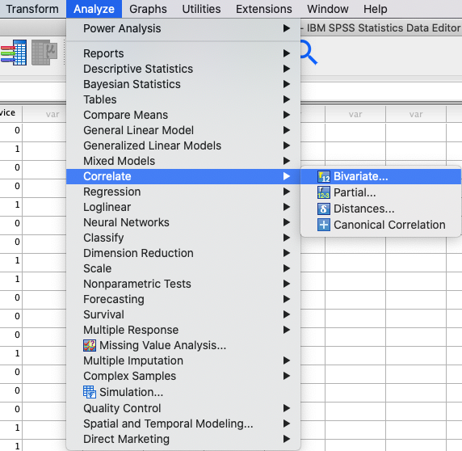
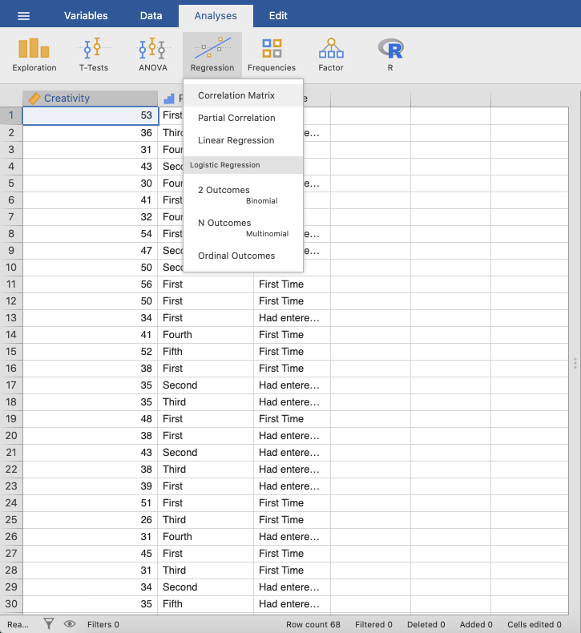
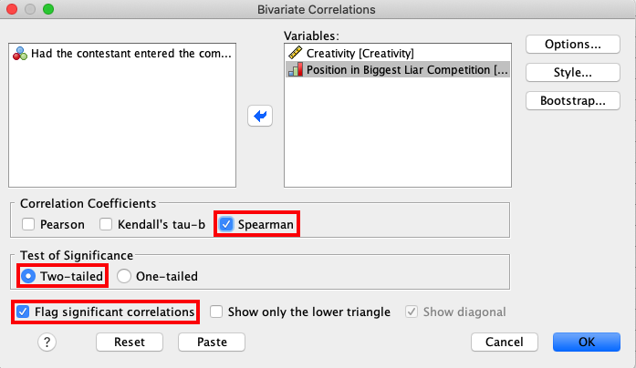
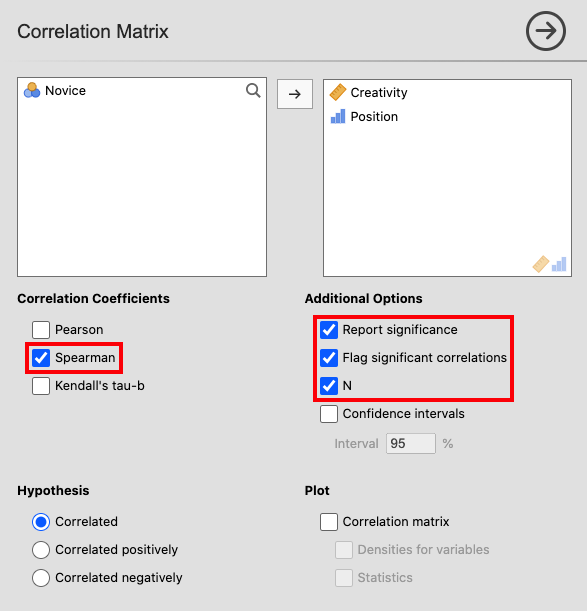
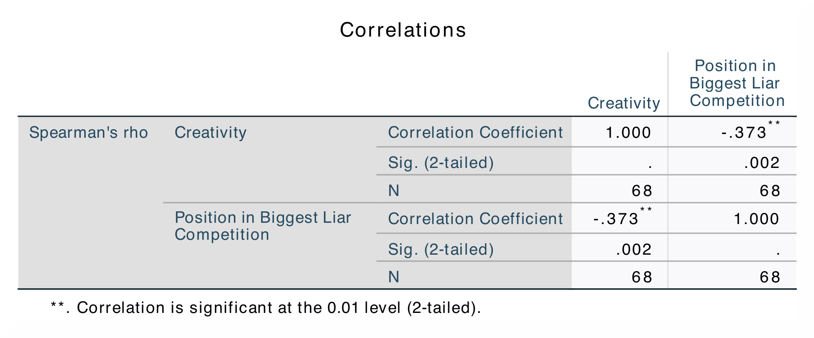
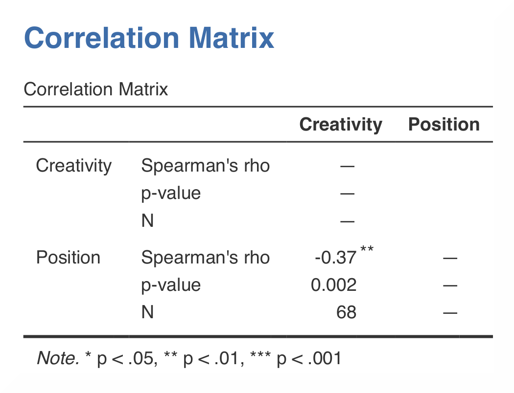

.. sectionauthor:: Rebecca Vederhus, `Sebastian Jentschke <https://www.uib.no/en/persons/Sebastian.Jentschke>`_

================================
From SPSS to jamovi: Correlation
================================

    This comparison shows how a Spearman’s correlation is conducted in SPSS and jamovi. The SPSS test follows the description in chapter 8.4.3 in `Field (2017)
    <https://edge.sagepub.com/field5e>`__, especially output 8.2. It uses the data set **The Biggest Liar.sav** which can be downloaded from the `web page
    accompanying the book <https://edge.sagepub.com/field5e/student-resources/datasets>`__.

+-------------------------------------------------------------------------------+-------------------------------------------------------------------------------+
| **SPSS**                                                                      | **jamovi**                                                                    |
+===============================================================================+===============================================================================+
| In SPSS you can run a correlation using: ``Analyze`` → ``Correlate`` →        | In jamovi you do this using: ``Analyses`` → ``Regression`` → ``Correlation    |
| ``Bivariate``.                                                                | Matrix``.                                                                     |
+-------------------------------------------------------------------------------+-------------------------------------------------------------------------------+
| |SPSS_Menu_corr2|                                                             | |jamovi_Menu_corr2|                                                           |
+-------------------------------------------------------------------------------+-------------------------------------------------------------------------------+
| In SPSS, move the variables ``Creativity`` and ``Position`` to the variable   | In jamovi, move the variables ``Creativity`` and ``Position`` into the box on |
| box ``Variables``. In addition, tick the box called ``Spearman`` under        | the right. Tick ``Spearman`` under ``Correlation Coefficients`` and ``Report  |
| ``Correlation Coefficients``.                                                 | significance``, ``Flag significant correlations`` and ``N`` under             |
|                                                                               | ``Additional Options``.                                                       |
+-------------------------------------------------------------------------------+-------------------------------------------------------------------------------+
| |SPSS_Input_corr2|                                                            | |jamovi_Input_corr2|                                                          |
+-------------------------------------------------------------------------------+-------------------------------------------------------------------------------+
| The results in SPSS and in jamovi are the same.                                                                                                               |
+-------------------------------------------------------------------------------+-------------------------------------------------------------------------------+
| |SPSS_Output_corr2|                                                           | |jamovi_Output_corr2|                                                         |
+-------------------------------------------------------------------------------+-------------------------------------------------------------------------------+
| In SPSS, you can tell if a correlation is significant by noting the amount of | jamovi, in accordance with APA-style, flags significant correlations using    |
| asterisks after the correlation coefficient. The correlation matrix shows the | one (p < .05), two (p < .01) or three (p < .001) asterisks. In contrast, in   |
| correlation coefficient, the p-value, and the sample size (N).                | SPSS all correlations above p < .01 level are simply marked using two instead |
|                                                                               | of three asterisks.                                                           |
+-------------------------------------------------------------------------------+-------------------------------------------------------------------------------+
| As in analysis on the previous page, the correlation coefficient is found both underneath and over the diagonal in SPSS, while in jamovi the coefficient is   |
| only shown underneath. The numerical values for the statistics are identical: *r* = -0.37, *p* < .01.                                                         |
+-------------------------------------------------------------------------------+-------------------------------------------------------------------------------+
| If you wish to replicate those analyses using syntax, you can use the commands below (in jamovi, just copy to code below to :ref:`Rj <rj_editor>`).           |
| Alternatively, you can download the SPSS output files and the jamovi files with the analyses from below the syntax.                                           |
+-------------------------------------------------------------------------------+-------------------------------------------------------------------------------+
| .. code-block:: none                                                          | .. code-block:: none                                                          |
|                                                                               |                                                                               |
|    NONPAR CORR                                                                |    jmv::corrMatrix(                                                           |
|      /VARIABLES=Creativity Position                                           |        data = data,                                                           |
|      /PRINT=SPEARMAN TWOTAIL NOSIG FULL                                       |        vars = vars(Creativity, Position),                                     |
|      /MISSING=PAIRWISE.                                                       |        pearson = FALSE,                                                       |
|                                                                               |        spearman = TRUE,                                                       |
|                                                                               |        flag = TRUE,                                                           |
|                                                                               |        n = TRUE)                                                              |
+-------------------------------------------------------------------------------+-------------------------------------------------------------------------------+
| `SPSS output file containing the analyses                                     | `jamovi file containing the analyses                                          |
| <../_static/output/s2j_Output_SPSS_corr2.spv>`_                               | <../_static/output/s2j_Output_jamovi_corr2.omv>`_                             |
+-------------------------------------------------------------------------------+-------------------------------------------------------------------------------+

| **References**
| Field, A. (2017). *Discovering statistics using IBM SPSS statistics* (5th ed.). SAGE Publications. https://edge.sagepub.com/field5e

.. ---------------------------------------------------------------------

