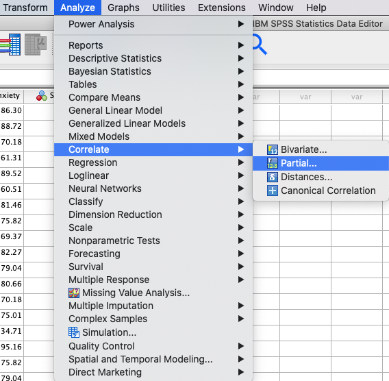
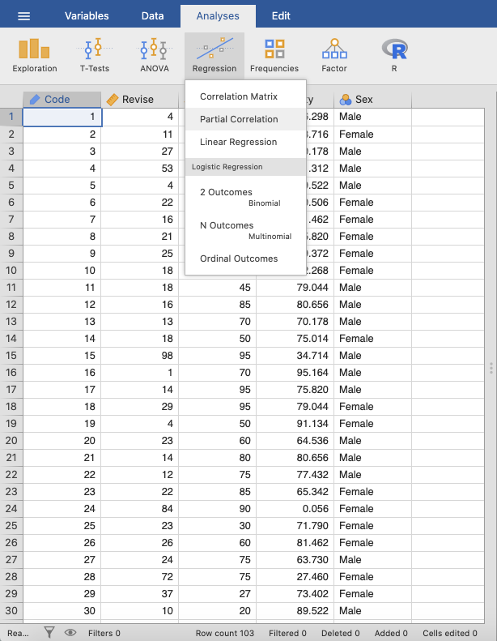
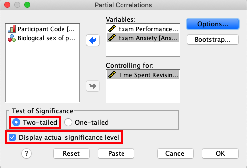
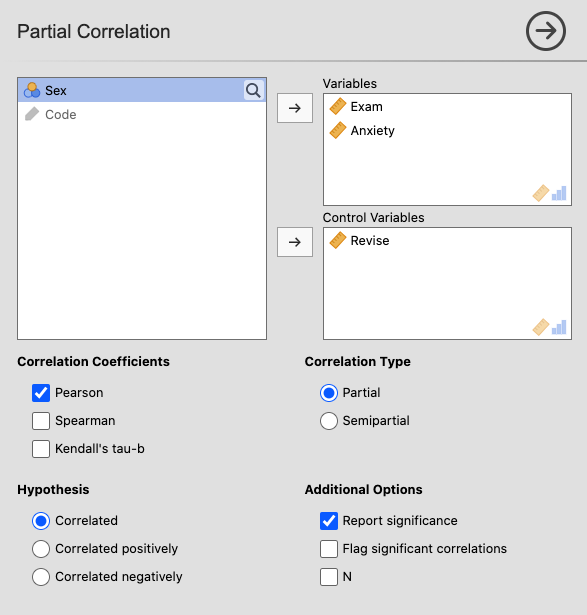
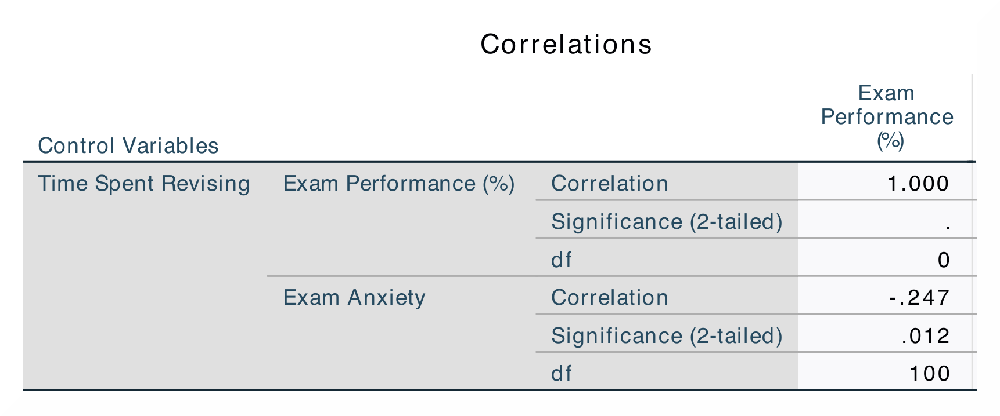
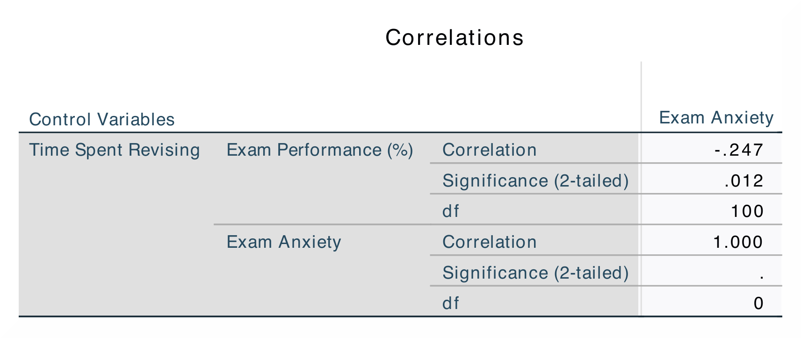
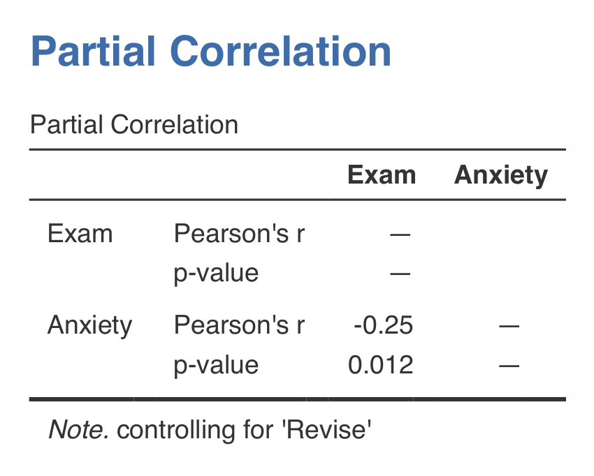

.. sectionauthor:: Rebecca Vederhus, `Sebastian Jentschke <https://www.uib.no/en/persons/Sebastian.Jentschke>`_

================================
From SPSS to jamovi: Correlation
================================

This comparison shows how a semi-partial (or partial) correlation is conducted in SPSS and jamovi. The SPSS test follows the description in chapter 8.5.3 in
`Field (2017) <https://edge.sagepub.com/field5e>`__, especially figure 8.11 and output 8.5. It uses the data set **Exam Anxiety.sav** which can be downloaded
from the `web page accompanying the book <https://edge.sagepub.com/field5e/student-resources/datasets>`__.

+-------------------------------------------------------------------------------+-------------------------------------------------------------------------------+
| **SPSS**                                                                      | **jamovi**                                                                    |
+===============================================================================+===============================================================================+
| In SPSS you can run a partial correlation using: ``Analyze`` → ``Correlate``  | In jamovi you do this using: ``Analyses`` → ``Regression`` → ``Partial        |
| → ``Partial``.                                                                | Correlation``.                                                                |
+-------------------------------------------------------------------------------+-------------------------------------------------------------------------------+
| |SPSS_Menu_corr5|                                                             | |jamovi_Menu_corr5|                                                           |
+-------------------------------------------------------------------------------+-------------------------------------------------------------------------------+
| In SPSS, move the variables ``Exam `` and ``Anxiety`` to the variable box     | In jamovi, move the variables ``Exam`` and ``Anxiety`` into the ``Variables`` |
| ``Variables``, and ``Revise`` into the box called ``Controlling for``.        | box and ``Revise`` into the variable box ``Control Variables``. Tick          |
|                                                                               | ``Pearson`` under ``Correlation Coefficients``and ``Report significance``     |
|                                                                               | under ``Additional Options``.                                                 |
+-------------------------------------------------------------------------------+-------------------------------------------------------------------------------+
| |SPSS_Input_corr5|                                                            | |jamovi_Input_corr5|                                                          |
+-------------------------------------------------------------------------------+-------------------------------------------------------------------------------+
| The results are the same in SPSS and in jamovi.                                                                                                               |
+-------------------------------------------------------------------------------+-------------------------------------------------------------------------------+
| |SPSS_Output_corr5_1|                                                         | |jamovi_Output_corr5|                                                         |
+-------------------------------------------------------------------------------+                                                                               |
| |SPSS_Output_corr5_2|                                                         |                                                                               |
+-------------------------------------------------------------------------------+-------------------------------------------------------------------------------+
| In SPSS, you can tell if a correlation is significant by noting the amount of | In jamovi, significant correlations are flagged using one (p < .05), two      |
| asterisks after the correlation coefficient. The correlation matrix shows the | (p < .01) or three (p < .001) asterisks. This differs from SPSS, where all    |
| correlation coefficient, the p-value, and the sample size (N).                | correlation above p < .01 level is simply marked using two instead of three   |
|                                                                               | asterisks.                                                                    |
+-------------------------------------------------------------------------------+-------------------------------------------------------------------------------+
| Results are presented twice in SPSS, while in jamovi they are only presented once. The numerical values for the statistics are identical: *r* = -.25.         |
+-------------------------------------------------------------------------------+-------------------------------------------------------------------------------+
| If you wish to replicate those analyses using syntax, you can use the commands below (in jamovi, just copy to code below to :ref:`Rj <rj_editor>`).           |
| Alternatively, you can download the SPSS output files and the jamovi files with the analyses from below the syntax.                                           |
+-------------------------------------------------------------------------------+-------------------------------------------------------------------------------+
| .. code-block:: none                                                          | .. code-block:: none                                                          |
|                                                                               |                                                                               |   
|    PARTIAL CORR                                                               |    jmv::corrPart(                                                             |
|      /VARIABLES=Exam Anxiety BY Revise                                        |        data = data,                                                           |
|      /SIGNIFICANCE=TWOTAIL                                                    |        vars = vars(Exam, Anxiety),                                            |
|      /MISSING=LISTWISE.                                                       |        controls = Revise)                                                     |
+-------------------------------------------------------------------------------+-------------------------------------------------------------------------------+
| `SPSS output file containing the analyses                                     | `jamovi file containing the analyses                                          |
| <../_static/output/s2j_Output_SPSS_corr5.spv>`_                               | <../_static/output/s2j_Output_jamovi_corr5.omv>`_                             |
+-------------------------------------------------------------------------------+-------------------------------------------------------------------------------+

| **References**
| Field, A. (2017). *Discovering statistics using IBM SPSS statistics* (5th ed.). SAGE Publications. https://edge.sagepub.com/field5e

.. ---------------------------------------------------------------------
                   

