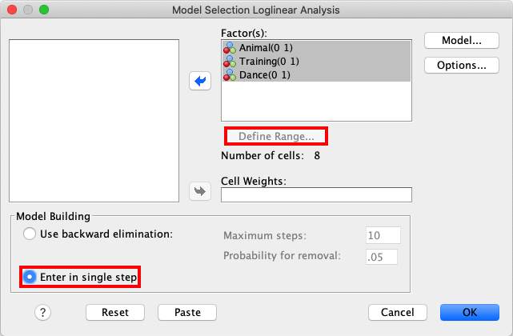
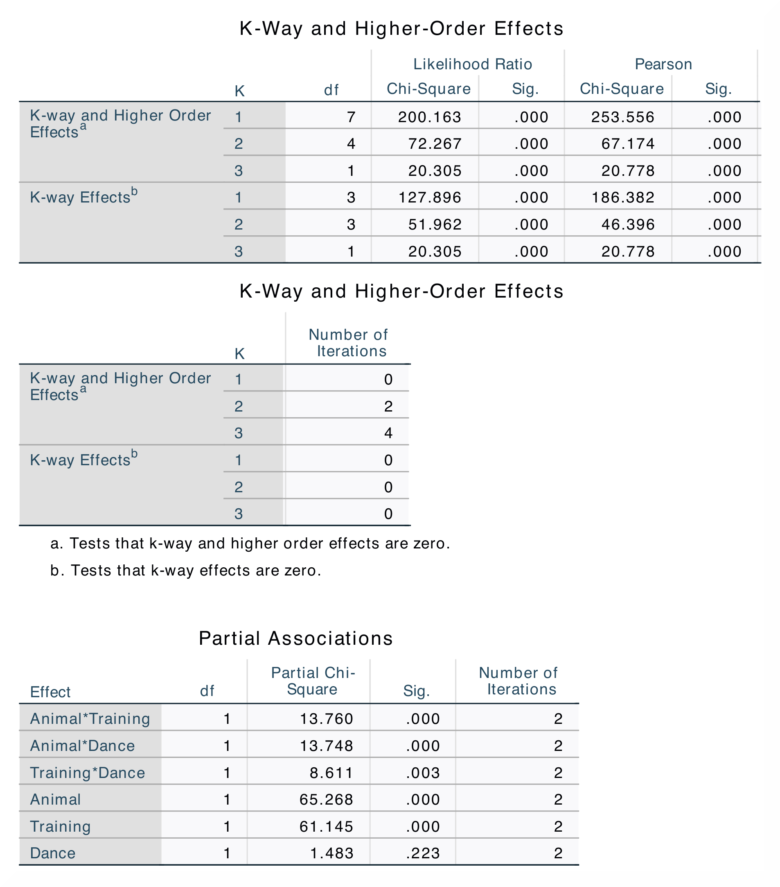

.. sectionauthor:: Rebecca Vederhus, `Sebastian Jentschke <https://www.uib.no/en/persons/Sebastian.Jentschke>`_

============================================
From SPSS to jamovi: Analysis of frequencies
============================================

    This comparison shows how a loglinear analysis is conducted in SPSS and jamovi. The SPSS test follows the description in chapter 19.9.2 in `Field (2017)
    <https://edge.sagepub.com/field5e>`__, especially figure 19.7 and output 19.7 - 19.10. It uses the data set **Cats and Dogs.sav** which can be downloaded
    from the `web page accompanying the book <https://edge.sagepub.com/field5e/student-resources/datasets>`__.

+-------------------------------------------------------------------------------+-------------------------------------------------------------------------------+
| **SPSS**                                                                      | **jamovi**                                                                    |
+===============================================================================+===============================================================================+
| In SPSS, you can run a loglinear analysis using: ``Analyze`` → ``Loglinear``  | In jamovi, this can be done using: ``Analyses`` → ``Frequencies`` →  ``Log-   |
| → ``Model Selection``.                                                        | Linear Regression``.                                                          |
+-------------------------------------------------------------------------------+-------------------------------------------------------------------------------+
| |SPSS_Menu_logLinear|                                                         | |jamovi_Menu_logLinear|                                                       |
+-------------------------------------------------------------------------------+-------------------------------------------------------------------------------+
| In SPSS, move the variables ``Animal``, ``Training`` and ``Dance`` to the     | In jamovi, move ``Animal``, ``Training`` and ``Dance`` to ``Factors``. Open   |
| ``Factor(s)`` box. Then, mark all three variables and click ``Define Range``. | the ``Model Builder`` window, click ``+ Add New Block`` and move the three    |
| In this window, set ``Minimum`` as 0 and ``Maximum`` as 1. Click              | variables to this block.                                                      |
| ``Continue``. In the box called ``Model Building``, click ``Enter in single   |                                                                               |
| step``.                                                                       |                                                                               |
+-------------------------------------------------------------------------------+-------------------------------------------------------------------------------+
| |SPSS_Input_logLinear_1|                                                      | |jamovi_Input_logLinear_1|                                                    |
+-------------------------------------------------------------------------------+                                                                               |
| |SPSS_Input_logLinear_2|                                                      |                                                                               |
+-------------------------------------------------------------------------------+-------------------------------------------------------------------------------+
|                                                                               | Add another block. Mark all three variables and choose ``All 2 way`` from the |
|                                                                               | drop-down menu. Then, add a third block and mark all three variables. Open    |
|                                                                               | the drop-down menu and click ``All 3 way``.                                   |
+-------------------------------------------------------------------------------+-------------------------------------------------------------------------------+
|                                                                               | |jamovi_Input_logLinear_2|                                                    |
+-------------------------------------------------------------------------------+-------------------------------------------------------------------------------+
|                                                                               | Open ``Model Fit`` and tick the box for ``Overall model test``. Lastly, tick  |
|                                                                               | ``Likelihood ratio tests`` in the ``Model Coefficients`` window.              |
+-------------------------------------------------------------------------------+-------------------------------------------------------------------------------+
|                                                                               | |jamovi_Input_logLinear_3|                                                    |
+-------------------------------------------------------------------------------+-------------------------------------------------------------------------------+
| Only the results in the output tables ``K-Way and Higher-Order Effects`` and ``Partial Associations`` in SPSS are replicated in the jamovi analysis.          |
+-------------------------------------------------------------------------------+-------------------------------------------------------------------------------+
| |SPSS_Output_logLinear|                                                       | |jamovi_Output_logLinear_1|                                                   |
|                                                                               +-------------------------------------------------------------------------------+
|                                                                               | |jamovi_Output_logLinear_2|                                                   |
+-------------------------------------------------------------------------------+-------------------------------------------------------------------------------+
| In the ``K-Way and Higher-Order Effects`` table, you can find *df*-values,    | In jamovi, the values that are found in the ``K-Way and Higher-Order          |
| likelihood ratio statistics and significance values when K = 1, 2 and 3. The  | Effects`` table in SPSS can be found in the ``Model Fit Measures`` and        |
| SPSS results also contains Pearson chi-square statistics. The different rows  | ``Model Comparisons`` tables. However, jamovi does not provide Pearson        |
| show if any higher-order effects or one-way effects significantly affect the  | chi-square statistics and the number of iterations. The partial associations  |
| model fit. The ``Partial Associations`` table breaks the model into specific  | table in jamovi is called ``Omnibus Likelihood Ratio Tests`` and are          |
| parts and tells us which two-way interactions that significantly affect the   | presented in three separate tables (one for each model).                      |
| fit of the model. You can tell this by looking  at the significance values    |                                                                               |
| for the different interactions and comparing them.                            |                                                                               |
+-------------------------------------------------------------------------------+-------------------------------------------------------------------------------+
| Output from the SPSS analysis contains a lot of tables that are not included in the jamovi analysis. In addition, the results from the parameter estimates    |
| tables differ from each other, and are therefore not included here.                                                                                           |
|                                                                                                                                                               |
| The numerical values for the statistics are the same: *χ²* = 127.90, *p* < .001; *χ²* = 200.16, *p* < .001; *χ²* = 51.96, *p* < .001: *χ²* = 20.30, *p* <     |
| .001; *χ²* = 65.27, *p* < .001; *χ²* = 61.15, *p* < .001; *χ²* = 1.48; *χ²* = 13.76, *p* < .001; *χ²* = 13.75, *p* < .001; *χ²* = 8.61, *p* < .01.            |
+-------------------------------------------------------------------------------+-------------------------------------------------------------------------------+
| If you wish to replicate those analyses using syntax, you can use the commands below (in jamovi, just copy to code below to :doc:`Rj <../jamovi2r/j2R_Rj>`).  |
| Alternatively, you can download the SPSS output files and the jamovi files with the analyses from below the syntax.                                           |
+-------------------------------------------------------------------------------+-------------------------------------------------------------------------------+
| .. code-block:: none                                                          | .. code-block:: none                                                          |
|                                                                               |                                                                               |   
|    HILOGLINEAR Animal(0 1) Training(0 1) Dance(0 1)                           |    jmv::logLinear(                                                            |
|      /CRITERIA ITERATION(20) DELTA(.0)                                        |        data = data,                                                           |
|      /PRINT=FREQ RESID ASSOCIATION ESTIM                                      |        factors = vars(Animal, Training, Dance),                               |     
|      /DESIGN.                                                                 |        blocks = list(                                                         |
|                                                                               |            list("Animal", "Training", "Dance"),                               |
|                                                                               |            list(c("Animal", "Training"), c("Animal", "Dance"),                |
|                                                                               |                 c("Training", "Dance")),                                      |
|                                                                               |            list(c("Animal", "Training", "Dance"))),                           |
|                                                                               |        refLevels = list(                                                      |
|                                                                               |             list(var = "Animal", ref = "Cat"),                                |
|                                                                               |             list(var = "Training", ref = "Food as Reward"),                   |
|                                                                               |             list(var = "Dance", ref = "No")),                                 |
|                                                                               |         modelTest = TRUE,                                                     |
|                                                                               |         dev = FALSE,                                                          |
|                                                                               |         aic = FALSE,                                                          |
|                                                                               |         pseudoR2 = NULL,                                                      |
|                                                                               |         omni = TRUE)                                                          |
+-------------------------------------------------------------------------------+-------------------------------------------------------------------------------+
| `SPSS output file containing the analyses                                     | `jamovi file containing the analyses                                          |
| <../_static/output/s2j_Output_SPSS_logLinear.spv>`_                           | <../_static/output/s2j_Output_jamovi_logLinear.omv>`_                         |
+-------------------------------------------------------------------------------+-------------------------------------------------------------------------------+

| **References**
| Field, A. (2017). *Discovering statistics using IBM SPSS statistics* (5th ed.). SAGE Publications. https://edge.sagepub.com/field5e

.. ---------------------------------------------------------------------

.. |jamovi_Input_logLinear_1|          image:: ../_images/s2j_jamovi_Input_logLinear_1.png

