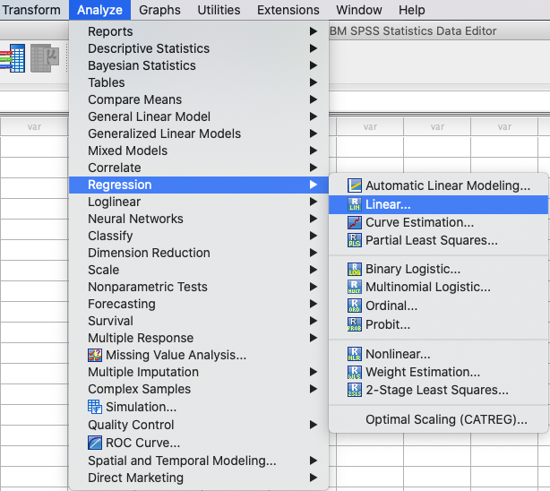
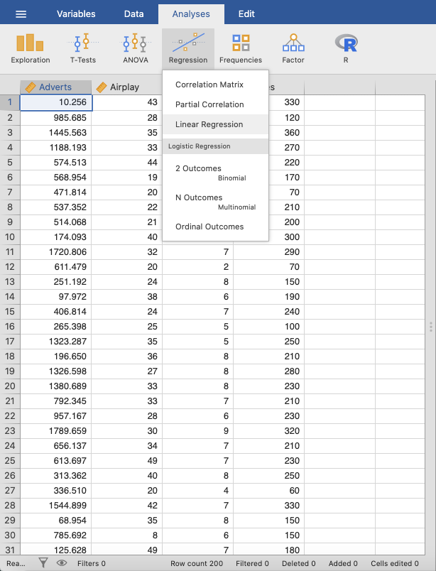
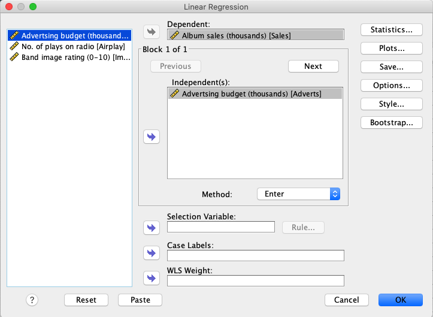
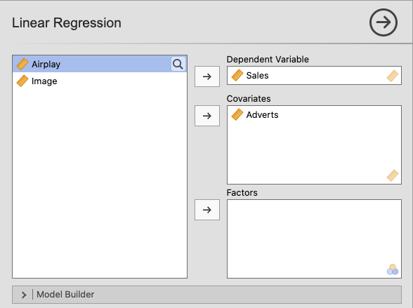
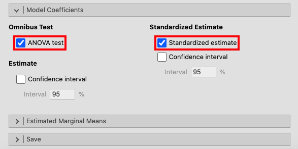
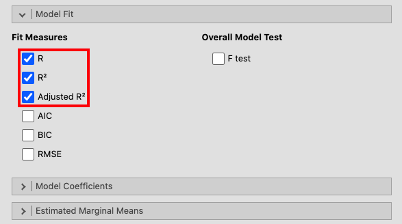
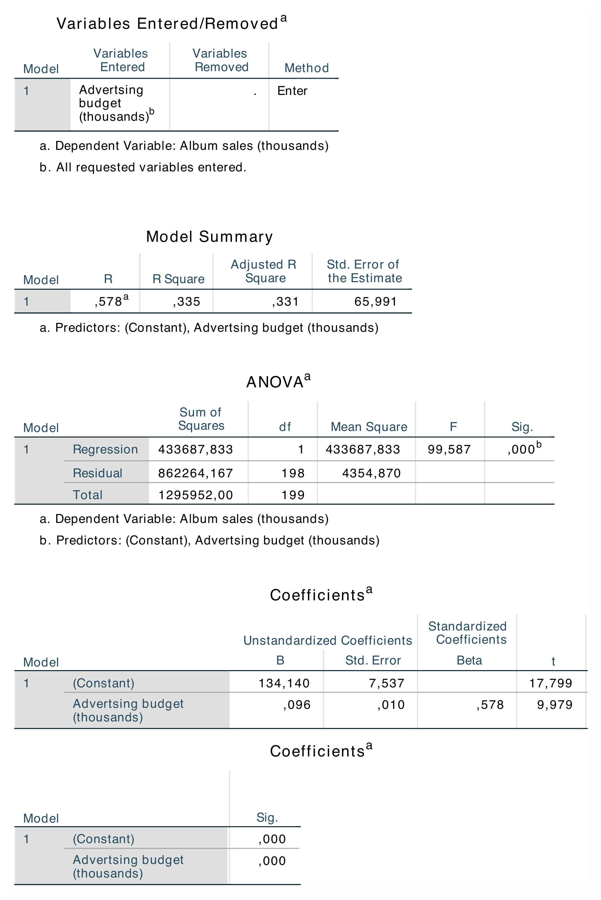
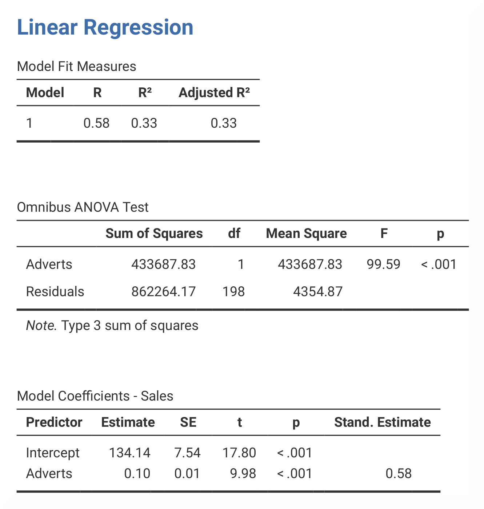

.. sectionauthor:: Rebecca Vederhus, `Sebastian Jentschke <https://www.uib.no/en/persons/Sebastian.Jentschke>`_

======================================
From SPSS to jamovi: Linear regression 
======================================

    This comparison shows how a linear model with one predictor is conducted in SPSS and jamovi. The SPSS test follows the description in chapter 9.7 in
    `Field (2017) <https://edge.sagepub.com/field5e>`__, especially figure 9.13, and output 9.2-9.4. It uses the data set **Album Sales.sav** which can be
    downloaded from the `web page accompanying the book <https://edge.sagepub.com/field5e/student-resources/datasets>`__.

+-------------------------------------------------------------------------------+-------------------------------------------------------------------------------+
| **SPSS**                                                                      | **jamovi**                                                                    |
+===============================================================================+===============================================================================+
| In SPSS, the following steps activates a linear regression: ``Analyze`` →     | In jamovi, this can be done using: ``Analyses`` → ``Regression`` →  ``Linear  |
| ``Regression`` → ``Linear``.                                                  | Regression``.                                                                 |
+-------------------------------------------------------------------------------+-------------------------------------------------------------------------------+
| |SPSS_Menu_linReg1|                                                           |  |jamovi_Menu_linReg1|                                                        |
+-------------------------------------------------------------------------------+-------------------------------------------------------------------------------+
| In SPSS, move the variable ``Sales`` to the ``Dependent`` box and the         | In jamovi, move ``Sales`` to the ``Dependent Variable`` box and ``Adverts``   |
| variable ``Adverts`` to the ``Independent(s)`` box. Click ``Ok``.             | to the ``Covariates`` box.                                                    |
+-------------------------------------------------------------------------------+-------------------------------------------------------------------------------+
| |SPSS_Input_linReg1|                                                          | |jamovi_Input_linReg1_1|                                                      |
+-------------------------------------------------------------------------------+-------------------------------------------------------------------------------+
|                                                                               | Then, open the ``Model Coefficients`` window and press ``ANOVA test`` and     |
|                                                                               | ``Standardized estimate``.                                                    |
+-------------------------------------------------------------------------------+-------------------------------------------------------------------------------+
|                                                                               | |jamovi_Input_linReg1_2|                                                      |
+-------------------------------------------------------------------------------+-------------------------------------------------------------------------------+
|                                                                               | In the window called ``Model Fit``, click ``R``, ``R²`` and ``Adjusted R²``.  |
+-------------------------------------------------------------------------------+-------------------------------------------------------------------------------+
|                                                                               | |jamovi_Input_linReg1_3|                                                      |
+-------------------------------------------------------------------------------+-------------------------------------------------------------------------------+
| Field (2017) recommends activating a bootstrapping for this analysis, but since this is not an alternative in jamovi it has been left out.                    |
+---------------------------------------------------------------------------------------------------------------------------------------------------------------+
| The results in SPSS and jamovi are essentially the same. However, jamovi does not display ``Std. Error of the Estimate`` and the total ``Sum of Squares`` in  | 
| the ANOVA output.                                                                                                                                             |
+-------------------------------------------------------------------------------+-------------------------------------------------------------------------------+
| |SPSS_Output_linReg1|                                                         | |jamovi_Output_linReg1|                                                       |
+-------------------------------------------------------------------------------+-------------------------------------------------------------------------------+
| The table Model Summary shows the value of *R* (= .578) and *R²* (= .335) for | In jamovi, *R* and *R²* are found in the table called Model Fit Measures. The |
| model. The most important part of the ANOVA table is the value of *F*         | results from the ANOVA is found in the table called Omnibus ANOVA Test, and   |
| (= 99.587), and its significance *p* (< .001). This shows that this model     | the beta values are found in the table Model Coefficients – Sales.            |
| this model predicts album sales significantly. The Coefficients table shows   | In jamovi, the beta value is found in the section called Stand. Estimate,     |
| the beta values and significance of these values.                             | which is located at the far right of the table. As this analysis only has one | 
|                                                                               | predictor, the *R* value is the correlation between advertising and album     |
|                                                                               | sales. Furthermore, the value of *R²* indicates that money spent on           |
|                                                                               | advertising can account for 33.5% of the variance in sales of albums.         |
+-------------------------------------------------------------------------------+-------------------------------------------------------------------------------+
| The numerical values for the statistics obtained from SPSS and jamovi are identical: *R* = 0.58, *R²* = 0.33, *F* = 99.59, *p* < .001; *β* = 0.58, *p* < .001.|
+-------------------------------------------------------------------------------+-------------------------------------------------------------------------------+
| If you wish to replicate those analyses using syntax, you can use the commands below (in jamovi, just copy to code below to :doc:`Rj <../jamovi2r/j2R_Rj>`).  |
<<<<<<< HEAD
| Alternatively, you can download the SPSS output files and the jamovi files with the analyses from below the syntax.                                           |
=======
>>>>>>> master
+-------------------------------------------------------------------------------+-------------------------------------------------------------------------------+
| .. code-block:: none                                                          | .. code-block:: none                                                          |
|                                                                               |                                                                               |   
|    REGRESSION                                                                 |    jmv::linReg(                                                               |
|       /MISSING LISTWISE                                                       |        data = data,                                                           |
|       /STATISTICS COEFF OUTS R ANOVA                                          |        dep = Sales,                                                           |
|       /CRITERIA=PIN(.05) POUT(.10)                                            |        covs = Adverts,                                                        |
|       /NOORIGIN                                                               |        blocks = list(                                                         |
|       /DEPENDENT Sales                                                        |            list("Adverts")),                                                  |
|       /METHOD=ENTER Adverts.                                                  |        refLevels = list(),                                                    |
|                                                                               |        r2Adj = TRUE,                                                          |
|                                                                               |        anova = TRUE,                                                          |
|                                                                               |        stdEst = TRUE)                                                         |
+-------------------------------------------------------------------------------+-------------------------------------------------------------------------------+
<<<<<<< HEAD
| `SPSS output file containing the analyses`_                                   | `jamovi file containing the analyses`_                                        | 
+-------------------------------------------------------------------------------+-------------------------------------------------------------------------------+
=======
>>>>>>> master

.. toctree::
   :hidden:

   s2j_linReg2

| **References**
| Field, A. (2017). *Discovering statistics using IBM SPSS statistics* (5th ed.). SAGE Publications. https://edge.sagepub.com/field5e

.. ---------------------------------------------------------------------

<<<<<<< HEAD

.. _SPSS output file containing the analyses:  ../_static/output/s2j_Output_SPSS_linReg1.spv
.. _jamovi file containing the analyses:       ../_static/output/s2j_Output_jamovi_linReg1.omv
=======
>>>>>>> master
