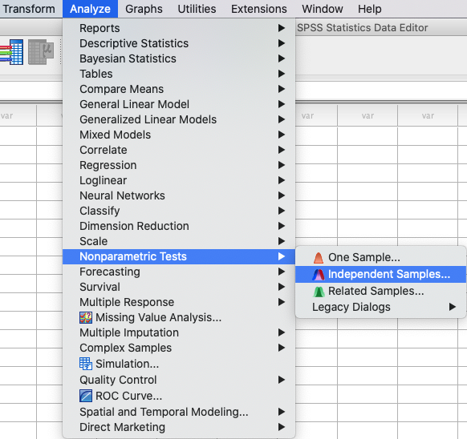

.. sectionauthor:: Rebecca Vederhus, `Sebastian Jentschke <https://www.uib.no/en/persons/Sebastian.Jentschke>`_

============================================
From SPSS to jamovi: Non-parametric analyses
============================================

    This comparison shows how a Mann-Whitney test is conducted in SPSS and jamovi. The SPSS test follows the description in chapter 7.4.3 in `Field (2017)
    <https://edge.sagepub.com/field5e>`__, especially figure 7.6 - 7.8 and output 7.2. It uses the data set **Drug.sav** which can be downloaded from the `web
    page accompanying the book <https://edge.sagepub.com/field5e/student-resources/datasets>`__.

+-------------------------------------------------------------------------------+-------------------------------------------------------------------------------+
| **SPSS**                                                                      | **jamovi**                                                                    |
+===============================================================================+===============================================================================+
| In SPSS, a Mann-Whitney test can be run using: ``Analyze`` → ``Nonparametric  | In jamovi this is done using the following steps: ``Analyses`` → ``T-tests``  |
| Tests `` → ``Independent Samples``.                                           | → ``Independent Samples T-Test``.                                             |
+-------------------------------------------------------------------------------+-------------------------------------------------------------------------------+
| |SPSS_Menu_nonParametric1|                                                    | |jamovi_Menu_nonParametric1|                                                  |
+-------------------------------------------------------------------------------+-------------------------------------------------------------------------------+
| In SPSS, choose ``Fields`` from the menu. Then, click ``Use custom field      | In jamovi, move ``Sunday_BDI`` and ``Wednesday_BDI`` to the ``Dependent       |
| assignments`` and move the variables ``Sunday_BDI`` and ``Wednesday_BDI`` to  | Variables`` variable box, and ``Drug`` to the ``Grouping Variable`` box.      |
| ``Test Fields``, and the variable ``Drug`` to ``Groups``.                     | Then, tick the box for ``Mann-Whitney U``.                                    |
+-------------------------------------------------------------------------------+-------------------------------------------------------------------------------+
| |SPSS_Input_nonParametric1_1|                                                 | |jamovi_Input_nonParametric1|                                                 |
+-------------------------------------------------------------------------------+-------------------------------------------------------------------------------+
| Open the ``Settings`` window, and click ``Customize tests``. Tick the box for |                                                                               |
| ``Mann-Whitney U (2 samples)``.                                               |                                                                               |
+-------------------------------------------------------------------------------+-------------------------------------------------------------------------------+
| |SPSS_Input_nonParametric1_2|                                                 |                                                                               |
+-------------------------------------------------------------------------------+-------------------------------------------------------------------------------+
| By comparing the output from SPSS and jamovi, you can tell that some of the   |                                                                               |
| results are the same. The results in jamovi are presented in a single table,  |                                                                               |
| while in SPSS you have to double-click the table in order to get the rest of  |                                                                               |
| the results.                                                                  |                                                                               |
+-------------------------------------------------------------------------------+-------------------------------------------------------------------------------+
| |SPSS_Output_nonParametric1_1|                                                | |jamovi_Output_nonParametric1|                                                |
|                                                                               |                                                                               |
| |SPSS_Output_nonParametric1_2|                                                |                                                                               |
|                                                                               |                                                                               |
| |SPSS_Output_nonParametric1_3|                                                |                                                                               |
+-------------------------------------------------------------------------------+-------------------------------------------------------------------------------+
| In SPSS, the first table is the ``Hypothesis Test Summary``, which only shows | In jamovi, results are presented in the ``Independent Samples T-Test`` table. |
| the significance value. If you double-click this table you open the model     | Here the *U*-value is found in the first column, and its significance level   |
| viewer window, which contains the details of the analysis. To view the        | in the second column.                                                         |
| results for the Wednesday sample, select ``Beck Depression Inventory          |                                                                               |
| (Wednesday) \* Type of Drug(Test 2)`` in the drop-down menu next to           |                                                                               |
| ``Field(s)``.                                                                 |                                                                               |
+-------------------------------------------------------------------------------+-------------------------------------------------------------------------------+
| The output in jamovi only presents the Mann-Whitney U statistic and its significance value, while SPSS presents values for ``Mean Rank``, ``N``, ``Total N``, |
| ``Wilcoxon W``, ``Test Statistic``, ``Standard Error``, ``Standardized Test Statistic`` and ``Asymptotic Sig. (2-sided test)``.                               |
|                                                                                                                                                               |
| The numerical values for the Wednesday group are the same in SPSS and jamovi (*U* = 4.00, *p* < .001), while the values for the Sunday group differ slightly  |
| (*U* = 35.50, *p* = .280 vs. *p* = .286). The reason for the difference is that jamovi applies `continuity correction                                         |
| <https://www.oxfordreference.com/view/10.1093/oi/authority.20110803100131510>`__ (where a discrete distribution – ranks – is approximated via a continuous    |
| one – the standard normal distribution) whereas SPSS doesn't.                                                                                                 |
+-------------------------------------------------------------------------------+-------------------------------------------------------------------------------+
| If you wish to replicate those analyses using syntax, you can use the commands below (in jamovi, just copy to code below to :ref:`Rj <rj_editor>`).           |
| Alternatively, you can download the SPSS output files and the jamovi files with the analyses from below the syntax.                                           |
+-------------------------------------------------------------------------------+-------------------------------------------------------------------------------+
| .. code-block:: none                                                          | .. code-block:: none                                                          |
|                                                                               |                                                                               |   
|    NPTESTS                                                                    |    jmv::ttestIS(                                                              |
|      /INDEPENDENT TEST (Sunday_BDI Wednesday_BDI) GROUP (Drug) MANN_WHITNEY   |        formula = Sunday_BDI + Wednesday_BDI ~ Drug,                           |
|      /MISSING SCOPE=ANALYSIS USERMISSING=EXCLUDE                              |        data = data,                                                           |
|      /CRITERIA ALPHA=0.05 CILEVEL=95.                                         |        students = FALSE,                                                      |
|                                                                               |        mann = TRUE)                                                           |
+-------------------------------------------------------------------------------+-------------------------------------------------------------------------------+
| `SPSS output file containing the analyses                                     | `jamovi file with the analyses                                                |
| <../_static/output/s2j_Output_SPSS_nonParametric1.spv>`_                      | <../_static/output/s2j_Output_jamovi_nonParametric1.omv>`_                    |
+-------------------------------------------------------------------------------+-------------------------------------------------------------------------------+

.. toctree::
   :hidden:

   s2j_nonParametric2
   s2j_nonParametric3

| **References**
| Field, A. (2017). *Discovering statistics using IBM SPSS statistics* (5th ed.). SAGE Publications. https://edge.sagepub.com/field5e

.. ---------------------------------------------------------------------

.. |jamovi_Menu_nonParametric1|        image:: ../_images/s2j_jamovi_Menu_ nonParametric1.png
.. |SPSS_Input_nonParametric1_1|       image:: ../_images/s2j_SPSS_Input_ nonParametric1_1.png
.. |SPSS_Input_nonParametric1_2|       image:: ../_images/s2j_SPSS_Input_ nonParametric1_2.png
.. |jamovi_Input_nonParametric1|       image:: ../_images/s2j_jamovi_Input_ nonParametric1.png
.. |SPSS_Output_nonParametric1_1|      image:: ../_images/s2j_SPSS_Output_ nonParametric1_1.png
.. |SPSS_Output_nonParametric1_2|      image:: ../_images/s2j_SPSS_Output_ nonParametric1_2.png
.. |SPSS_Output_nonParametric1_3|      image:: ../_images/s2j_SPSS_Output_ nonParametric1_3.png
.. |jamovi_Output_nonParametric1|      image:: ../_images/s2j_jamovi_Output_ nonParametric1.png
