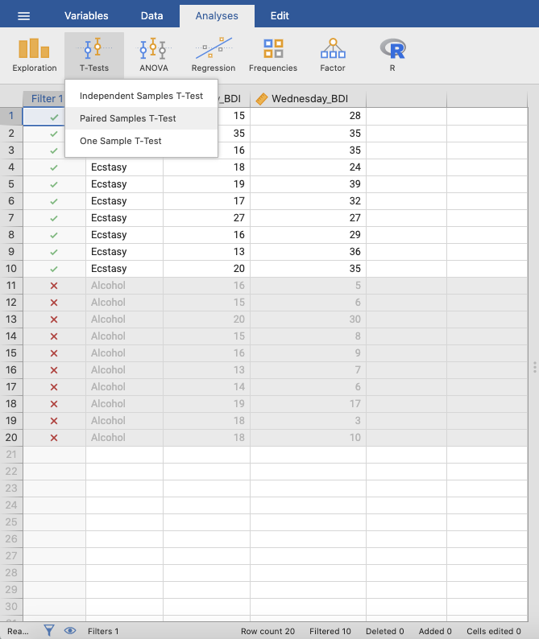
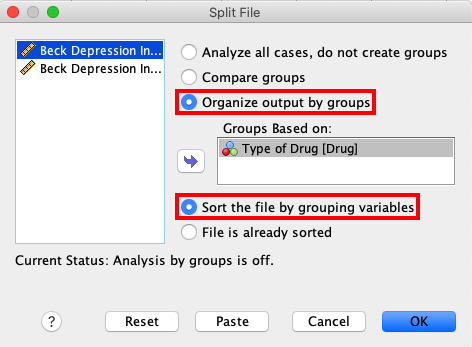
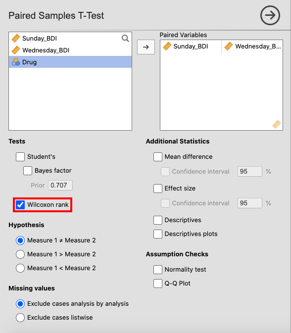

.. sectionauthor:: Rebecca Vederhus, `Sebastian Jentschke <https://www.uib.no/en/persons/Sebastian.Jentschke>`_

============================================
From SPSS to jamovi: Non-parametric analyses
============================================

    This comparison shows how a Wilcoxon signed-rank test is conducted in SPSS and jamovi. The SPSS test follows the description in chapter 7.5.2 in
    `Field (2017) <https://edge.sagepub.com/field5e>`__, especially figure 7.9 and output 7.3 - 7.4. It uses the data set **Drug.sav** which can be downloaded
    from the `web page accompanying the book <https://edge.sagepub.com/field5e/student-resources/datasets>`__.

+-------------------------------------------------------------------------------+-------------------------------------------------------------------------------+
| **SPSS**                                                                      | **jamovi**                                                                    |
+===============================================================================+===============================================================================+
| In SPSS, first split the file using ``Data`` → ``Split File``.                | In jamovi, the ``FILTER()``-function can be used to achieve a split. You need |
+-------------------------------------------------------------------------------+ to create two new computed variables (ideally, those variables should be      |
| |SPSS_Menu_nonParametric2_1|                                                  | inserted before ``Wednesay_BDI``). For the first, use ``FILTER(Sunday_BDI,    |
+-------------------------------------------------------------------------------+ Drug == "Ecstasy")`` as expression to be calculated and name the variable     |
| In the ``Split File`` window, click ``Organize output by groups``. Then, move | ``Sunday_BDI_Ecstasy``. For the second, use ``FILTER(Sunday_BDI, Drug ==      |
| the ``Drug`` variable to the box called ``Groups Based on``. Lastly, click    | "Alcohol")`` as expression and ``Sunday_BDI_Alcohol`` as name. Please note,   |
| ``Sort the file by grouping variables``.                                      | that it is not necessary to split the second variable ``Wednesday_BDI`` since |
|                                                                               | jamovi uses listwise exclusion.                                               |
+-------------------------------------------------------------------------------+-------------------------------------------------------------------------------+       
| |SPSS_Input_nonParametric2_1|                                                 | |jamovi_Menu_nonParametric2_1|                                                |
|                                                                               | |jamovi_Menu_nonParametric2_2|                                                |
|                                                                               | |jamovi_Menu_nonParametric2_3|                                                |
+-------------------------------------------------------------------------------+-------------------------------------------------------------------------------+
| Then, create a Mann-Whitney test using: ``Analyze`` → ``Nonparametric Tests`` | Create a Wilcoxon signed-rank test using: ``Analyses`` → ``T-tests`` →        |
| → ``Related Samples``.                                                        | ``Paired Samples T-Test``.                                                    |
+-------------------------------------------------------------------------------+-------------------------------------------------------------------------------+
| |SPSS_Menu_nonParametric2_2|                                                  | |jamovi_Menu_nonParametric2_4|                                                |
+-------------------------------------------------------------------------------+-------------------------------------------------------------------------------+
| In the ``Nonparametric Tests`` window, open ``Fields`` and click ``Use custom | Select ``Wednesday_BDI`` and ``Sunday_BDI_Ecstasy``, and move them to the     |
| field assignments``. Move the ``Sunday`` and ``Wednesday`` variables to the   | ``Paired Variables`` box. Then, untick ``Student's`` and tick the box for     |
| ``Test Fields`` box.                                                          | ``Wilcoxon rank``. Afterwards, you can either right-click on the analysis you |
|                                                                               | just created and select ``Analysis`` → ``Duplicate`` or repeat the previous   |
|                                                                               | step to set up a new analysis. This time, ``Wednesday_BDI`` and               |
|                                                                               | ``Sunday_BDI_Ecstasy`` have to be chosen as ``Paired Variables``.             |
+-------------------------------------------------------------------------------+-------------------------------------------------------------------------------+
| |SPSS_Input_nonParametric2_2|                                                 | |jamovi_Input_nonParametric2|                                                 |
+-------------------------------------------------------------------------------+-------------------------------------------------------------------------------+
| Lastly, open ``Settings`` and click ``Customize tests``. Tick the box for     |                                                                               |
| ``Wilcoxon matched-pair signed-rank`` as shown in the picture below.          |                                                                               |
+-------------------------------------------------------------------------------+-------------------------------------------------------------------------------+
| |SPSS_Input_nonParametric2_3|                                                 |                                                                               |
+-------------------------------------------------------------------------------+-------------------------------------------------------------------------------+
| Comparisons of the output show that the results in SPSS and jamovi are slightly different.                                                                    |
+-------------------------------------------------------------------------------+-------------------------------------------------------------------------------+
| |SPSS_Output_nonParametric2_1|                                                | |jamovi_Output_nonParametric2|                                                |
| |SPSS_Output_nonParametric2_2|                                                |                                                                               |
+-------------------------------------------------------------------------------+-------------------------------------------------------------------------------+
| In SPSS, the first output table is the model summary, which only shows the    | Other than SPSS, the ``Paired Samples T-Test`` table only displays the test   |
| *p*-value for the test. If you double-click this table, you get the details   | statistic and its significance value.                                         |
| of the analysis (see images underneath). There are two model summaries, on    |                                                                               |
| for each drug condition. The Wilcoxon Signed Rank test show the following     |                                                                               |
| values: ``Total N``, ``Test Statistic``, ``Standard Error``, ``Standardized   |                                                                               |
| Test Statistic`` and ``Asymptotic Sig. (2-sided test)``.                      |                                                                               |
+-------------------------------------------------------------------------------+                                                                               |
| |SPSS_Output_nonParametric2_3|                                                |                                                                               |
| |SPSS_Output_nonParametric2_4|                                                |                                                                               |
+-------------------------------------------------------------------------------+-------------------------------------------------------------------------------+
| When comparing the output, none of the numerical values for the test statistic are the same. The reason for the difference in p-values is that jamovi         |
| applies `continuity correction <https://www.oxfordreference.com/view/10.1093/oi/authority.20110803100131510>`__ (where a discrete distribution – ranks – is   |
| approximated via a continuous one – the standard normal distribution) whereas SPSS doesn't.                                                                   |
+-------------------------------------------------------------------------------+-------------------------------------------------------------------------------+
| If you wish to replicate those analyses using syntax, you can use the commands below (in jamovi, just copy to code below to :ref:`Rj <rj_editor>`).           |
| Alternatively, you can download the SPSS output files and the jamovi files with the analyses from below the syntax.                                           |
+-------------------------------------------------------------------------------+-------------------------------------------------------------------------------+
| .. code-block:: none                                                          | .. code-block:: none                                                          |
|                                                                               |                                                                               |   
|    NPTESTS                                                                    |    jmv::ttestPS(                                                              |
|       /RELATED TEST(Sunday_BDI Wednesday_BDI) WILCOXON                        |        data = data,                                                           |
|       /MISSING SCOPE=ANALYSIS USERMISSING=EXCLUDE                             |        pairs = list(                                                          |
|       /CRITERIA ALPHA=0.05 CILEVEL=95.                                        |            list(i1 = "Wednesday_BDI", i2 = "Sunday_BDI_Ecstasy")),            |
|                                                                               |        students = FALSE,                                                      |
|                                                                               |        wilcoxon = TRUE)                                                       |
|                                                                               |                                                                               |
|                                                                               |    jmv::ttestPS(                                                              |
|                                                                               |        data = data,                                                           |
|                                                                               |        pairs = list(                                                          |
|                                                                               |            list(i1 = "Wednesday_BDI", i2 = "Sunday_BDI_Alcohol")),            |
|                                                                               |        students = FALSE,                                                      |
|                                                                               |        wilcoxon = TRUE)                                                       |
|                                                                               |                                                                               |
+-------------------------------------------------------------------------------+-------------------------------------------------------------------------------+
| `SPSS output file containing the analyses                                     | `jamovi file with the analyses                                                |
| <../../_static/output/s2j_Output_SPSS_nonParametric2.spv>`_                   | <../../_static/output/s2j_Output_jamovi_nonParametric2.omv>`_                 |
+-------------------------------------------------------------------------------+-------------------------------------------------------------------------------+

| **References**
| Field, A. (2017). *Discovering statistics using IBM SPSS statistics* (5th ed.). SAGE Publications. https://edge.sagepub.com/field5e

.. ---------------------------------------------------------------------

.. |SPSS_Menu_nonParametric2_2|        image:: ../_images/s2j_SPSS_Menu_nonParametric2_2.png

.. |SPSS_Input_nonParametric2_3|       image:: ../_images/s2j_SPSS_Input_nonParametric2_3.png

.. |SPSS_Output_nonParametric2_2|      image:: ../_images/s2j_SPSS_Output_nonParametric2_2.png

.. |jamovi_Output_nonParametric2|      image:: ../_images/s2j_jamovi_Output_nonParametric2.png
