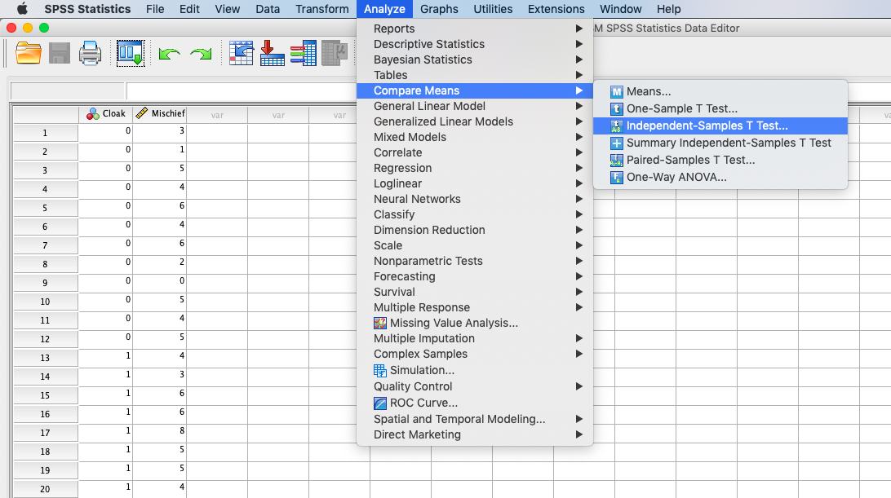
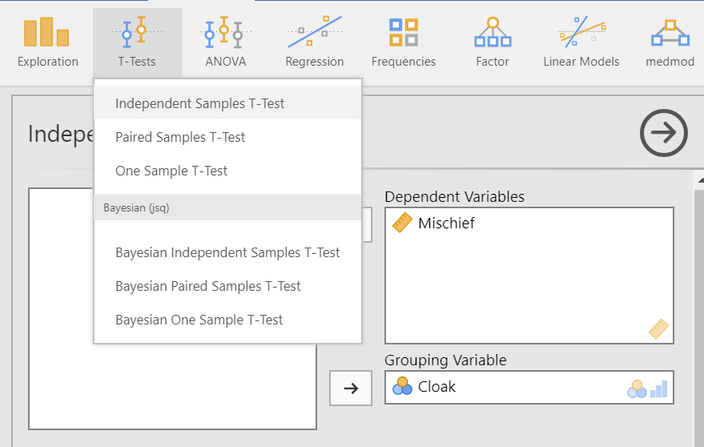
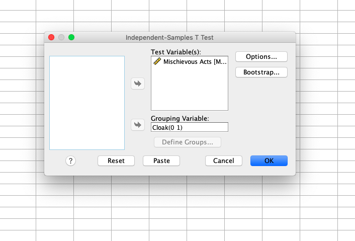
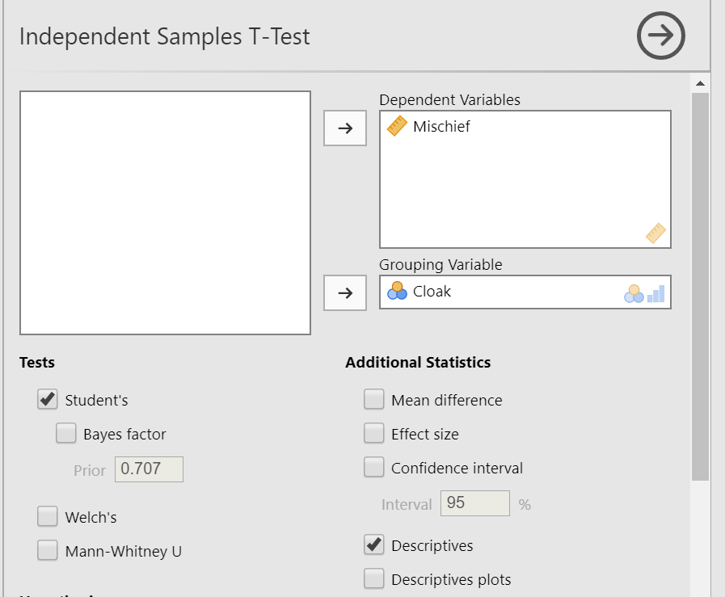
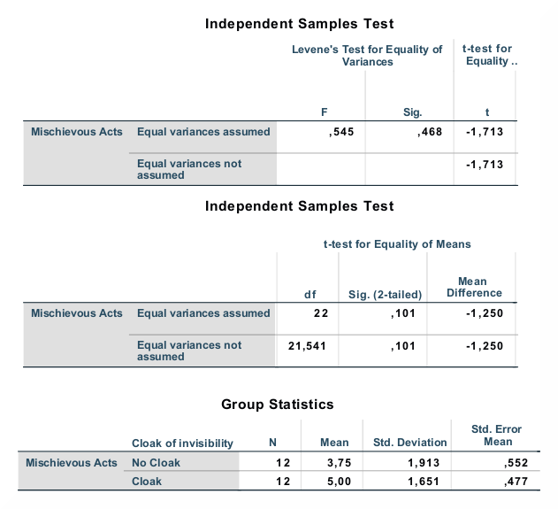
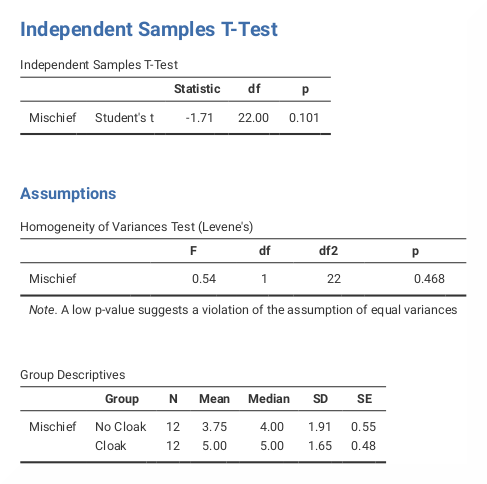

.. sectionauthor:: `Sebastian Jentschke <https://www.uib.no/en/persons/Sebastian.Jentschke>`_

===================================================
From SPSS to jamovi: t-test for independent samples 
===================================================

    This comparison shows how a t-test for independent samples is performed in SPSS and jamovi. How the test is conducted in SPSS follows the description in
    chapter 10.8 of `Field (2017) <https://edge.sagepub.com/field5e>`__, especially Figure 10.4 and Output 10.3 - 10.4. It uses the data set
    **Invisibility.sav** which can be downloaded from the `web page accompanying the book <https://edge.sagepub.com/field5e/student-resources/datasets>`__.

+-------------------------------------------------------------------------------+-------------------------------------------------------------------------------+
| **SPSS**                                                                      | **jamovi**                                                                    |
+===============================================================================+===============================================================================+
| In SPSS you can run an independent t-test using: ``Analyze`` → ``Compare      | In jamovi you do this using: ``Analyses`` (tab) → ``T-Tests`` →               |
| Means`` → ``Independent Samples T-test``                                      | ``Independent Samples T-Test``                                                |
+-------------------------------------------------------------------------------+-------------------------------------------------------------------------------+
| |SPSS_Menu_ttestIS1|                                                          | |jamovi_Menu_ttestIS1|                                                        |
+-------------------------------------------------------------------------------+-------------------------------------------------------------------------------+
| In SPSS, ``Mischevious acts`` is moved to the variable box ``Test             | In jamovi, the variable ``Mischief`` is moved to the variable box ``Dependent |
| variables(s)`` and ``Cloak of invisibility`` to variable box ``Grouping       | Variable(s)``, and the variable ``Cloak`` is moved to the variable box        |
| variables``. Afterwards, press the button ``Define Groups...`` (underneath    | ``Grouping Variable``. If you wish to obtain an identical output to SPSS, one |
| the variable box ``Grouping variables``) and enter ``0`` under ``Group 1``    | has to switch on the Levene's Test for the Equality of Variances, by ticking  |
| and ``1`` under ``Group 2``.                                                  | ``Homogeneity Test`` under ``Assumption Checks``; the table with the          |
|                                                                               | descriptive statistics for the two groups can be selected by ticking          |
|                                                                               | ``Descriptives`` under ``Additional Statistics``.                             |
+-------------------------------------------------------------------------------+-------------------------------------------------------------------------------+
| |SPSS_Input_ttestIS1|                                                         | |jamovi_Input_ttestIS1|                                                       |
+-------------------------------------------------------------------------------+-------------------------------------------------------------------------------+
| If one compares the outputs of SPSS and jamovi, the results are the same. However, the output of jamovi appears much clearer. The main results can be found   |
| in slightly different places in SPSS and jamovi.                                                                                                              |
+-------------------------------------------------------------------------------+-------------------------------------------------------------------------------+
| |SPSS_Output_ttestIS1|                                                        | |jamovi_Output_ttestIS1|                                                      |
+-------------------------------------------------------------------------------+-------------------------------------------------------------------------------+
| In SPSS, the output table ``Independent Samples T-Test`` starts with Levene's | If the p-value in the table ``Homogeneity of Variances Test (Levene's)`` is   |
| Test for the Equality of Variances. If it is NOT significant (p >   0.05),    | significant (p < 0.05), then you have to correct for that inhomogeneity. To   |
| one can use the results from the first line (``Equal variances assumed``),    | do so, untick ``Student's`` and tick ``Welch's`` instead (under ``Test`` in   |
| otherwise, you have to use the results from the second line (``Equal          | the input panel). The results described underneath can be found in the first  |                 
| variances not assumed``).                                                     | table ``Independent Samples T-Test``.                                         |
+-------------------------------------------------------------------------------+-------------------------------------------------------------------------------+
| The t-value can be found in the third column (``t``) in SPSS and the first column (``statistics``) in jamovi, the next column after that (``df``, both in     |
| SPSS and jamovi) shows the degrees of freedom and the column after that (``Sig. (2-tailed)`` in SPSS, ``p`` in jamovi) the p-value for this combination of    |
| t-value and degrees of freedom.                                                                                                                               |
|                                                                                                                                                               |   
| The numerical values for the statistics are identical: *t* = -1.71, *df* = 22, *p* = 0.101.                                                                   |
+-------------------------------------------------------------------------------+-------------------------------------------------------------------------------+
| If you wish to replicate those analyses using syntax, you can use the commands below (in jamovi, just copy to code below to :doc:`Rj <../jamovi2r/j2R_Rj>`).  |
| Alternatively, you can download the SPSS output files and the jamovi files with the analyses from below the syntax.                                           |
+-------------------------------------------------------------------------------+-------------------------------------------------------------------------------+
| .. code-block:: none                                                          | .. code-block:: none                                                          |
|                                                                               |                                                                               |   
|    T-TEST GROUPS=Cloak(0 1)                                                   |    jmv::ttestIS(                                                              |
|       /VARIABLES=Mischief                                                     |        data = data,                                                           |
|       /CRITERIA=CI(.95)                                                       |        formula = Mischief ~ Cloak,                                            |
|       /MISSING=ANALYSIS.                                                      |        desc = TRUE,                                                           |
|                                                                               |        eqv = TRUE)                                                            |
+-------------------------------------------------------------------------------+-------------------------------------------------------------------------------+
| `SPSS output file containing the analyses                                     | `jamovi file with the analyses                                                |
| <../_static/output/s2j_Output_SPSS_ttestIS.spv>`_                             | <../_static/output/s2j_Output_jamovi_ttestIS.omv>`_                           |
+-------------------------------------------------------------------------------+-------------------------------------------------------------------------------+

| **References**
| Field, A. (2017). *Discovering statistics using IBM SPSS statistics* (5th ed.). SAGE Publications. https://edge.sagepub.com/field5e

.. ---------------------------------------------------------------------

.. _SPSS output file containing the analyses:  ../_static/output/s2j_Output_SPSS_ttestIS.spv
.. _jamovi file containing the analyses:       ../_static/output/s2j_Output_jamovi_ttestIS.omv
