.. sectionauthor:: `Sebastian Jentschke <https://www.uib.no/en/persons/Sebastian.Jentschke>`_

==============================================
From SPSS to jamovi: t-test for paired samples 
==============================================

    This comparison shows how a t-test for independent samples is performed in SPSS and jamovi. As a first step, it demonstrates the calculation of the
    statistics underlying the t-test for paired samples. For this calculation, first, the average number of mischieveous acts for each person is calculated
    before a mean of these individual averages is calculated for the whole group. The individual is then adjusted for that group mean. The aim of this
    calculation is to show that by using repeated measurements, one can “control” for some proportion of the variance which is caused by individual differences
    in performance. In connection with this, the standard error of mean becomes smaller (which means that effects easier can become significant (as compared to
    a between-subjects design). This is described in chapter 10.9.2 of `Field (2017) <https://edge.sagepub.com/field5e>`__, especially Figure 10.7 to 10.10.
    
    It uses the data set **Invisibility RM.sav** which can be obtained from the `web page accompanying the book
    <https://edge.sagepub.com/field5e/student-resources/datasets>`__. The data set describes a repeated-measures-design where first the “baseline”-number of
    mischieveous acts (during one week) is determined for each participant (variable ``No_Cloak``) before they are handed a cloak that makes them invisible.
    After receiving the cloak, the number of mischieveous acts is recorded for the following week (variable ``Cloak``) during which they can make themselves
    invisible (which is assumed to increase the number of mischieveous acts committed).

+-------------------------------------------------------------------------------+-------------------------------------------------------------------------------+
| **SPSS**                                                                      | **jamovi**                                                                    |
+===============================================================================+===============================================================================+
| In SPSS you can create variables using: ``Transform`` →                       | In jamovi you do this using: ``Data`` (tab) → ``Compute``                     |
| ``Compute Variable...``                                                       |                                                                               |
+-------------------------------------------------------------------------------+-------------------------------------------------------------------------------+
| |SPSS_Theory_ttestPS1|                                                        | |jamovi_Theory_ttestPS1|                                                      |
+-------------------------------------------------------------------------------+-------------------------------------------------------------------------------+
| Both in SPSS and jamovi, you can calculate the average of the two columns ``No_Cloak`` and ``Cloak`` by using the calculation term ``MEAN(No_Cloak, Cloak)``  |
| (as shown in the images below). Alternatively, you can choose the function to calculate the mean from the available functions (press ``fx`` in jamovi to open |
| a input window where you can select those functions).                                                                                                         |
+-------------------------------------------------------------------------------+-------------------------------------------------------------------------------+
| |SPSS_Theory_ttestPS2|                                                        | |jamovi_Theory_ttestPS2|                                                      |
+-------------------------------------------------------------------------------+-------------------------------------------------------------------------------+
| Now we would like to calculate the group mean for the individual means of the two conditions (``No_Cloak`` and ``Cloak``). To do this, we calculate           |
| descriptive statistics.                                                                                                                                       |
+-------------------------------------------------------------------------------+-------------------------------------------------------------------------------+
| In SPSS this is done with: ``Analyze`` → ``Descriptive Statistics`` →         | In jamovi this is done using: ``Analyzes`` → ``Exploration`` →                |
| ``Descriptives``. In the input window, you assign the variable with the       | ``Descriptives``. In the input panel, you assign the variable with the        |
| individual mean ``Mean`` to ``Variable(s)``.                                  | individual mean ``Mean`` to ``Variables``.                                    |
+-------------------------------------------------------------------------------+-------------------------------------------------------------------------------+
| |SPSS_Theory_ttestPS3|                                                        | |jamovi_Theory_ttestPS3|                                                      |
+-------------------------------------------------------------------------------+-------------------------------------------------------------------------------+
| After clicking ``Options`` in the input window, one can adjust which          | In jamovi, one can adjust which statistics one wishes to be calculated in the |
| statistics one wishes to be calculated. For now, we just need to ``Mean`` and | drop-down-menu ``Statistics``. There, we untick all settings except for       |
| could (in principle) just untick all other values.                            | ``Mean``.                                                                     |
+-------------------------------------------------------------------------------+-------------------------------------------------------------------------------+
| |SPSS_Theory_ttestPS4|                                                        | |jamovi_Theory_ttestPS4|                                                      |
+-------------------------------------------------------------------------------+-------------------------------------------------------------------------------+
| The mean value (4.375) which is the output from the descriptive statistics is used in the next step.                                                          |
+-------------------------------------------------------------------------------+-------------------------------------------------------------------------------+
| |SPSS_Theory_ttestPS5|                                                        | |jamovi_Theory_ttestPS5|                                                      |
+-------------------------------------------------------------------------------+-------------------------------------------------------------------------------+
| More specifically, it is used to calculate an adjustment variable that “corrects” the individual means for the group mean (i.e., it calculates for each       |
| participant where the mean for that participant – ``Mean`` – is located relatively to the group mean – 4.375).                                                |
+-------------------------------------------------------------------------------+-------------------------------------------------------------------------------+
| To calculate this ``Adjustment``-variable in SPSS, we create a new variable   | To calculate the ``Adjustment``-variable in jamovi, we choose ``Data`` (tab)  |
| using: ``Transform`` → ``Compute Variable…`` In numeric expression, we        | → ``Compute`` → ``Compute Variable``, and enter the term ``(4.375) - Mean``   |
| enter the term ``(4.375) - Mean`` as shown in the picture below in order to   | into the input box (marked in red in the picture below) to calculate the new  |
| calculate the new variable ``Adjustment``.                                    | variable ``Adjustment``.                                                      |
+-------------------------------------------------------------------------------+-------------------------------------------------------------------------------+
| |SPSS_Theory_ttestPS6|                                                        | |jamovi_Theory_ttestPS6|                                                      |
+-------------------------------------------------------------------------------+-------------------------------------------------------------------------------+
| We create two further computed variables where we subtract that adjustment from each of the original variables, using the formula ``No_Cloak + Adjustment``   |
| to calculate ``No_Cloak_Adj``, and the formula ``Cloak + Adjustment`` to calculate ``Cloak_Adj``.                                                             |
+-------------------------------------------------------------------------------+-------------------------------------------------------------------------------+
| |SPSS_Theory_ttestPS7|                                                        | |jamovi_Theory_ttestPS7|                                                      |
+-------------------------------------------------------------------------------+-------------------------------------------------------------------------------+
| |SPSS_Theory_ttestPS8|                                                        | |jamovi_Theory_ttestPS8|                                                      |
+-------------------------------------------------------------------------------+-------------------------------------------------------------------------------+
|                                                                               | In jamovi, one also could have calculated those two variables in a much       |
|                                                                               | simpler way. For ``No_Cloak_Adj``, the term to calculate is ``No_Cloak``      |
|                                                                               | ``- MEAN(No_Cloak, Cloak)`` ``+ VMEAN(MEAN(No_Cloak, Cloak))`` and for        |
|                                                                               | ``Cloak_Adj`` the term is ``Cloak`` ``- MEAN(No_Cloak, Cloak)``               |
|                                                                               | ``+ VMEAN(MEAN(No_Cloak, Cloak))``.                                           |
|                                                                               | ``VMEAN`` means vertical mean, i.e., it calculates the mean over a column / a |
|                                                                               | variable, in our case over the individual means of the two conditions         |
|                                                                               | (``No_Cloak`` and ``Cloak``).                                                 |
+-------------------------------------------------------------------------------+-------------------------------------------------------------------------------+
| For these two variables and the two original (unadjusted) variables, we now calculate descriptives statistics. We do this using the same procedure for        |
| calculating descriptive statistics as shown above.                                                                                                            |
+-------------------------------------------------------------------------------+-------------------------------------------------------------------------------+
| In SPSS this is done with: ``Analyze`` → ``Descriptive Statistics`` →         | In jamovi this is done using: Analyzes → Exploration → Descriptives. In the   |
| ``Descriptives``. In the input window, you assign the variables ``No_Cloak``, | input panel, you assign variables ``No_Cloak``, ``Cloak``, ``No_Cloak_Adj``,  |
| ``Cloak``, ``No_Cloak_Adj``, and ``Cloak_Adj`` to ``Variable(s)``. We click   | and ``Cloak_Adj`` to ``Variables``. Afterwards, we open the drop-down-menu    |
| ``Options`` in the input window and ensure that ``Mean`` and ``S.E. Mean``    | ``Statistics``. There, we untick all statistics except for ``Mean`` and       |
| are ticked.                                                                   | ``Std. error of mean``.                                                       |
+-------------------------------------------------------------------------------+-------------------------------------------------------------------------------+
| The output from either program, SPSS and jamovi, the output shows that the means for ``No_Cloak`` is the same as the mean for ``No_Cloak_Adj`` while the      |
| standard error of the mean was reduced to about one third. The same is true for the comparison of ``Cloak`` and ``Cloak_Adj``. This indicates that we – by    |
| using a repeated-measures-design – could reduce our error when estimating the mean quite substantially.                                                       |
+-------------------------------------------------------------------------------+-------------------------------------------------------------------------------+
| |SPSS_Theory_ttestPS9|                                                        | |jamovi_Theory_ttestPS9|                                                      |
+-------------------------------------------------------------------------------+-------------------------------------------------------------------------------+
| You can download the SPSS output files and the jamovi files with the analyses demonstrated above underneath.                                                  |
+-------------------------------------------------------------------------------+-------------------------------------------------------------------------------+
| `SPSS data file containing the computed variables                             | `jamovi file with the analyses                                                |
| <../../_static/output/s2j_Output_SPSS_ttestPS1.sav>`_                         | <../../_static/output/s2j_Output_jamovi_ttestPS1.omv>`_                       |
| `SPSS output file containing the analyses                                     |                                                                               |
| <../../_static/output/s2j_Output_SPSS_ttestPS1.spv>`_                         |                                                                               |
+-------------------------------------------------------------------------------+-------------------------------------------------------------------------------+

.. toctree::
   :hidden:

   s2j_ttestPS2

| **References**
| Field, A. (2017). *Discovering statistics using IBM SPSS statistics* (5th ed.). SAGE Publications. https://edge.sagepub.com/field5e

.. ---------------------------------------------------------------------

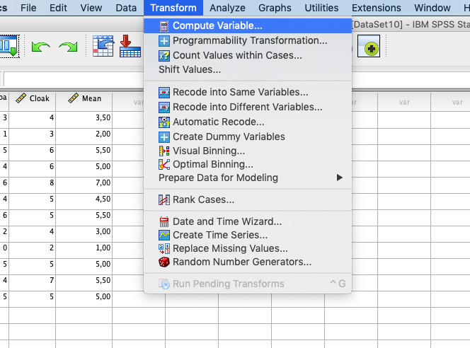
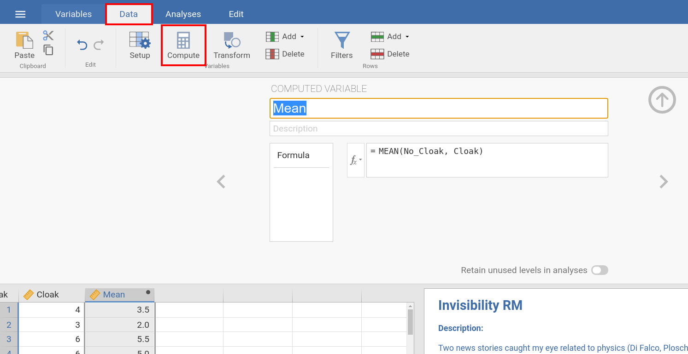
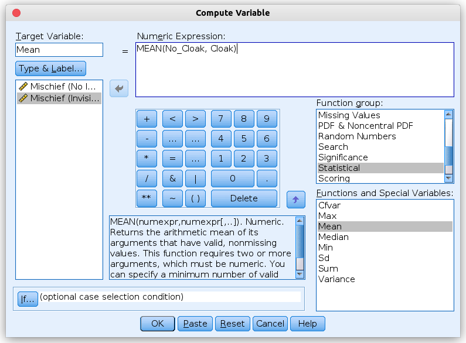
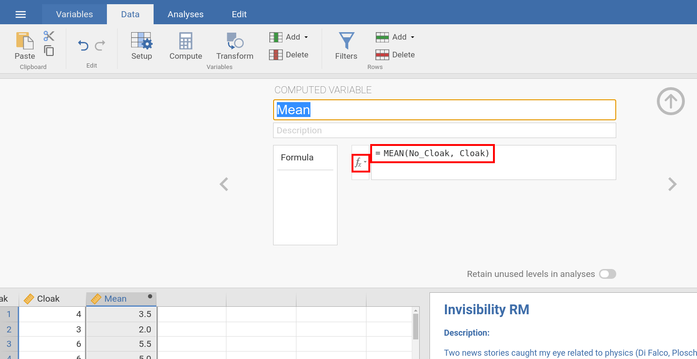
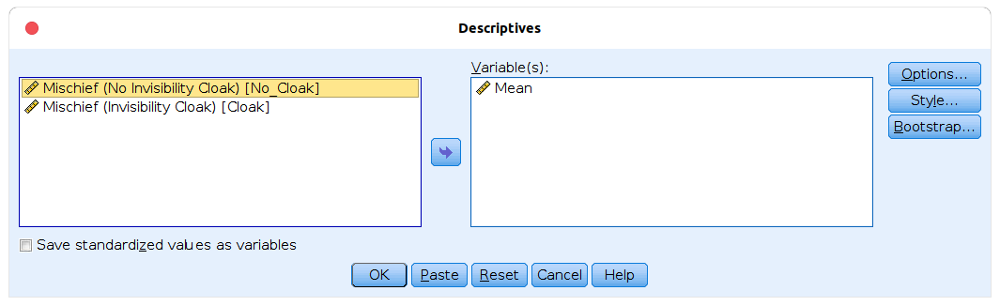
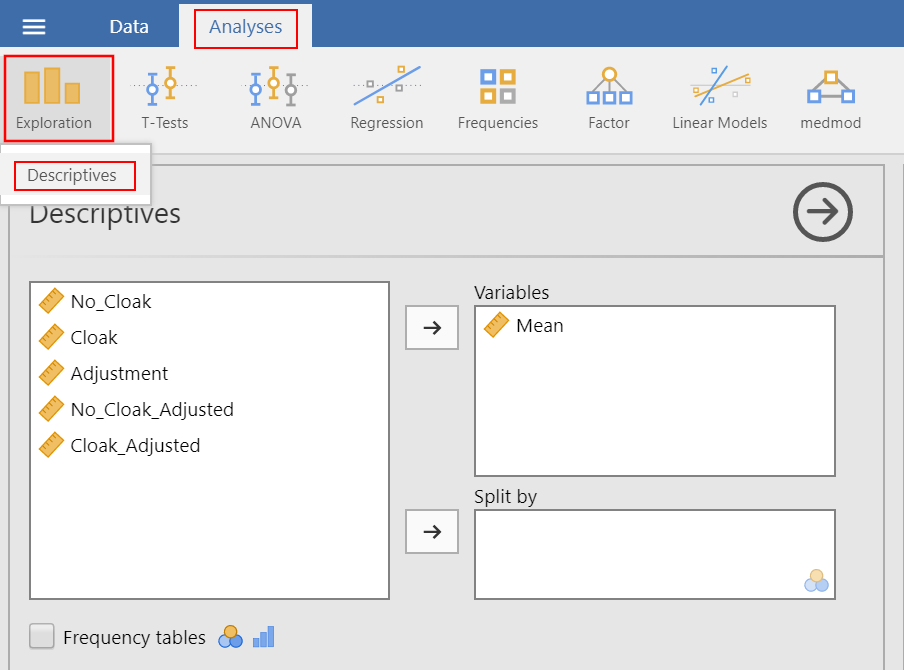
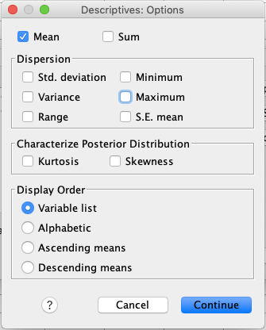
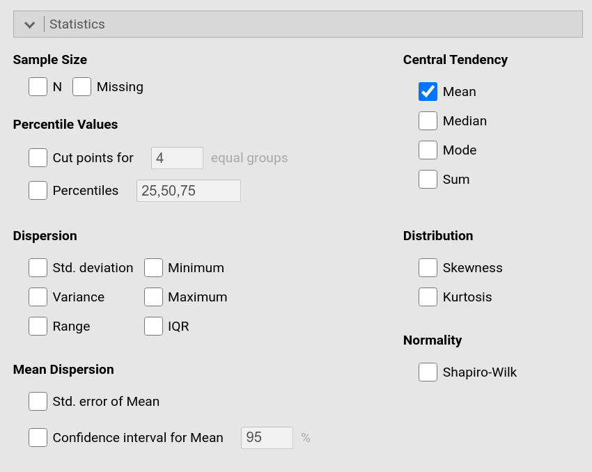
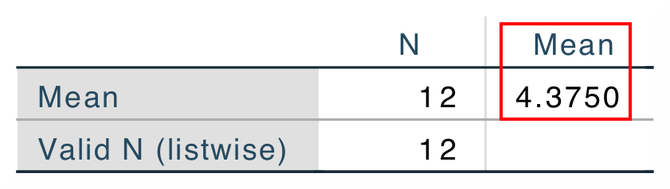
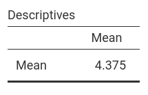
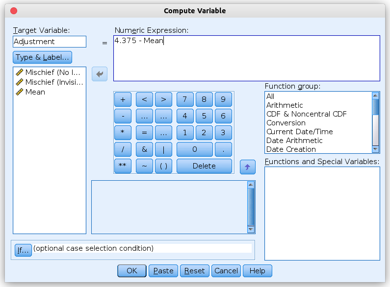
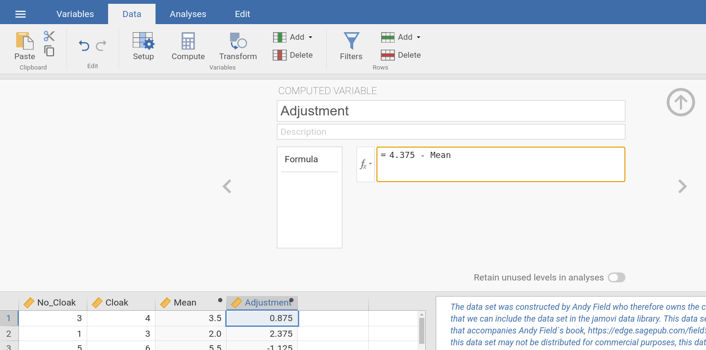
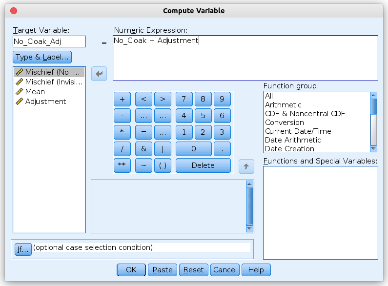
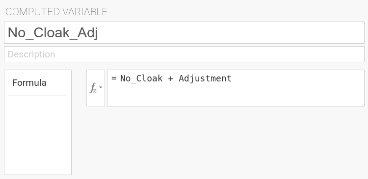
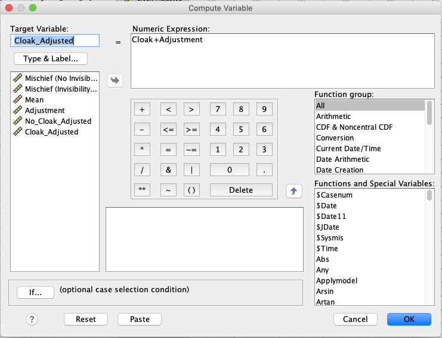
.. |jamovi_Theory_ttestPS8|            image:: ../_images/s2j_jamovi_Theory_ttestPS8.png
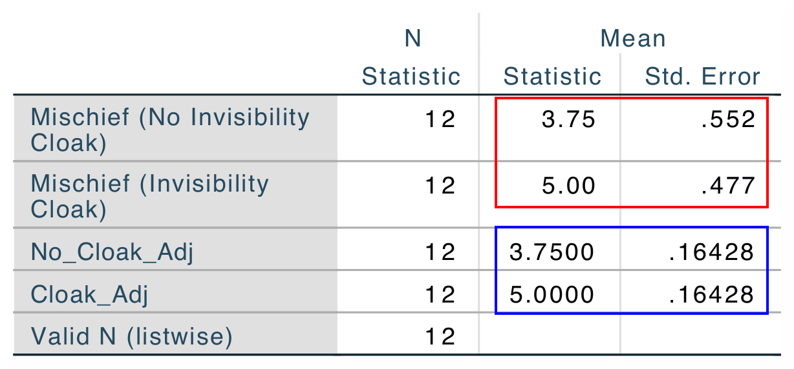
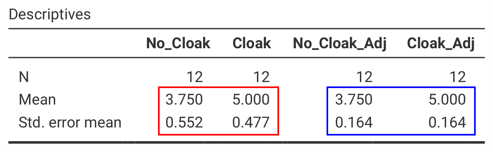
