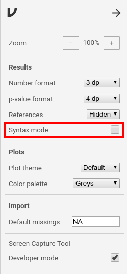
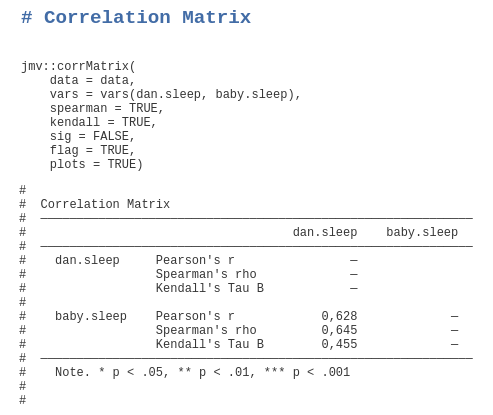
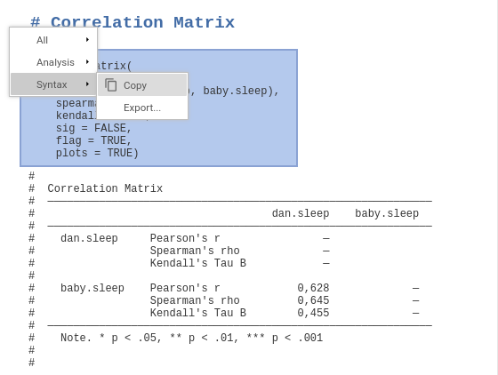

.. sectionauthor:: `Sebastian Jentschke <https://www.uib.no/en/persons/Sebastian.Jentschke>`_

=====================
The R-library ``jmv`` 
=====================

| The real power of using jamovi and the jmv-library (described below) comes
  with the opportunity to integrate it with other R-functions. Such R-functions
  could, e.g., be used to extract and manipulate data from log files of
  software used to conduct experiments (PsychoPy, e-prime, etc.).

Preparation
===========

| To install the library that contains the functions used by jamovi (and in the
  examples below) open R and type the first line (the second line is required
  if you want to read or write SPSS files, the >-mark at the begin of the line
  is the input-mark of R and must not be copied / typed):

.. code-block:: R
  
   install.packages('jmv')
   install.packages('haven')

Use of jamovi syntax in R
=========================

| First, you have to enable the syntax mode by pressing the properties
  icon (⋮) in the top-right corner. Set a tick at syntax
  mode in the properties window.
| Close the properties with the arrow-icon (→) at the top-right.

+----------------------------------+------------------------------------------+
| |jamovi_SyntaxMode1|             | The main window changes to text mode and |
|                                  | you can run analyses and afterwards      |
|                                  | right-click on the command the appears   |
|                                  | at the top of each analysis to export or |
|                                  | copy the syntax.                         |
|                                  |                                          |
|                                  |                                          |
|                                  | |jamovi_SyntaxMode2|                     |
|                                  |                                          |
|                                  | |jamovi_SyntaxMode3|                     |
+----------------------------------+------------------------------------------+

| Alternatively, you can write syntax directly. To do this, open R or RStudio
  and type the command in the first line (while the second line is required for
  if you want to use SPSS files):

.. code-block:: R
 
   library(jmv)
   library(haven)

| Afterwards you are ready to analyze your data. Typically, you have to load a
  dataset first. Do this using the first line if you have a CSV file (``sep``
  has to be set to the separator between data cells, e.g., ``,``, ``;``, etc.)
  or with the second line for loading SPSS data:

.. code-block:: R
 
   data = read.csv("data.csv", header = TRUE, sep = ",")

.. code-block:: R
   
   data = haven::read_sav("data.sav")

| Afterwards are you ready to run whatever analysis you like (here is an
  `overview <https://www.jamovi.org/jmv>`__ of available functions). For
  example, to run a simple descriptive-statistics-analysis:

.. code-block:: R
  
   jmv::descriptives(data = data, vars = vars(var1, var2))

| or for a correlation between to variables (quite basic in the first and more
  advanced - adding two non-parametric measures and plots - in the second line;
  please note that pearson = TRUE is not necessary because it is the default):

.. code-block:: R
  
   jmv::corrMatrix(data = data, vars = vars(var1, var2), pearson = TRUE, sig = TRUE)
   
.. code-block:: R
   
   jmv::corrMatrix(data = data, vars = vars(var1, var2), spearman = TRUE, kendall = TRUE, sig = FALSE, flag = TRUE, plots = TRUE)

.. ----------------------------------------------------------------------------

